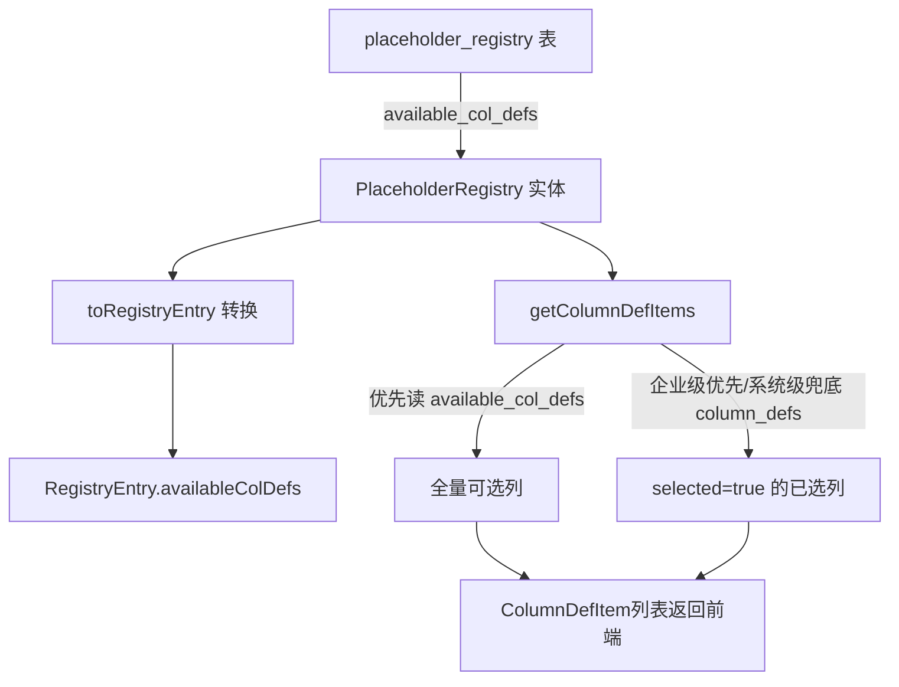

## 用户需求

新增 `available_col_defs` 字段，将 `TABLE_ROW_TEMPLATE` 占位符的"全量可选列"与"默认选中列"解耦：

- `available_col_defs`：前端列选择器展示的所有可选列（不写死，由注册表条目配置）
- `column_defs`：默认选中列（系统推荐勾选，也是企业级自定义保存的字段）

## 核心问题与目标

1. **BVD SummaryYear 回归修复**：修复 knownCols 后，全量可选列从12列缩减为2列，需恢复为12列（`available_col_defs`），保持默认选中 `["#","COMPANY"]`（`column_defs` 不变）
2. **组织结构默认列**：`清单模板-1_组织结构及管理架构` 全量5列可选（`available_col_defs`），但默认只选前3列（`column_defs`）
3. **其他 TABLE_ROW_TEMPLATE 占位符**：全量可选 = 默认选中（`available_col_defs` 同 `column_defs`，零感知变化）

## 各占位符目标配置

| 占位符 | available_col_defs（全量可选） | column_defs（默认选中） |
| --- | --- | --- |
| BVD SummaryYear | 12列（BVD_COLUMN_KEYWORD_MAP values） | `["#","COMPANY"]`（不变） |
| 清单模板-1_组织结构及管理架构 | 5列（全量） | `["主要部门","人数","主要职责范围"]`（前3列） |
| 供应商/客户/劳务支出/劳务收入 | 同 column_defs（无变化） | 不变 |


## 技术栈

现有 Java Spring Boot 项目，MyBatis-Plus ORM，Flyway 数据库迁移，Jackson JSON 处理。

## 实现思路

在 `placeholder_registry` 表新增 `available_col_defs` 字段，贯通"DB表 → 实体 → RegistryEntry → Service逻辑"整条链路：

1. **DB 层**：V19 迁移文件新增列 + UPDATE 各占位符数据
2. **实体层**：`PlaceholderRegistry.java` 新增字段
3. **引擎层**：`ReverseTemplateEngine.RegistryEntry` 新增字段和9参数构造方法，修改两个注册表条目（组织结构、BVD SummaryYear）
4. **Service 层**：`toRegistryEntry()` 同步转换新字段；`getColumnDefItems()` 改用 `availableColDefs` 作全量列来源，fallback 到 `columnDefs`
5. **V18 修正**：V18 中组织结构 `column_defs` 写的是5列全量，V19 同时修正为前3列

## 关键设计决策

- **`overrideForCompany` 不复制 `available_col_defs`**：全量可选列始终以系统级为准，企业级覆盖只影响已选列（`column_defs`），语义清晰
- **向后兼容 fallback**：`getColumnDefItems` 读全量列时，优先 `availableColDefs`，为空则 fallback 到 `columnDefs`，其他现有占位符零感知
- **V19 对其他占位符的处理**：`UPDATE ... SET available_col_defs = column_defs WHERE level='system' AND ph_type='TABLE_ROW_TEMPLATE' AND available_col_defs IS NULL`，批量一次设置，不逐条枚举

## 架构设计



## 目录结构

```
src/main/java/com/fileproc/
├── registry/
│   ├── entity/
│   │   └── PlaceholderRegistry.java       # [MODIFY] 新增 availableColDefs 字段
│   └── service/
│       └── PlaceholderRegistryService.java # [MODIFY] toRegistryEntry + getColumnDefItems
├── report/
│   └── service/
│       └── ReverseTemplateEngine.java      # [MODIFY] RegistryEntry 新增字段/构造，修改2个注册表条目
src/main/resources/db/
├── V18__upgrade_org_structure_to_row_template.sql  # 已存在（V19 会修正其 column_defs）
└── V19__add_available_col_defs.sql                 # [NEW] 新增列 + UPDATE 各占位符数据
```

## 实现细节

### V19 SQL 策略

```sql
-- 1. 新增列
ALTER TABLE placeholder_registry ADD COLUMN available_col_defs VARCHAR(1000) DEFAULT NULL;

-- 2. BVD SummaryYear：available_col_defs=12列
UPDATE placeholder_registry SET available_col_defs='["#","COMPANY","FY2023_STATUS","FY2022_STATUS","NCP_CURRENT","NCP_PRIOR","Remarks","Sales","CoGS","SGA","Depreciation","OP"]'
WHERE level='system' AND placeholder_name='BVD数据模板-SummaryYear-第一张表格' AND deleted=0;

-- 3. 组织结构：available_col_defs=5列，column_defs 修正为前3列
UPDATE placeholder_registry SET
  available_col_defs='["主要部门","人数","主要职责范围","汇报对象","汇报对象主要办公所在"]',
  column_defs='["主要部门","人数","主要职责范围"]'
WHERE level='system' AND placeholder_name='清单模板-1_组织结构及管理架构' AND deleted=0;

-- 4. 其他所有 TABLE_ROW_TEMPLATE：available_col_defs = column_defs（批量兜底）
UPDATE placeholder_registry SET available_col_defs=column_defs
WHERE level='system' AND ph_type='TABLE_ROW_TEMPLATE' AND available_col_defs IS NULL AND deleted=0;
```

### RegistryEntry 9参数构造方法

用于 `available_col_defs != column_defs` 的场景（BVD SummaryYear、组织结构）：

```java
public RegistryEntry(String placeholderName, String displayName, PlaceholderType type,
              String dataSource, String sheetName, String cellAddress,
              List<String> titleKeywords, List<String> columnDefs, List<String> availableColDefs)
```

### getColumnDefItems 核心修改

```java
// 全量可选列：优先 availableColDefs，为空则 fallback 到 columnDefs（向后兼容）
List<String> allCols = parseJsonList(system.getAvailableColDefs());
if (allCols == null || allCols.isEmpty()) {
    allCols = parseJsonList(system.getColumnDefs());
}
if (allCols == null) allCols = Collections.emptyList();
```