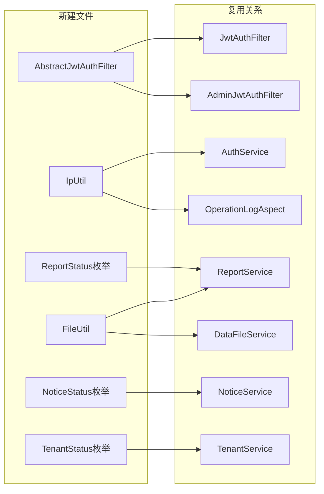

## 用户需求

对全项目二次全面审查发现的 36 个问题（P0×4、P1×18、P2×14）进行全量修复，涵盖安全漏洞、多租户数据隔离、事务完整性、参数校验、DRY 代码重构和性能优化。

## 产品概述

Spring Boot 多租户后端，需在不破坏现有接口行为的前提下，按优先级修复全部审查问题，保持零 Lint 错误。

## 核心功能

### P0（4项紧急）

- `MybatisPlusConfig`：`ignoreTable()` 当 `TenantContext.getTenantId()` 为 null 时直接返回 true，防止向数据库写入 `tenant_id=''` 的脏数据
- `AdminJwtAuthFilter`：添加 `finally { TenantContext.clear() }` 清理 ThreadLocal，防止线程池复用导致租户上下文残留
- `SecurityConfig`：注入 `@Value("${springdoc.api-docs.enabled:true}")` 控制 Swagger 路由的 `permitAll`/拒绝，生产关闭文档入口
- `WebMvcConfig`：`@PostConstruct` 校验 `cors.allowed-origins` 不含 `*` 通配符，误配时启动失败拦截

### P1 安全与多租户（7项）

- `SysAdmin` 实体新增 `status` 字段，修复 `AdminAuthService` 禁用超管账号逻辑永远为 false 的安全漏洞
- `NoticeController` 4个接口补全 `@PreAuthorize` 权限注解
- `SysConfig` 实体字段加 `@Size`/`@Min`/`@Max` 约束，`SysConfigController.updateConfig` 加 `@Valid`
- `RoleService.updateRolePermissions` 增加权限码数据库存在性校验，防止写入无效权限
- `DataFileService.getPhysicalFile()` 增加路径穿越防护（normalize + startsWith 校验）
- `StatsService.getStats()` 5 个 `selectCount(null)` 改为显式 `tenantId` 保底过滤
- `NoticeUserMapper.selectMyNotices` JOIN 查询增加 `tenant_id` 过滤参数，`NoticeService.getMyNotices()` 传入 `tenantId`

### P1 事务与参数校验（7项）

- `Report` 实体新增 `generationStatus`（pending/success/failed）和 `generationError` 字段；`tryGenerateFile` 失败时更新状态而非静默吞噬
- `ReportService.updateReport` 加 `@Transactional(rollbackFor = Exception.class)`
- `SysConfigService.getConfig` 改为 `@Transactional(readOnly = true)`
- `NoticeService.markRead` 和 `updateNotice` 加 `@Transactional(rollbackFor = Exception.class)`
- `DataFileController.upload` 的 `type` 加枚举校验、`year` 加 `@Min/@Max` 范围校验
- `ReportController.upload` 的 `year` 加 `@Min/@Max` 范围校验
- `CompanyController.search` 的 `keyword` 改为注解校验（`@NotBlank @Size`），消除 NPE 风险

### P1 DRY 重构（3项）

- 新建 `AbstractJwtAuthFilter` 父类，合并两个 Filter 重复的 `extractToken`、`writeUnauthorized`、`TOKEN_BLACKLIST_PREFIX`
- 新建 `IpUtil` 工具类，合并 `AuthService` 和 `OperationLogAspect` 重复的 `getClientIp` 实现
- 新建 `FileUtil` 工具类，合并 `ReportService` 和 `DataFileService` 重复的 `formatSize` 方法和 `DownloadInfo` 内部类

### P2 优化（14项）

- 新建 `ReportStatus`、`NoticeStatus`、`TenantStatus` 枚举（`getCode()` 返回原始字符串），全量替换各 Service 中魔法字符串字面量
- `Placeholder.type` 字段加 `@Pattern(regexp="^(text|table|chart)$")`
- 6 处分页接口的 `pageSize` 参数加 `@Max(100)` 上限
- `NoticeUserMapper.deleteByNoticeId` 改用 `@Delete` 注解替代错误的 `@Update`
- `CompanyService.updateCompany` 和 `ModuleService.update` 加租户归属校验
- `PlaceholderService.update` 移除重复 `selectById` 死代码
- `PermissionService.buildTree` 过滤改为 `!= null && !isEmpty()`
- `UserMapper.selectPageWithRole` SQL 明确列名，排除 `password` 字段
- `SysTenant` 实体的 `name`/`code`/`logoUrl` 加 `@NotBlank`/`@Size`/`@Pattern` 约束
- `TenantService.getActiveTenantList` 仅返回 `id/name`，不暴露 `code` 等敏感字段
- `ReportService.getFileForDownload` 补充 `report.getName()` 为空字符串时的文件名处理

## 技术栈

Spring Boot 3.2.5 + Java 17 + MyBatis-Plus 3.5.9 + Spring Security + JJWT + Redis（SpringData Redis）+ Bean Validation（jakarta.validation）

## 实现方案

按依赖顺序分 5 个批次修改，每批聚焦一类问题，避免跨文件依赖链断裂。新建工具类（`AbstractJwtAuthFilter`、`IpUtil`、`FileUtil`、枚举）必须在被引用方修改前完成。

### 关键技术决策

**P0-1 租户 null 处理**：在 `ignoreTable()` 方法中判断 `TenantContext.getTenantId() == null` 时直接返回 `true`（跳过全部表的租户过滤），而非继续在 `getTenantId()` 中返回空字符串。此方案比修改 `getTenantId()` 更安全，避免 SELECT * 场景下 WHERE tenant_id='' 仍能找到错误数据。

**P0-3 Swagger 条件控制**：注入 `@Value("${springdoc.api-docs.enabled:true}")` 的 `swaggerEnabled` 布尔值，在 `requestMatchers().access()` 中用 `AuthorizationDecision` 实现条件放开，不删除已有 `application-prod.yml` 的 disable 配置（双重防护）。

**P1-TXN-02 异常吞噬**：引入 `generationStatus` 字段（`pending/success/failed`）而非抛出异常，保持接口 HTTP 200 可用性，让前端通过状态字段感知失败并决策重试。`generationError` 存储简短错误消息（限 500 字符）。

**P1-QUAL 公共抽取**：`AbstractJwtAuthFilter` 不使用 `@Bean`/`@Component`，保持与现有 `SecurityConfig` 手工 `new` 构造的方式兼容；`IpUtil`/`FileUtil` 使用纯静态工具方法，无 Spring 依赖，便于单元测试。

**P2 枚举替换**：枚举 `getCode()` 返回原始小写字符串（如 `"editing"`），与数据库存储值保持一致，不改变接口响应中的状态字符串格式。

## 实现注意事项

- `AbstractJwtAuthFilter` 需持有 `objectMapper` 字段供 `writeUnauthorized` 使用，子类通过 `@RequiredArgsConstructor` 构造注入后传入 `super()`（或抽象类 `@RequiredArgsConstructor` 方式）
- `FileUtil.DownloadInfo` 替代两处内部类后，`ReportController` 和 `DataFileController` 的 `download` 方法需改为 `FileUtil.DownloadInfo`
- `StatsService` 5 个 Mapper（Company/Report/Template/DataFile/User）各自的实体类已有 `TenantId` 字段，使用 `LambdaQueryWrapper` 即可
- `SysTenant.code` 的 `@Pattern` 只限格式，不影响已有 `TenantService` 的唯一性校验逻辑
- `UserMapper.selectPageWithRole` 修改 SQL 后需确保 `SysUser` 的 `roleName` `@TableField(exist=false)` 已存在，避免映射失败
- `NoticeUserMapper.selectMyNotices` 新增 `tenantId` 参数后，`NoticeService.getMyNotices()` 需同步传入 `TenantContext.getTenantId()`

## 架构设计



## 目录结构

```
src/main/java/com/fileproc/
├── auth/
│   ├── config/
│   │   └── SecurityConfig.java              [MODIFY] P0-3：注入 swaggerEnabled，Swagger 路由条件控制
│   ├── entity/
│   │   └── SysAdmin.java                    [MODIFY] P1-SEC-05：添加 status 字段
│   ├── filter/
│   │   ├── AbstractJwtAuthFilter.java       [NEW]    P1-QUAL-01：抽取 extractToken/writeUnauthorized/常量
│   │   ├── JwtAuthFilter.java               [MODIFY] P1-QUAL-01：extends AbstractJwtAuthFilter
│   │   └── AdminJwtAuthFilter.java          [MODIFY] P0-2 + P1-QUAL-01：finally TenantContext.clear() + extends
│   └── service/
│       └── AdminAuthService.java            [MODIFY] P1-SEC-05：status 禁用判断现可生效（字段已添加）
├── common/
│   ├── MybatisPlusConfig.java               [MODIFY] P0-1：ignoreTable 判 null 返回 true
│   ├── WebMvcConfig.java                    [MODIFY] P0-4：@PostConstruct 校验 * 通配符
│   ├── aspect/
│   │   └── OperationLogAspect.java          [MODIFY] P1-QUAL-02：改用 IpUtil.getClientIp()
│   ├── enums/
│   │   ├── ReportStatus.java                [NEW]    P2-QUAL-05：报告状态枚举
│   │   ├── NoticeStatus.java                [NEW]    P2-QUAL-05：通知状态枚举
│   │   └── TenantStatus.java                [NEW]    P2-QUAL-05：租户状态枚举
│   └── util/
│       ├── IpUtil.java                      [NEW]    P1-QUAL-02：getClientIp 静态工具
│       └── FileUtil.java                    [NEW]    P1-QUAL-03/04：formatSize + DownloadInfo
├── company/
│   ├── controller/
│   │   └── CompanyController.java           [MODIFY] P1-VAL-04 + P2-VAL-08：keyword 注解校验 + pageSize @Max
│   └── service/
│       └── CompanyService.java              [MODIFY] P2-QUAL-07：updateCompany 加租户归属校验
├── datafile/
│   ├── controller/
│   │   └── DataFileController.java          [MODIFY] P1-VAL-01/02 + P2-VAL-08：type/year/pageSize 校验
│   └── service/
│       └── DataFileService.java             [MODIFY] P1-SEC-09 + P1-QUAL-03：路径穿越防护 + 改用 FileUtil
├── notice/
│   ├── controller/
│   │   └── NoticeController.java            [MODIFY] P1-SEC-06 + P2-VAL-08：@PreAuthorize + pageSize @Max
│   ├── mapper/
│   │   └── NoticeUserMapper.java            [MODIFY] P1-TENANT-03 + P2-QUAL-06：selectMyNotices 加 tenantId + @Delete
│   └── service/
│       └── NoticeService.java               [MODIFY] P1-TXN-04 + P1-TENANT-03 + P2-QUAL-05：事务 + tenantId + 枚举
├── report/
│   ├── controller/
│   │   └── ReportController.java            [MODIFY] P1-VAL-03 + P2-VAL-08：year 范围 + pageSize
│   ├── entity/
│   │   └── Report.java                      [MODIFY] P1-TXN-02：添加 generationStatus/generationError 字段
│   └── service/
│       └── ReportService.java               [MODIFY] P1-TXN-01/02 + P2-ERR-05 + P2-QUAL-05 + P1-QUAL-03
├── system/
│   ├── controller/
│   │   ├── RoleController.java              [MODIFY] P1-SEC-08：@Valid 到 updatePermissions
│   │   └── SysConfigController.java         [MODIFY] P1-SEC-07：update 加 @Valid
│   ├── entity/
│   │   └── SysConfig.java                   [MODIFY] P1-SEC-07：字段加 @Size/@Min/@Max
│   ├── mapper/
│   │   └── UserMapper.java                  [MODIFY] P2-PERF-05：selectPageWithRole SQL 明确列名排除 password
│   └── service/
│       ├── PermissionService.java           [MODIFY] P2-PERF-04：buildTree 过滤 != null && !isEmpty()
│       ├── RoleService.java                 [MODIFY] P1-SEC-08：updateRolePermissions 加权限码 DB 校验
│       ├── StatsService.java                [MODIFY] P1-TENANT-02：5个 selectCount 加显式 tenantId
│       └── SysConfigService.java            [MODIFY] P1-TXN-03：getConfig 改 readOnly=true
├── template/
│   ├── entity/
│   │   └── Placeholder.java                 [MODIFY] P2-VAL-07：type 加 @Pattern
│   └── service/
│       ├── ModuleService.java               [MODIFY] P2-QUAL-09：update 加租户归属校验
│       └── PlaceholderService.java          [MODIFY] P2-QUAL-08：update 移除重复 selectById 死代码
└── tenant/
    ├── controller/
    │   └── AdminTenantController.java       [MODIFY] P2-QUAL-05：枚举替换状态字符串
    ├── entity/
    │   └── SysTenant.java                   [MODIFY] P2-SEC-12：name/code/logoUrl 加约束注解
    └── service/
        └── TenantService.java               [MODIFY] P2-TENANT-05 + P2-QUAL-05：仅返 id/name + 枚举替换
```