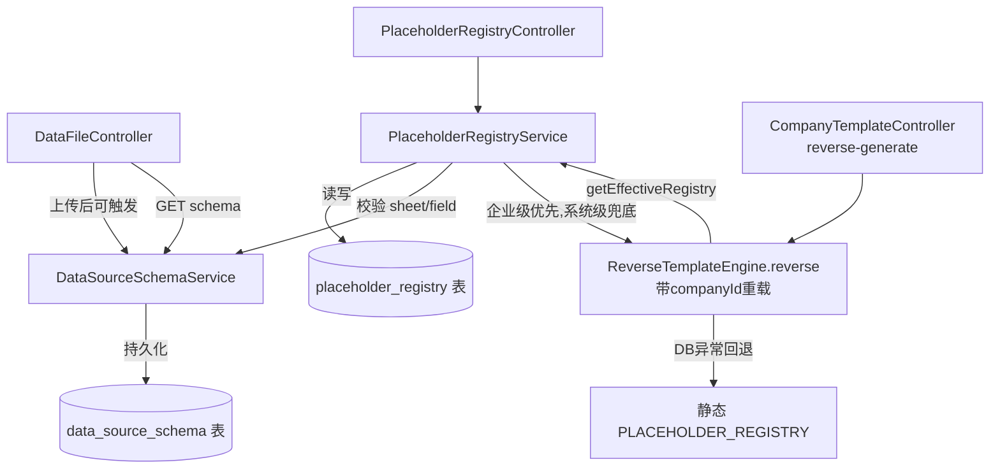

## 用户需求

### 产品概述

对现有报告生成系统进行架构升级，将 `ReverseTemplateEngine` 中硬编码的占位符注册表改造为"数据源结构化解析 + 数据库可配置注册表"双层架构，提升系统对不同企业模板格式的适应性。

### 核心功能

**1. 数据源结构化解析接口**

- 系统在数据文件（清单/BVD）上传后，自动解析 Excel 的 Sheet 列表与字段结构，形成结构化数据源 Schema（包含 Sheet 名、字段坐标/名称、字段类型推断、样本值预览）
- 提供独立的解析接口，前端可随时按 dataFileId 查询已上传文件的 Schema 树（Sheet → 字段列表）
- Schema 解析结果持久化，避免重复 IO 解析

**2. 占位符注册表数据库化**

- 将现有 `PLACEHOLDER_REGISTRY` 静态列表中的约40条规则迁移到数据库新表 `placeholder_registry`
- 支持两级注册表：**系统级**（硬编码迁移，所有企业共享默认规则）和**企业级**（特定企业覆盖或扩展，优先于系统级生效）
- 提供 CRUD 接口，支持管理员维护系统级注册表条目，支持企业级个性化配置
- `ReverseTemplateEngine.reverse()` 在运行时从数据库读取有效注册表，系统级规则保持向后兼容

**3. 两者联动**

- 新建占位符注册条目时，`sourceSheet` 和 `sourceField` 可通过 Schema 解析接口的下拉联动选择（后端提供校验）
- 反向引擎优先使用企业级注册表，回退到系统级注册表，行为与现有完全兼容

## 技术栈

与现有项目保持一致：Spring Boot + MyBatis-Plus + MySQL，Apache POI（xlsx 读取），EasyExcel（已用于清单解析），Flyway（版本化数据库迁移）。

---

## 实现方案

### 整体策略

分三个独立层次实现，层间松耦合：

1. **Schema 解析层**：新增 `DataSourceSchemaService`，解析 xlsx 文件结构并持久化到 `data_source_schema` 表，通过 `DataFileController` 挂载新接口
2. **注册表数据库化层**：新增 `placeholder_registry` 表 + `PlaceholderRegistryService`，迁移现有硬编码条目为系统级数据，提供 CRUD 接口
3. **引擎适配层**：修改 `ReverseTemplateEngine`，运行时从数据库读取注册表，逻辑不变，仅数据来源切换；保留静态列表作为 DB 不可用时的最终兜底

### 关键设计决策

**Schema 解析：按需触发+缓存策略**
文件上传时不自动触发解析，前端进入子模板编辑页面时先调 `GET /data-files/{id}/schema` 检查是否已有解析结果：有则直接使用；没有则自动调 `POST /data-files/{id}/parse-schema` 触发解析，等待返回后展示。解析结果持久化缓存，同一文件只解析一次（除非手动刷新）。解析结果按 `(dataFileId, sheetName)` 粒度存储到数据库，字段列表以 JSON 序列化存储（避免宽表）。

**注册表两级优先链：企业级 > 系统级**
`PlaceholderRegistryService.getEffectiveRegistry(companyId)` 合并两级规则，同一 `placeholderName` 企业级覆盖系统级，其余系统级规则原样保留。`ReverseTemplateEngine` 在 `reverse()` 入口接收 `companyId` 参数，获取有效注册表替代静态列表；原无 companyId 场景（如测试/降级）回退静态列表。

**向后兼容保障**

- 系统级注册表通过 Flyway V9 迁移脚本初始化（精确还原现有40条规则），不删除 Java 静态列表，作为 DB 查询异常时的兜底
- `reverse()` 方法签名新增重载（带 companyId），原4参数签名保留且默认使用静态列表，不破坏现有调用

---

## 实现注意事项

- **Schema 字段列表 JSON**：`fields` 列存储 `[{"address":"B1","label":"企业全称","sampleValue":"xxx","inferredType":"TEXT"}]`，使用 Jackson 序列化，避免引入额外依赖
- **注册表条目的 titleKeywords 和 columnDefs**：使用 JSON 列存储（`VARCHAR(1000)`），读取时反序列化为 `List<String>`，与 `RegistryEntry` 完全对应
- **引擎内部 RegistryEntry 类不改动**：`PlaceholderRegistryService` 返回 `List<RegistryEntry>` 类型，引擎内部无需感知来源
- **EasyExcel 读取 xlsx**：Schema 解析复用引擎已有 `readSheetByIndex` / `readSheetNames` 方法，抽取到 `ExcelParseUtil` 工具类共用
- **租户隔离**：企业级注册表条目通过 `tenantId + companyId` 双重隔离，系统级条目 `tenantId=null / companyId=null`

---

## 架构设计



---

## 目录结构

```
src/main/java/com/fileproc/
├── datafile/
│   ├── controller/
│   │   └── DataFileController.java          [MODIFY] 新增 POST /{id}/parse-schema 和 GET /{id}/schema 两个接口
│   ├── entity/
│   │   └── DataSourceSchema.java            [NEW] 数据源 Schema 实体，对应 data_source_schema 表
│   │                                               字段：id/dataFileId/tenantId/sheetName/sheetIndex/fields(JSON)/parsedAt
│   ├── mapper/
│   │   └── DataSourceSchemaMapper.java      [NEW] MyBatis-Plus Mapper，按 dataFileId 查询 Schema 列表
│   └── service/
│       └── DataSourceSchemaService.java     [NEW] 核心解析服务
│                                                  - parseSchema(dataFileId): 读取文件 → 逐 Sheet 解析 → 持久化
│                                                  - getSchema(dataFileId): 查询已解析的 Schema 列表
│                                                  - getSchemaTree(dataFileId): 返回前端友好的 Sheet→字段树形结构
│
├── registry/                                [NEW 包] 占位符注册表管理
│   ├── entity/
│   │   └── PlaceholderRegistry.java         [NEW] 注册表条目实体，对应 placeholder_registry 表
│   │                                               字段：id/tenantId/companyId/level(system|company)/placeholderName
│   │                                                     displayName/phType/dataSource/sheetName/cellAddress
│   │                                                     titleKeywords(JSON)/columnDefs(JSON)/sort/enabled/deletedAt
│   ├── mapper/
│   │   └── PlaceholderRegistryMapper.java   [NEW] 按 level/companyId 查询，支持系统级+企业级合并查询
│   ├── service/
│   │   └── PlaceholderRegistryService.java  [NEW] 核心注册表服务
│   │                                              - getEffectiveRegistry(companyId): 合并企业级+系统级，返回 List<RegistryEntry>
│   │                                              - listSystemEntries(): 查询系统级条目
│   │                                              - listCompanyEntries(companyId): 查询企业级条目
│   │                                              - saveEntry()/updateEntry()/deleteEntry(): CRUD
│   │                                              - initSystemDefaults(): 初始化系统级默认条目（供 Flyway 后调用）
│   └── controller/
│       └── PlaceholderRegistryController.java [NEW] REST 接口
│                                                    GET  /placeholder-registry?level=system|company&companyId=
│                                                    POST /placeholder-registry
│                                                    PUT  /placeholder-registry/{id}
│                                                    DELETE /placeholder-registry/{id}
│                                                    GET  /placeholder-registry/effective?companyId=  (预览生效规则)
│
├── report/service/
│   └── ReverseTemplateEngine.java           [MODIFY] 新增 reverse(histPath,listPath,bvdPath,outPath,companyId) 重载
│                                                      内部替换 PLACEHOLDER_REGISTRY 读取为 placeholderRegistryService.getEffectiveRegistry()
│                                                      DB 异常时回退静态列表；静态列表保留不删除
│
└── template/controller/
    └── CompanyTemplateController.java       [MODIFY] reverse-generate 接口传 companyId 给引擎新重载（不触发 parseSchema，Schema 由前端按需调用）

src/main/resources/db/
└── V9__placeholder_registry_and_schema.sql  [NEW] Flyway 迁移脚本
                                                   创建 placeholder_registry 表 + data_source_schema 表
                                                   INSERT 全部系统级默认条目（迁移现有40条硬编码规则）
```

---

## 关键数据结构

**`placeholder_registry` 表核心字段**：

| 列名 | 类型 | 说明 |
| --- | --- | --- |
| id | VARCHAR(36) PK | UUID |
| tenant_id | VARCHAR(36) | 企业级时填值，系统级为 NULL |
| company_id | VARCHAR(36) | 企业级时填值，系统级为 NULL |
| level | VARCHAR(20) | system / company |
| placeholder_name | VARCHAR(200) | 唯一标识（系统级唯一，企业级 company_id+name 唯一） |
| display_name | VARCHAR(200) | 可读名称 |
| ph_type | VARCHAR(30) | DATA_CELL / TABLE_CLEAR_FULL / TABLE_ROW_TEMPLATE / LONG_TEXT / BVD |
| data_source | VARCHAR(20) | list / bvd |
| sheet_name | VARCHAR(100) | 来源 Sheet 名 |
| cell_address | VARCHAR(20) | 单元格坐标如 B1 |
| title_keywords | VARCHAR(1000) | JSON 数组，TABLE_CLEAR 专用 |
| column_defs | VARCHAR(1000) | JSON 数组，TABLE_ROW_TEMPLATE 专用 |
| sort | INT | 排序，影响引擎处理顺序 |
| enabled | TINYINT | 0/1，企业级可禁用某条系统规则 |


**`data_source_schema` 表核心字段**：

| 列名 | 类型 | 说明 |
| --- | --- | --- |
| id | VARCHAR(36) PK | UUID |
| data_file_id | VARCHAR(36) | 关联 data_file.id |
| tenant_id | VARCHAR(36) | 租户隔离 |
| sheet_name | VARCHAR(100) | Sheet 名称 |
| sheet_index | INT | Sheet 顺序 |
| fields | TEXT | JSON 数组，每项含 address/label/sampleValue/inferredType |
| parsed_at | DATETIME | 解析时间 |


## Agent Extensions

### SubAgent

- **code-explorer**
- 用途：在实现各模块时，深度探索 `ReverseTemplateEngine` 中 `buildBvdEntries`、`buildExcelEntries`、`readSheetNames` 等已有工具方法，以及 `DataFileMapper`、`TenantContext` 等基础设施的完整签名，确保新代码复用而非重复实现
- 预期结果：找到所有可复用的 Excel 解析方法、现有 Mapper 模式，输出精确的引用路径，保证新服务层代码与现有架构风格一致