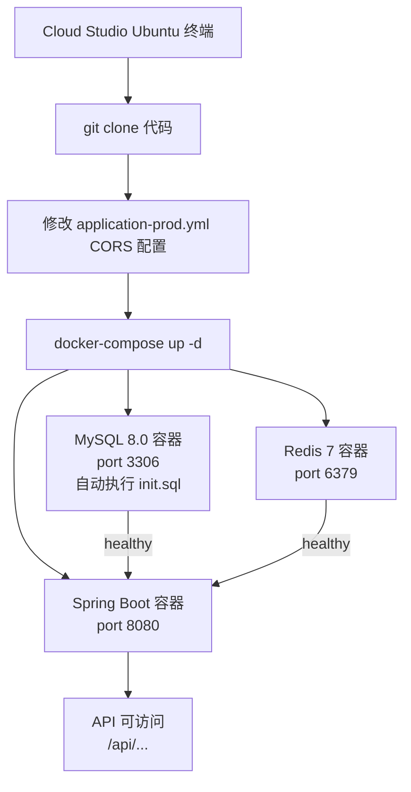

## 用户需求

在腾讯云 Cloud Studio 创建的 Ubuntu 应用空间中，将本地 Spring Boot 后端项目通过 Docker Compose 完整部署运行。

## 产品概述

生成一份可在 Cloud Studio Ubuntu 终端中逐步执行的完整部署操作指南，涵盖环境检测与安装、代码获取、配置调整、服务启动、健康验证全流程。

## 核心功能

- 检测并安装 Docker / Docker Compose（不确定是否已装）
- 通过 Git 从 GitHub 克隆项目代码到 Cloud Studio 环境
- 调整生产环境配置（CORS 域名、JWT 密钥等敏感项）
- 使用 `docker-compose up` 一键启动 MySQL、Redis、Spring Boot 三个服务
- 验证服务健康状态，提供常用运维命令备查

## 技术栈

- **运行环境**：Cloud Studio Ubuntu 应用空间
- **容器化**：Docker 24+ / Docker Compose v2
- **应用服务**：Spring Boot 3.2.5（Java 17，JDK 21 镜像兼容运行）
- **依赖服务**：MySQL 8.0、Redis 7-alpine
- **构建方式**：Dockerfile 多阶段构建（Maven 3.9 + eclipse-temurin:21）

---

## 实施方案

项目已内置完整的 `Dockerfile` 与 `docker-compose.yml`，核心路径是：

**安装 Docker → Git 克隆代码 → 调整生产配置 → docker-compose up -d → 验证健康**

所有依赖（MySQL、Redis、Spring Boot）均通过 Docker Compose 编排，无需手动安装 JDK 或 Maven，构建过程完全在容器内完成。

### 关键决策与注意点

1. **Docker 安装**：Cloud Studio Ubuntu 环境可能已预装 Docker，先 `docker --version` 检测，未安装则通过官方脚本一键安装。

2. **生产配置调整**：`application-prod.yml` 中 `cors.allowed-origins` 默认为 `https://your-production-domain.com`，需替换为 Cloud Studio 实际访问域名（或暂时改为 `*` 用于测试）。JWT 密钥建议通过环境变量覆盖，不写死在文件中。

3. **数据库初始化**：`docker-compose.yml` 已挂载 `./src/main/resources/db/init.sql` 到 MySQL 容器的 `/docker-entrypoint-initdb.d/`，首次启动自动执行建表。V2 迁移脚本需手动执行。

4. **端口暴露**：Cloud Studio 需要在应用空间设置中开放 `8080`（Spring Boot）端口的公网访问，否则外部无法访问 API。

5. **构建时间**：首次 `docker-compose up` 会拉取 Maven 镜像并下载依赖，预计耗时 5~15 分钟，后续增量构建更快。

---

## 部署架构



---

## 目录结构（部署相关文件）

```
fileWork_backend/
├── Dockerfile                          # [不改动] 多阶段构建，JDK21 镜像
├── docker-compose.yml                  # [不改动] 三服务编排
├── src/
│   └── main/
│       └── resources/
│           ├── application.yml         # [不改动] 基础配置，环境变量占位符
│           ├── application-prod.yml    # [MODIFY] 替换 cors.allowed-origins 为实际域名
│           └── db/
│               ├── init.sql            # [不改动] MySQL 首次启动自动执行
│               └── V2__add_report_unique_index.sql  # [手动执行] 首次部署后补跑
```

---

## 完整部署命令清单

### 第一步：检测并安装 Docker

```
# 检测 Docker 是否已安装
docker --version && docker compose version

# 如果未安装，执行以下命令（官方一键脚本）
curl -fsSL https://get.docker.com | sudo sh
sudo usermod -aG docker $USER
newgrp docker

# 验证安装
docker --version
docker compose version
```

### 第二步：克隆代码

```
# 替换为你的实际 GitHub 仓库地址
git clone https://github.com/你的用户名/fileWork_backend.git
cd fileWork_backend
```

### 第三步：调整生产配置（CORS）

```
# 查看 Cloud Studio 应用空间的访问域名（在 Cloud Studio 控制台查看）
# 然后修改 CORS 白名单，替换为实际域名或暂用 * 测试
sed -i 's|https://your-production-domain.com|*|g' \
  src/main/resources/application-prod.yml

# 查看修改结果
cat src/main/resources/application-prod.yml
```

### 第四步：启动所有服务

```
# 后台启动，-d 表示守护进程模式
docker compose up -d --build

# 查看启动日志（可 Ctrl+C 退出跟踪，服务继续运行）
docker compose logs -f
```

### 第五步：执行 V2 数据库迁移脚本

```
# 等待 MySQL 启动完成（约 30 秒）后执行
docker compose exec mysql mysql -uroot -proot123 file_proc_db \
  < src/main/resources/db/V2__add_report_unique_index.sql
```

### 第六步：验证服务健康

```
# 查看所有容器状态（应全部为 Up/healthy）
docker compose ps

# 测试 Spring Boot API 是否响应
curl http://localhost:8080/api/actuator/health 2>/dev/null || \
curl http://localhost:8080/api/auth/login -s -o /dev/null -w "%{http_code}"
```

### 常用运维命令

```
# 查看实时日志
docker compose logs -f backend

# 重启某个服务
docker compose restart backend

# 停止所有服务
docker compose down

# 停止并清除数据卷（慎用，会删除数据库数据）
docker compose down -v

# 进入 MySQL 容器
docker compose exec mysql mysql -uroot -proot123 file_proc_db
```