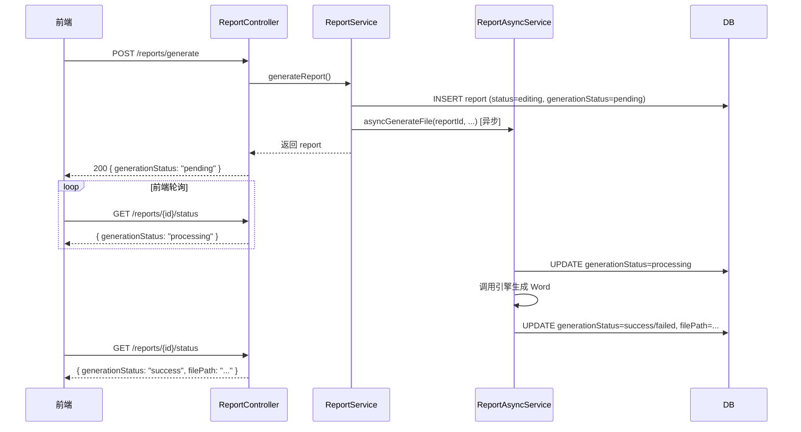

## 用户需求

针对前端反馈的问题，修复后端以下4个问题：

### 问题1（纯前端，跳过）

反向生成步骤向导为前端 UI 组件，后端无需修改。

### 问题2：报告生成改为异步 + 新增轮询接口

当前 `generateReport` / `updateReport` 是同步阻塞调用，大文档生成耗时长会导致 HTTP 超时。改为：

- 接口立即返回 `generationStatus: pending` 的 Report 记录
- 后台异步执行引擎生成，完成后写库更新 `generationStatus`（pending → success/failed）
- 新增 `GET /reports/{id}/status` 轻量轮询接口，供前端查询生成进度

### 问题3：新增 `content-url` 接口，支持 OnlyOffice 集成

OnlyOffice 需要一个可访问的文件 URL 而非二进制流。新增 `GET /company-template/{id}/content-url` 接口，返回子模板文件的可访问 URL 和文件名，供前端直接传给 OnlyOffice 编辑器。

### 问题4（Bug）：修复双重前缀 `/api/api/...`

`application.yml` 已配置 `context-path: /api`，但新建的两个 Controller 的 `@RequestMapping` 仍带 `/api` 前缀，导致实际路径变为 `/api/api/...`，需去掉 Controller 中的 `/api` 前缀。

## 核心功能点

- 修复路径 Bug（`SystemTemplateController` / `CompanyTemplateController`）
- 报告生成异步化，`@Async` 线程池执行，`generationStatus` 状态机驱动
- 新增 `/reports/{id}/status` 轮询接口
- 新增 `/company-template/{id}/content-url` 接口

## 技术栈

已有项目：Spring Boot 3 + MyBatis-Plus + Java 17，`@EnableAsync` 已在主类开启。

## 实现方案

### 问题4（路径 Bug）

直接将两个 Controller 的 `@RequestMapping("/api/xxx")` 改为 `@RequestMapping("/xxx")`，同时同步更新注释中的接口路径说明，不涉及任何逻辑。

### 问题2（异步生成）

采用 **"先落库、再异步"** 模式：

1. `generateReport` / `updateReport` 在事务中先将 report 状态设为 `generationStatus=pending` 写入DB，立即返回
2. 提取新的 `@Async` 方法 `asyncGenerateFile(reportId, companyId, year, tenantId, companyTemplateId)` 在 `ReportAsyncService` 中执行引擎调用
3. 异步方法内：先更新状态为 `processing`，执行完成后更新为 `success` 或 `failed`
4. 新增 `GET /reports/{id}/status` 返回 `{ id, generationStatus, generationError, filePath }`

**关键点**：

- `@Async` 方法必须在独立 Bean（`ReportAsyncService`）中，不能在 `ReportService` 自调用，否则代理失效
- 异步方法不继承 `TenantContext`（ThreadLocal 会断），需在调用前将 `tenantId` 显式传参
- 新增 `AsyncConfig.java` 配置专用线程池（核心3线程，最大10，队列50），避免占用默认 `SimpleAsyncTaskExecutor`
- `ReportStatus` 枚举新增 `PROCESSING("processing")` 状态

### 问题3（content-url 接口）

在 `CompanyTemplateController` 新增接口：

```
GET /company-template/{id}/content-url
```

返回：

```
{ "url": "http://host/api/files/company-templates/...", "name": "xxx.docx" }
```

文件 URL 通过 `request.getScheme() + "://" + request.getServerName() + ":" + request.getServerPort() + contextPath + "/files/" + relativePath` 拼接。

但注意当前 `WebMvcConfig` 的注释明确说明：**文件不通过静态资源映射暴露（安全修复）**。因此不能直接返回静态文件URL，改为返回受鉴权的下载接口 URL 即可：`/api/company-template/{id}/download`，前端让 OnlyOffice 带 JWT token 访问该地址。

## 架构图



## 目录结构

```
src/main/java/com/fileproc/
├── common/
│   └── AsyncConfig.java                           # [NEW] 异步线程池配置，定义 "reportExecutor" Bean
├── report/
│   ├── service/
│   │   ├── ReportService.java                     # [MODIFY] generateReport/updateReport 改为提交异步任务，不再直接调用 tryGenerateFile
│   │   └── ReportAsyncService.java                # [NEW] @Async 异步生成服务，包含 asyncGenerateFile 方法
│   └── controller/
│       └── ReportController.java                  # [MODIFY] 新增 GET /{id}/status 接口
├── template/
│   └── controller/
│       ├── SystemTemplateController.java          # [MODIFY] @RequestMapping 去掉 /api 前缀
│       └── CompanyTemplateController.java         # [MODIFY] @RequestMapping 去掉 /api 前缀，新增 content-url 接口
└── common/enums/
    └── ReportStatus.java                          # [MODIFY] 新增 PROCESSING("processing") 枚举值
```