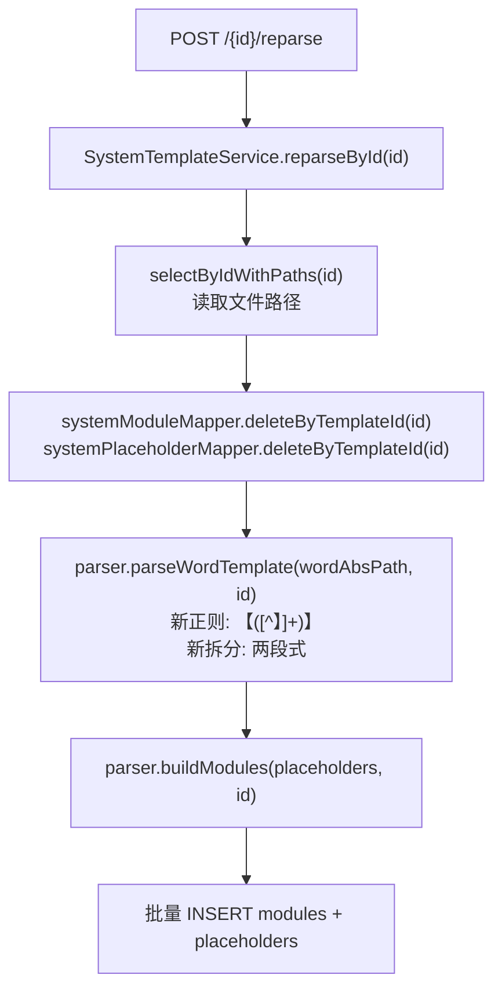

## 用户需求

Word 模板中的占位符使用中文方括号 `【】` 包裹，格式为 `【数据源-Sheet名单元格地址】`（两段式，Sheet 名与单元格地址直接拼接），例如 `【清单模板-数据表B4】`，而后端解析器当前使用 `{{...}}` 正则匹配、三段式拆分逻辑，导致解析结果为 0 个占位符，`/modules` 和 `/placeholders` 接口均返回空数组。

## 产品概述

修复 `SystemTemplateParser.java` 中的正则表达式与名称拆分逻辑，使其正确识别 `【...】` 格式的占位符，并按两段式（`数据源-Sheet名+单元格地址`）解析字段；同时为已存在的激活模板提供重新触发解析的管理端接口，无需重新上传文件即可补全 `system_module` 和 `system_placeholder` 表数据。

## 核心功能

- **正则修复**：将占位符匹配模式从 `\{\{([^}]+)\}\}` 改为匹配 `【([^】]+)】`
- **名称拆分修复**：将三段式正则 `^([^-]+)-([^-]+)-([A-Za-z]+\d+) 改为两段式 `^([^-]+)-([A-Za-z\u4e00-\u9fa5]+)([A-Za-z]+\d+)，将 Sheet 名与单元格地址从第二段中分离
- **重新解析接口**：新增 `POST /admin/system-template/{id}/reparse` 接口，对已上传的指定模板重新执行 Word 解析流程，清空旧的 module/placeholder 数据后重新写入
- **注释与文档同步**：更新 Parser 类中与旧格式相关的注释说明

## 技术栈

沿用项目现有技术栈：Spring Boot + MyBatis-Plus + Apache POI（XWPFDocument），无需引入新依赖。

---

## 实现方案

### 核心思路

仅修改 `SystemTemplateParser.java` 中两个静态 Pattern 常量及 `buildPlaceholder` 方法的字段赋值逻辑，其余解析流程（段落扫描、表格扫描、页眉页脚扫描、去重、buildModules）无需改动。

**关键正则分析：**

实际占位符示例：`【清单模板-数据表B4】`

- 外层匹配：`【([^】]+)】` → 捕获组得到 `清单模板-数据表B4`
- 内层拆分：以第一个 `-` 分割为两段：
- 第一段 `清单模板` → `dataSourceRaw`
- 第二段 `数据表B4` → 需进一步拆分为 Sheet 名（中文部分）和单元格地址（字母+数字）
- 两段式拆分正则：`^([^-]+)-([^\u0041-\u005A\u0061-\u007A]*[A-Za-z\u4e00-\u9fa5]+?)([A-Za-z]+\d+)

更稳健的方案（避免中英文边界误判）：采用 **贪婪匹配 + 回溯** 的方式，在第二段中用正则 `^(.*?)([A-Za-z]+\d+) 分离 Sheet 名与单元格地址：

- `(.*?)` 非贪婪匹配 Sheet 名（如 `数据表`）
- `([A-Za-z]+\d+)` 匹配末尾单元格地址（如 `B4`）

该方案兼容 Sheet 名包含字母（如 `Sheet1B`）的边界情况不会出现，因为业务上 Sheet 名均为中文。

### 重新解析接口

新增 `reparseById(String id)` Service 方法：

1. 通过 `selectByIdWithPaths` 读取模板文件路径（已有 Mapper 方法）
2. 删除该模板旧的 module/placeholder 记录（`deleteByTemplateId`）
3. 重新调用 `parseWordTemplate` + `buildModules`，批量写入

Controller 新增 `POST /{id}/reparse` 接口调用该方法。

---

## 实现细节

- `PLACEHOLDER_PATTERN` 直接替换，不影响任何调用方（`extractPlaceholders` 方法对外透明）
- `PLACEHOLDER_NAME_PATTERN` 修改后 `buildPlaceholder` 中的捕获组编号相应调整
- `deleteByTemplateId` 在 `SystemModuleMapper` 和 `SystemPlaceholderMapper` 中检查是否已有该方法，若无则新增
- reparse 操作在 `@Transactional` 中执行，先删后写，保证原子性
- 避免修改 `uploadAndInit` 主流程，防止影响正常上传逻辑

---

## 架构设计



---

## 目录结构

```
src/main/java/com/fileproc/template/
├── service/
│   └── SystemTemplateParser.java          # [MODIFY] 修复两个Pattern常量及buildPlaceholder方法
│   └── SystemTemplateService.java         # [MODIFY] 新增reparseById方法
├── controller/
│   └── SystemTemplateController.java      # [MODIFY] 新增POST /{id}/reparse接口
├── mapper/
│   └── SystemModuleMapper.java            # [MODIFY] 新增deleteByTemplateId方法（若缺失）
│   └── SystemPlaceholderMapper.java       # [MODIFY] 新增deleteByTemplateId方法（若缺失）
```

## Agent Extensions

### SubAgent

- **code-explorer**
- 用途：在执行修改前确认 `SystemModuleMapper` 和 `SystemPlaceholderMapper` 中是否已有 `deleteByTemplateId` 方法，避免重复声明
- 预期结果：确认两个 Mapper 的现有方法列表，明确哪些需要新增