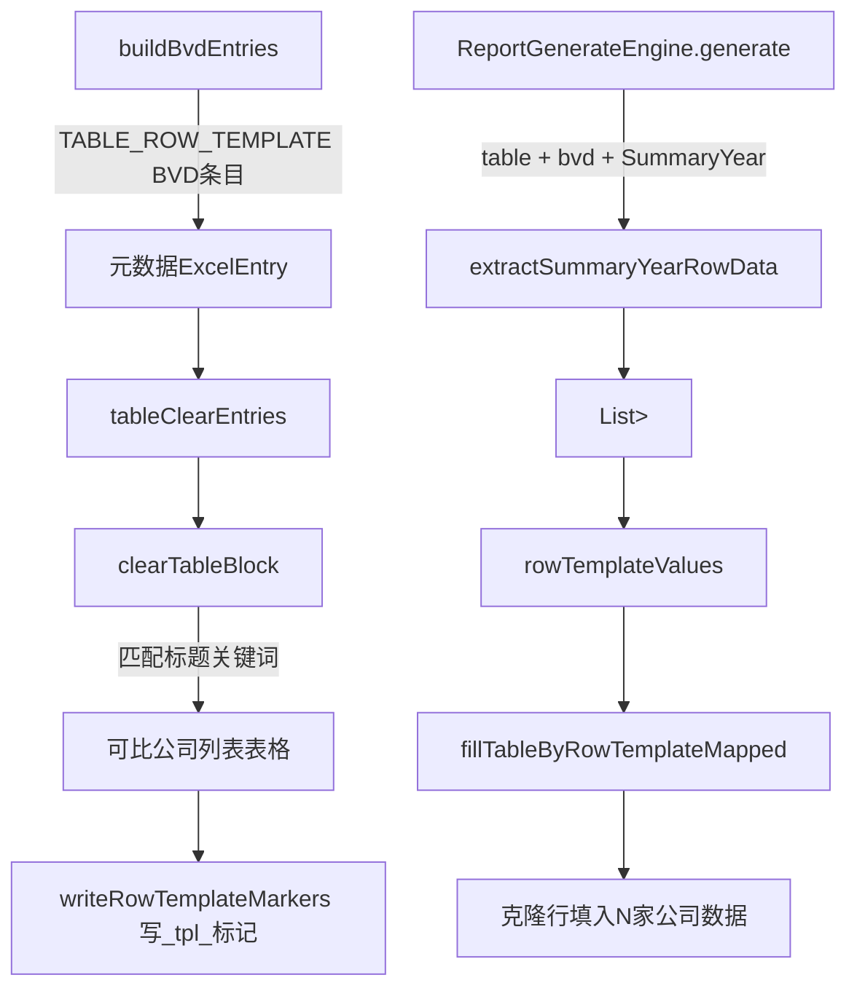

## 用户需求

将 `BVD数据模板-SummaryYear-第一张表格` 占位符的处理方式从单值文本模式改为**动态行模板表格**模式：

- **数据来源**：BVD Excel 的 `SummaryYear` sheet
- **读取范围**：行1（表头，跳过）到 D 列出现 MIN/LQ/MED/UQ/MAX 关键词行之前的所有可比公司数据行
- **写入字段**：A列（`#`）、B列（`COMPANY`）、E列（`NCP_CURRENT`）、F列（`NCP_PRIOR`）、G列（`Remarks`）共5个字段
- **Word 表格模式**：动态行模板（只有一个模板行，运行时自动克隆 N 行）

## 产品概述

可比公司数量因企业不同（SPX=10家，松莉=11家，派智能源更多），Word 报告中的"可比公司列表"表格行数需动态匹配数据行数，不能写死。通过复用现有 `TABLE_ROW_TEMPLATE` 机制（反向生成时写 `{{_tpl_}}` 模板标记，报告生成时按字段名克隆填充），实现 BVD 数据源的行模板表格填充。

## 核心功能

- **逆向引擎**：识别历史报告中可比公司列表表格，在第2行写入 `{{_tpl_}}{{_row_data}}{{_col_#}}` 等5列模板标记
- **报告引擎**：从 SummaryYear sheet 中动态读取所有数据行，按字段名填充，自动扩展/收缩表格行数
- **注册表配置**：统一更新 Java 静态注册表、V9 SQL 和新建 V13 迁移脚本

## 技术栈

现有 Java Spring Boot 项目，延用已有的 `ReverseTemplateEngine`、`ReportGenerateEngine`、POI XWPFDocument 操作及 EasyExcel 读取等所有现有机制，不引入新依赖。

## 实现思路

### 核心决策：不新增枚举值，用 dataSource=bvd + phType=TABLE_ROW_TEMPLATE 组合区分

当前 `PlaceholderType.TABLE_ROW_TEMPLATE` 类型已有完整的逆向写标记逻辑（`clearTableBlock` → `writeRowTemplateMarkers`）和报告填充逻辑（`fillTableByRowTemplateMapped`）。只需在以下两个路口新增 BVD 数据源的路由分支，即可复用全部现有机制：

1. **`buildBvdEntries`**（逆向引擎）：对 `dataSource=bvd` + `type=TABLE_ROW_TEMPLATE` 的注册条目，生成纯元数据 ExcelEntry（不读单值，不跳过），追加到 `tableClearEntries` 而非 `bvdTextEntries`，走 `clearTableBlock` 流程写模板标记
2. **`ReportGenerateEngine.generate`**（报告引擎）：在 `"table"` 类型分支内，新增 `"bvd".equals(dataSource) && "SummaryYear".equals(sourceSheet)` 判断，路由到新方法 `extractSummaryYearRowData`，放入 `rowTemplateValues`

### 链路全景

```
逆向生成：
  buildBvdEntries → 遇 TABLE_ROW_TEMPLATE BVD条目 → 生成 ExcelEntry(type=TABLE_ROW_TEMPLATE, columnDefs=[#,COMPANY,...])
  → 加入 tableClearEntries
  → clearTableBlock → 识别"可比公司列表"前置标题关键词对应表格
  → writeRowTemplateMarkers → 表格第2行写入 {{_tpl_...}}{{_row_data}}{{_col_#}} 等标记

报告生成：
  Placeholder(type=table, dataSource=bvd, sourceSheet=SummaryYear)
  → 新增分支：extractSummaryYearRowData → List<Map<字段名,值>>
  → 放入 rowTemplateValues
  → fillTableByRowTemplateMapped → 按字段名克隆行填充
```

### 数据提取逻辑（extractSummaryYearRowData）

```
- 跳过 row[0]（表头行）
- 遍历 row[1..N]：如果 D列（index=3）含 MIN/LQ/MED/UQ/MAX 任一词，停止
- 否则取：col0→"#", col1→"COMPANY", col4→"NCP_CURRENT", col5→"NCP_PRIOR", col6→"Remarks"
- 过滤完全空行（B列为空）
- 返回 List<Map<String,Object>>，_rowType 统一标记为 "data"
```

## 实现注意事项

- **`buildBvdEntries` 修改**：在方法开头（第902行 `if (reg.getCellAddress() == null) continue;` 之前）插入 `TABLE_ROW_TEMPLATE` 类型的特殊分支，生成元数据 ExcelEntry 并单独收集，最终加入总 result；注意此类型不读单值，无需 `getSheetRowsWithFallback`
- **`tableClearEntries` 过滤**：`ReverseTemplateEngine.java` 第488~491行（静态方法版）和第627~631行（动态注册表版）**两处都要同步修改**，均需追加 `|| e.getPlaceholderType() == PlaceholderType.TABLE_ROW_TEMPLATE`（BVD 行模板条目的 placeholderType 已是 TABLE_ROW_TEMPLATE，无需新枚举）
- **`ReportGenerateEngine` 路由**：在第104行 `rowTemplateSheets.contains(ph.getSourceSheet())` 的 `else` 分支之前，插入 `"bvd".equals(dataSource) && "SummaryYear".equals(ph.getSourceSheet())` 判断，不修改 `rowTemplateSheets` 常量集合（避免副作用）
- **`mapPhType` 修改**：`CompanyTemplatePlaceholderService.java` 第621行追加 `case "BVD_TABLE_ROW" -> "table"`（若 SQL 中 ph_type 改为此字符串）；或直接利用 SQL 中 `ph_type=TABLE_ROW_TEMPLATE`，现有 `mapPhType` 已处理，无需修改
- **NCP 数值格式化**：从 EasyExcel 读到的 NCP 是 `Double`，需调用已有的 `toPlainString` 方法转字符串（避免科学计数法）
- **V13 Flyway**：V12 已被 AP sheet 修复使用，本次用 V13

## 架构关系图



## 目录结构

```
src/main/java/com/fileproc/
├── report/service/
│   ├── ReportGenerateEngine.java          # [MODIFY] generate()新增BVD行模板路由分支；新增extractSummaryYearRowData方法
│   └── ReverseTemplateEngine.java         # [MODIFY] PlaceholderType枚举新增注释说明；buildBvdEntries新增TABLE_ROW_TEMPLATE分支；两处tableClearEntries过滤扩展；注册表第269行改为TABLE_ROW_TEMPLATE类型
├── template/service/
│   └── CompanyTemplatePlaceholderService.java  # [MODIFY] mapPhType方法追加TABLE_ROW_TEMPLATE BVD情况（若ph_type字符串一致则无需改）
└── resources/db/
    ├── V9__placeholder_registry_and_schema.sql  # [MODIFY] 第127行改ph_type、cell_address、title_keywords、column_defs
    └── V13__fix_summary_year_table_type.sql     # [NEW] Flyway升级脚本，UPDATE已部署数据库中该条记录
```

## 关键代码结构

### extractSummaryYearRowData 方法签名

```java
/**
 * 从 SummaryYear sheet 提取可比公司数据行（行模板用）。
 * 跳过表头行（index=0），读取至 D 列出现五分位关键词（MIN/LQ/MED/UQ/MAX）的行前停止。
 * 字段映射：col0→"#", col1→"COMPANY", col4→"NCP_CURRENT", col5→"NCP_PRIOR", col6→"Remarks"
 *
 * @param rows SummaryYear sheet 的全部行数据
 * @return 数据行列表，每行为字段名→值的Map，含 _rowType=data
 */
private List<Map<String, Object>> extractSummaryYearRowData(List<Map<Integer, Object>> rows)
```

### ReverseTemplateEngine.buildBvdEntries 新增分支伪码

```java
// 在 if (reg.getCellAddress() == null) continue; 之前插入：
if (reg.getType() == PlaceholderType.TABLE_ROW_TEMPLATE) {
    // BVD 行模板：不读单值，生成纯元数据 ExcelEntry，由 clearTableBlock 处理
    ExcelEntry entry = new ExcelEntry();
    entry.setPlaceholderName(reg.getPlaceholderName());
    entry.setDisplayName(reg.getDisplayName());
    entry.setDataSource("bvd");
    entry.setSourceSheet(reg.getSheetName());
    entry.setSourceField(null);
    entry.setLongText(false);
    entry.setPlaceholderType(PlaceholderType.TABLE_ROW_TEMPLATE);
    entry.setTitleKeywords(reg.getTitleKeywords());
    entry.setColumnDefs(reg.getColumnDefs());
    bvdTableRowEntries.add(entry); // 单独收集，最终 result.addAll(bvdTableRowEntries)
    continue;
}
```