## 用户需求

将 `BVD数据模板-SummaryYear-第一张表格` 占位符从单值文本模式升级为**可配置列的动态行模板表格**模式，后端实现方案 A+C：

- **方案 A（逆向自动识别）**：逆向引擎扫描 Word 报告中"可比公司列表"表格的实际列头文字，按内置默认关键词映射表自动匹配 SummaryYear sheet 列索引，动态确定 `column_defs`；列头无法匹配时降级使用注册表中已保存的 `column_defs`（系统级默认 `["#","COMPANY"]`）
- **方案 C 后端部分**：新增 2 个 API 接口供前端 Vue3 调用

1. `GET /api/placeholder-registry/bvd-table-columns?sheetName=SummaryYear` 查询该 BVD sheet 的所有可选列定义（fieldKey + 列头文字 + 列索引）
2. `POST /api/placeholder-registry/{id}/update-column-defs` 保存企业级自定义 `column_defs`（若无企业级条目则先基于系统级 override）

- **报告生成**：`ReportGenerateEngine` 按 `column_defs` 动态读取 SummaryYear 数据行，自动克隆 N 行填充
- 系统级默认 `column_defs = ["#","COMPANY"]`；企业级可扩展为任意列组合
- 前端 UI 实现由前端团队完成，后端只提供接口文档

## 产品概述

可比公司数量因企业不同（SPX=10家、松莉=11家），Word 报告中的"可比公司列表"表格行数需动态匹配，且各企业可能选用不同的列（如增加 NCP、Remarks、Sales 等）。通过扩展现有 `TABLE_ROW_TEMPLATE` 机制，结合两级注册表体系，实现 BVD 数据源的可配置动态行表格填充。

## 核心功能

- **逆向引擎**：识别 Word 历史报告中可比公司列表表格，自动解析列头映射 Excel 列，写入 `{{_tpl_}}{{_col_字段名}}` 行模板标记
- **报告引擎**：按 `column_defs` 从 SummaryYear sheet 读取可比公司数据行，动态克隆填充
- **注册表扩展**：新增可选列查询接口、企业级 column_defs 保存接口
- **数据库迁移**：V13 将已部署数据库中该条记录的 `ph_type/cell_address/column_defs` 更新

## 技术栈

现有 Java Spring Boot 项目，完全复用 `ReverseTemplateEngine`、`ReportGenerateEngine`、`PlaceholderRegistryService`、POI XWPFDocument、EasyExcel 等已有组件，不引入新依赖。

## 实现思路

### 核心决策：phType 改为 TABLE_ROW_TEMPLATE + 两处路由扩展

不新增 `PlaceholderType` 枚举值，利用 `dataSource=bvd` + `phType=TABLE_ROW_TEMPLATE` 的组合标识 BVD 行模板类型。需在两个关键路口插入新分支：

1. **`buildBvdEntries`**：在 `cellAddress==null` 跳过之前，检测 `TABLE_ROW_TEMPLATE` 类型，生成纯元数据 `ExcelEntry` 加入 `tableClearEntries`，走 `clearTableBlock → writeRowTemplateMarkers` 路径
2. **`ReportGenerateEngine.generate`**：在 `"table"` 类型分支内，新增 `"bvd".equals(dataSource) && "SummaryYear".equals(sourceSheet)` 判断，路由到新方法 `extractSummaryYearRowData`

### Word 列头自动映射（方案 A）

`clearTableBlock / writeRowTemplateMarkers` 处理 TABLE_ROW_TEMPLATE 时，在写标记前新增一步：扫描 Word 表格第0行（表头行）的每个单元格文字，按内置 `BVD_COLUMN_KEYWORD_MAP` 映射关键词到 fieldKey，动态构建本次使用的 `column_defs`；匹配失败时回退到 `ExcelEntry.columnDefs`（来自注册表）。

### 可选列接口（方案 C 后端）

新增工具方法 `buildSummaryYearColumnSchema`，读取 BVD Excel 的 SummaryYear 表头行（index=0），与内置映射表匹配，输出 `List<ColumnDef>`（fieldKey, label, colIndex, matched）供前端展示勾选。在 `PlaceholderRegistryController` 新增两个端点。

## 实现注意事项

- **`buildBvdEntries` 两处修改**：静态路径（第890行调用）和动态注册表路径（第896行）调用的是同一私有方法 `buildBvdEntries(path, name, registry)`，只改这一处即可覆盖两个调用点
- **`tableClearEntries` 过滤**：`ReverseTemplateEngine.java` 第488行（静态版）和第628行（动态版）**两处都要同步修改**，追加 `PlaceholderType.TABLE_ROW_TEMPLATE`；但 BVD 的 TABLE_ROW_TEMPLATE 条目 dataSource=bvd，`clearTableBlock` 内部已按 `titleKeywords` 匹配表格，两者不冲突
- **`ExcelEntry` 字段补全**：需确认 `ExcelEntry` 已有 `titleKeywords` 和 `columnDefs` 字段（查到 RegistryEntry 有，需确认 ExcelEntry 也有对应字段，否则需新增）
- **`extractSummaryYearRowData` 停止条件**：遍历到 D列（index=3）含 `MIN/LQ/MED/UQ/MAX` 任一关键词时停止；过滤 B列（index=1）为空的完全空行
- **`column_defs` 优先级**：Word列头自动匹配 > 注册表 column_defs > 硬编码默认 `["#","COMPANY"]`
- **V13 Flyway**：V12 已被 AP sheet 修复使用，本次用 V13；SQL 中 `ph_type` 改为 `TABLE_ROW_TEMPLATE`，`cell_address` 改为 `NULL`，`column_defs` 改为 `'["#","COMPANY"]'`
- **接口权限**：查询可选列接口使用已有 `registry:list` 权限；更新 column_defs 接口使用已有 `registry:edit` 权限，复用 `overrideForCompany` 逻辑
- **NCP 数值格式**：EasyExcel 读取的数值型单元格为 Double，调用现有 `toPlainString` 或 `String.valueOf` 转换，避免科学计数法

## 架构关系图

```mermaid
graph TD
    subgraph 逆向生成
        A[buildBvdEntries] -->|TABLE_ROW_TEMPLATE BVD条目| B[元数据ExcelEntry\ntitleKeywords+columnDefs]
        B --> C[tableClearEntries]
        C --> D[clearTableBlock]
        D -->|匹配titleKeywords| E[可比公司列表表格]
        E --> F[扫描Word表头行\n自动映射列头→fieldKey]
        F --> G[writeRowTemplateMarkers\n写_tpl_+_col_标记]
    end

    subgraph 报告生成
        H[ReportGenerateEngine.generate] -->|table+bvd+SummaryYear| I[extractSummaryYearRowData\n按column_defs动态读列]
        I --> J[List Map字段名值]
        J --> K[fillTableByRowTemplateMapped\n克隆N行填充]
    end

    subgraph 配置接口
        L[GET /bvd-table-columns] --> M[读SummaryYear表头行\n返回ColumnDef列表]
        N[POST /update-column-defs] --> O[overrideForCompany\n保存企业级column_defs]
    end
```



## 目录结构

```
src/main/java/com/fileproc/
├── report/service/
│   ├── ReverseTemplateEngine.java     # [MODIFY]
│   │   1. 静态注册表第269行：phType→TABLE_ROW_TEMPLATE, cellAddress→null,
│   │      titleKeywords→["可比公司列表","可比公司","Comparable Companies"],
│   │      columnDefs→["#","COMPANY"]
│   │   2. buildBvdEntries()：在 cellAddress==null 跳过之前，插入
│   │      TABLE_ROW_TEMPLATE 分支，生成元数据 ExcelEntry 加入单独列表，
│   │      方法末尾 result.addAll(bvdTableRowEntries)
│   │   3. 静态版 tableClearEntries 过滤（第488行）：追加
│   │      || e.getPlaceholderType() == PlaceholderType.TABLE_ROW_TEMPLATE
│   │   4. 动态版 tableClearEntries 过滤（第628行）：同上追加
│   │   5. 新增静态常量 BVD_COLUMN_KEYWORD_MAP：Word列头关键词→fieldKey映射表
│   │   6. 新增私有方法 inferColumnDefsFromWordTable(XWPFTable, List<String> fallback)：
│   │      扫描表头行单元格文字，匹配关键词返回 List<String> fieldKeys；
│   │      无匹配时返回 fallback
│   │   7. clearTableBlock / writeRowTemplateMarkers 调用 inferColumnDefsFromWordTable
│   │      动态确定本次写入的 columnDefs
│   └── ReportGenerateEngine.java      # [MODIFY]
│       1. generate() 第104行 "table" 类型分支内，在 rowTemplateSheets.contains() 之前
│          新增：if ("bvd".equals(dataSource) && "SummaryYear".equals(ph.getSourceSheet()))
│          → 调用 extractSummaryYearRowData(rows, ph.getColumnDefs())
│          → rowTemplateValues.put(ph.getName(), rowData)
│       2. 新增私有方法 extractSummaryYearRowData(
│              List<Map<Integer,Object>> rows, List<String> columnDefs)：
│          跳过row[0]表头，遍历到D列含MIN/LQ/MED/UQ/MAX停止，
│          按columnDefs中fieldKey→colIndex映射提取数据，
│          过滤B列空行，返回 List<Map<String,Object>>（含_rowType=data）
│       3. Placeholder 实体若无 getColumnDefs() 方法，需确认从 source_field 或
│          注册表动态读取 column_defs（见实现注意事项）
├── registry/
│   ├── controller/PlaceholderRegistryController.java  # [MODIFY]
│   │   新增两个端点：
│   │   1. GET /placeholder-registry/bvd-table-columns?sheetName=&bvdFilePath=
│   │      （或从 system_template 读取 bvd_excel_path）
│   │      返回 List<BvdColumnDef>（fieldKey, label, colIndex, defaultSelected）
│   │   2. POST /placeholder-registry/{id}/update-column-defs?companyId=
│   │      body: {columnDefs: ["#","COMPANY","NCP_CURRENT"]}
│   │      若已有企业级条目则直接 update；否则先 overrideForCompany 再 update column_defs
│   └── service/PlaceholderRegistryService.java        # [MODIFY]
│       新增方法：
│       1. buildSummaryYearColumnSchema(String bvdFilePath): 读取SummaryYear表头行，
│          与 BVD_COLUMN_KEYWORD_MAP 匹配，返回 List<BvdColumnDef>
│       2. updateColumnDefs(String registryId, String companyId, List<String> columnDefs):
│          查找该企业是否已有同名企业级条目，有则update，无则先overrideForCompany再update
└── resources/db/
    ├── V9__placeholder_registry_and_schema.sql         # [MODIFY]
    │   第127行：ph_type改为'TABLE_ROW_TEMPLATE', cell_address改为NULL,
    │   column_defs改为'["#","COMPANY"]',
    │   title_keywords改为'["可比公司列表","可比公司","Comparable Companies"]'
    └── V13__fix_summary_year_table_type.sql            # [NEW]
        UPDATE placeholder_registry
        SET ph_type='TABLE_ROW_TEMPLATE', cell_address=NULL,
            column_defs='["#","COMPANY"]',
            title_keywords='["可比公司列表","可比公司","Comparable Companies"]',
            updated_at=NOW()
        WHERE level='system'
          AND placeholder_name='BVD数据模板-SummaryYear-第一张表格';
```

## 关键代码结构

### BvdColumnDef DTO（接口返回类型）

```java
/** 前端列选择接口返回的列定义 */
@Data
public class BvdColumnDef {
    /** 字段键（对应 column_defs 数组元素），如 "NCP_CURRENT" */
    private String fieldKey;
    /** Excel 原始列头文字，如 "2020-2022 NCP" */
    private String label;
    /** Excel 列索引（0-based） */
    private int colIndex;
    /** 是否默认选中（系统级 column_defs 中包含的列） */
    private boolean defaultSelected;
}
```

### extractSummaryYearRowData 方法签名

```java
/**
 * 从 SummaryYear sheet 按 columnDefs 动态提取可比公司数据行。
 * 跳过 row[0]（表头行），读取到 D列（index=3）含五分位关键词行前停止。
 * @param rows       SummaryYear sheet 全部行数据
 * @param columnDefs 需要提取的字段名列表，如 ["#","COMPANY","NCP_CURRENT"]
 * @return 数据行列表，每行为字段名→值的 Map，含 _rowType=data
 */
private List<Map<String, Object>> extractSummaryYearRowData(
        List<Map<Integer, Object>> rows, List<String> columnDefs)
```

### 前端对接接口文档（供前端团队参考）

**1. 查询可选列定义**

```
GET /api/placeholder-registry/bvd-table-columns?sheetName=SummaryYear
权限：registry:list
响应：
{
  "code": 200,
  "data": [
    {"fieldKey":"#",           "label":"#",              "colIndex":0,  "defaultSelected":true},
    {"fieldKey":"COMPANY",     "label":"COMPANY",         "colIndex":1,  "defaultSelected":true},
    {"fieldKey":"FY2023_STATUS","label":"FY2023 Status",  "colIndex":2,  "defaultSelected":false},
    ...
  ]
}
```

**2. 保存企业级自定义列**

```
POST /api/placeholder-registry/{systemRegistryId}/update-column-defs?companyId={companyId}
权限：registry:edit
请求体：{"columnDefs": ["#","COMPANY","NCP_CURRENT","NCP_PRIOR"]}
响应：{"code":200, "data": {更新后的PlaceholderRegistry条目}}
说明：若该企业已有同名企业级条目则直接更新 column_defs；否则先 override 再更新
```

## Agent Extensions

### SubAgent

- **code-explorer**
- Purpose: 在执行各 todo 任务时，精确定位 clearTableBlock、writeRowTemplateMarkers 方法的具体行号和实现细节，以及 ExcelEntry 是否已有 titleKeywords/columnDefs 字段，Placeholder 实体是否有 columnDefs 字段
- Expected outcome: 确认所有修改点的精确位置，避免遗漏或错误修改