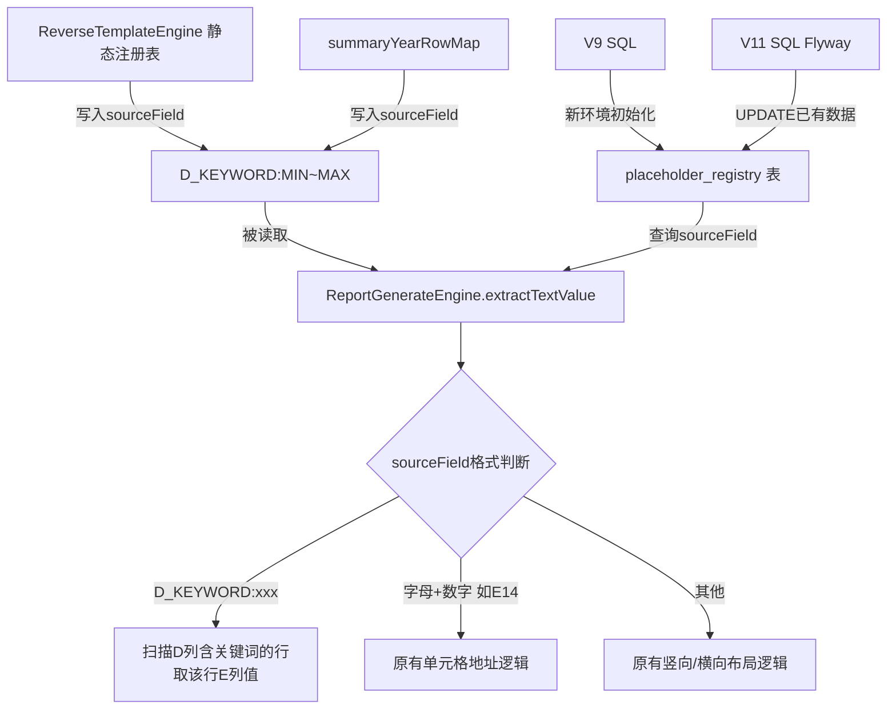

## 用户需求

修复 BVD 数据模板 `SummaryYear` sheet 中 `MIN/LQ/MED/UQ/MAX` 五个占位符的取值错误问题。

## 问题概述

当前代码在注册表和逆向引擎中将五个占位符的 `sourceField` 硬编码为 `E14~E18` 固定坐标。由于不同企业 BVD 文件中可比公司数量不同，这五行数据所在的行号是动态变化的，导致非标准行数的企业取值全部错误。

- SPX：MIN 在 E14（凑巧正确）
- 松莉2023：MIN 在 E16（取错）
- 派智能源2023：MIN 在 E25（取错）

## 核心功能

- 在 `ReportGenerateEngine.extractTextValue` 中新增 `D_KEYWORD:xxx` 格式识别，通过扫描 D 列（index=3）查找含指定关键词的行，取该行 E 列（index=4）的值
- 将 `ReverseTemplateEngine` 静态注册表中 `E14~E18` 改为 `D_KEYWORD:MIN` 等动态格式
- 同步修改 `summaryYearRowMap` 中写死的 `E14~E18` 为 `D_KEYWORD:xxx` 格式
- 同步修改 SQL 初始化脚本，为新环境部署正确的格式；同时添加 Flyway 升级脚本修复已存在数据库中的旧数据

## 技术栈

- **后端语言**：Java（Spring Boot）
- **数据库迁移**：Flyway（已有 V9，新增 V11）
- **核心文件**：`ReportGenerateEngine.java`、`ReverseTemplateEngine.java`、`V9__placeholder_registry_and_schema.sql`、新增 `V11__fix_summary_year_source_field.sql`

---

## 实现方案

### 核心思路

引入 `D_KEYWORD:xxx` 这一特殊 `sourceField` 格式，作为"动态行定位"指令：解析时扫描 SummaryYear sheet 的 D 列（index=3），找到首个文本包含指定关键词（如 `MIN`、`LQ`）的行，取该行 E 列（index=4）的数值。这样无论可比公司有多少行，五个分位数的行位置均可被正确定位。

### 关键设计决策

1. **格式选择 `D_KEYWORD:xxx`**：与已有 `B1`、`A1` 等单元格地址格式在语法上互不冲突，`if-else` 优先判断即可，无需修改其他逻辑分支。
2. **关键词大小写不敏感匹配 + `contains` 语义**：D 列实际内容如 `"Minimum"/"MIN"/"最低值"` 等因模板版本略有差异，使用 `toUpperCase().contains(keyword.toUpperCase())` 兼容更宽泛的格式，同时向下兼容。
3. **仅作最小范围改动**：`extractTextValue` 方法只在现有三种模式之前增加一个新分支，不触碰其他分支；注册表和 `summaryYearRowMap` 只替换五个坐标字符串，不改结构。
4. **数据库双轨修复**：

- 修改 `V9` SQL 源码，保证新环境初始化正确；
- 新增 `V11` Flyway 升级脚本，对已部署数据库中 `placeholder_registry` 表的旧坐标执行 `UPDATE`，无需手动操作。

### 性能与可靠性

- D 列扫描是对单个 sheet 的行列遍历，数据量最多几十行，时间复杂度 O(n)，无性能瓶颈。
- 找不到关键词时记录 `warn` 日志后返回 `null`，与现有行为一致，不引入异常。

---

## 架构设计



---

## 目录结构

```
src/
├── main/
│   ├── java/com/fileproc/report/service/
│   │   ├── ReportGenerateEngine.java          # [MODIFY] extractTextValue 方法新增 D_KEYWORD 分支
│   │   └── ReverseTemplateEngine.java         # [MODIFY] 静态注册表5行 + summaryYearRowMap 5行，E14~E18 → D_KEYWORD:xxx
│   └── resources/db/
│       ├── V9__placeholder_registry_and_schema.sql  # [MODIFY] 5条INSERT的sourceField改为D_KEYWORD格式
│       └── V11__fix_summary_year_source_field.sql   # [NEW] Flyway升级脚本，UPDATE已有库中的旧坐标
```

---

## 关键代码结构

`D_KEYWORD` 分支逻辑插入位置（`extractTextValue` 方法最前端，在单元格地址判断之前）：

```java
// 新增：D列关键词动态定位格式，如 "D_KEYWORD:MIN"
if (field.startsWith("D_KEYWORD:")) {
    String keyword = field.substring("D_KEYWORD:".length()).trim().toUpperCase();
    for (Map<Integer, Object> row : rows) {
        Object dCell = row.get(3); // D列，index=3
        if (dCell != null && dCell.toString().toUpperCase().contains(keyword)) {
            Object eCell = row.get(4); // E列，index=4
            if (eCell != null && !eCell.toString().isBlank()) {
                return eCell.toString().trim();
            }
        }
    }
    log.warn("[ReportEngine] D列未找到含关键词 '{}' 的行（sheet={}）", keyword, sheetName);
    return null;
}
```

`V11` 升级脚本核心内容：

```sql
UPDATE placeholder_registry SET source_field = 'D_KEYWORD:MIN' WHERE name = 'BVD数据模板-SummaryYear-MIN' AND level = 'system';
UPDATE placeholder_registry SET source_field = 'D_KEYWORD:LQ'  WHERE name = 'BVD数据模板-SummaryYear-LQ'  AND level = 'system';
UPDATE placeholder_registry SET source_field = 'D_KEYWORD:MED' WHERE name = 'BVD数据模板-SummaryYear-MED' AND level = 'system';
UPDATE placeholder_registry SET source_field = 'D_KEYWORD:UQ'  WHERE name = 'BVD数据模板-SummaryYear-UQ'  AND level = 'system';
UPDATE placeholder_registry SET source_field = 'D_KEYWORD:MAX' WHERE name = 'BVD数据模板-SummaryYear-MAX' AND level = 'system';
```