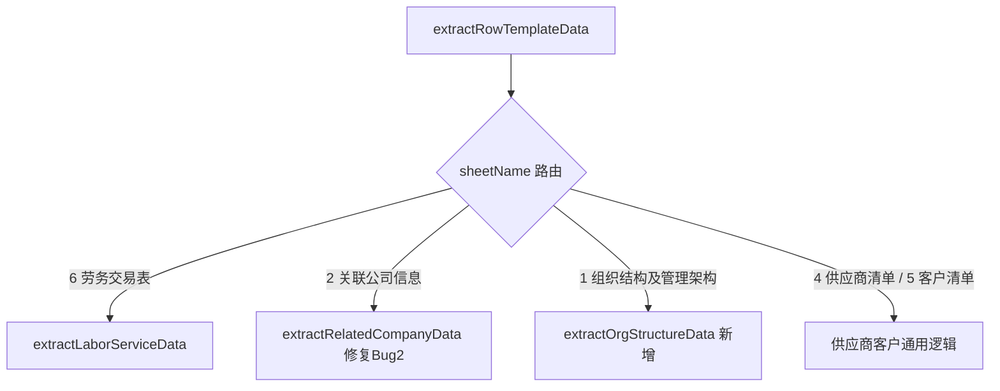

## 用户需求

修复 `TABLE_ROW_TEMPLATE` 占位符类型在 `ReportGenerateEngine.java` 中的两个 Bug，并保持现有代码风格一致。

## 产品概述

该项目为文件处理后端系统，支持从 Excel 清单模板中提取结构化数据并填充到报告模板中。`ReportGenerateEngine` 负责根据 Sheet 名将数据路由到不同的专用提取方法。当前 `1 组织结构及管理架构` 和 `2 关联公司信息` 两个 Sheet 的数据提取存在 Bug。

## 核心功能

### Bug1：`1 组织结构及管理架构` 未被正确路由

- `rowTemplateSheets` 集合（第84行）缺少 `"1 组织结构及管理架构"`，导致该 Sheet 走 `extractTableData` 旧路径
- 需将其加入路由集合，并在 `extractRowTemplateData` 中新增分支，路由到新建的 `extractOrgStructureData` 方法
- 新方法逻辑：读取 index=5（行6）作为表头行，从 index=6（行7）起扫描，col0（主要部门列）字符串非空为有效数据行

### Bug2：`2 关联公司信息` 数据起始行错误

- `extractRelatedCompanyData` 从 index=5（行6）开始扫描，但行6实为列序号辅助行（col0="1"，col1="2"...均为纯数字），被误判为第一条有效数据
- 修复方案：结合双重判断——col0 非空 **且** col1（关联方名称列）非空字符串才收录；或直接将扫描起始行从 index=5 改为 index=6，同步更新方法注释中的 Excel 结构说明

## 技术栈

- 语言：Java（Spring Boot 项目）
- Excel 读取：EasyExcel（行数据结构为 `List<Map<Integer, Object>>`）
- 日志：Slf4j（与现有代码一致）

## 实现方案

### 整体策略

基于已验证的 Excel 结构（派智、远化、松莉三份清单）进行精确修复，遵循现有 `extractRelatedCompanyData` / `extractLaborServiceData` 的代码风格，不引入新依赖或新模式。

### Bug1 修复（`1 组织结构及管理架构`）

1. **修改 `rowTemplateSheets` 集合**（第84行）：`Set.of(...)` 为不可变集合，将其扩展为包含 `"1 组织结构及管理架构"` 的五元素集合
2. **在 `extractRowTemplateData` 方法头部**新增路由分支（参照第353-360行已有分支模式）：

```java
if ("1 组织结构及管理架构".equals(sheetName)) {
return extractOrgStructureData(rows);
}
```

3. **新增 `extractOrgStructureData` 方法**，结构与 `extractRelatedCompanyData` 对称：

- 读取 index=5（行6）为表头行，构建 `colIdx→字段名 Map`
- 从 index=6（行7）起扫描，col0（主要部门）`toString().trim()` 非空为有效行
- 按 `colNameMap` 逐列提取，输出 `Map<字段名, 值>`
- 方法注释完整描述 Excel 结构（行0-4：说明文字，行5：表头，行6起：数据）

### Bug2 修复（`2 关联公司信息`）

采用**双重条件过滤**（更健壮，兼容未来格式微调）：

- 原条件：`col0 != null && !col0.toString().trim().isEmpty()`
- 新条件：`col0 非空` **且** `col1（关联方名称，colIdx=1）非空字符串`
- 列序号辅助行（行6，index=5）的 col1 为纯数字 "2"，不是真实的关联方名称，双重判断可准确跳过
- 同时更新方法 Javadoc 中"行5（index=5）起"为"行5（index=4）：表头，行6（index=5）：序号辅助行，行7（index=6）起：数据行"

### 性能与兼容性

- 修改范围极小，仅涉及两个方法内部逻辑及一处集合定义，不影响其他 Sheet 提取路径
- 无需修改 `ReverseTemplateEngine.java`（注册表中 `availableColDefs` 配置已正确）
- `Set.of` 扩展后仍为不可变集合，线程安全性不变

## 架构设计



## 目录结构

```
src/main/java/com/fileproc/report/service/
└── ReportGenerateEngine.java   # [MODIFY]
    - 第84行：rowTemplateSheets 集合增加 "1 组织结构及管理架构"
    - extractRowTemplateData 方法：在"2 关联公司信息"分支之前新增"1 组织结构及管理架构"路由分支
    - extractRelatedCompanyData 方法：Bug2修复——循环体内增加 col1 非空二次校验，并更新方法 Javadoc
    - 新增 extractOrgStructureData 私有方法：组织结构专用提取，index=5取表头，index=6起扫描数据
```