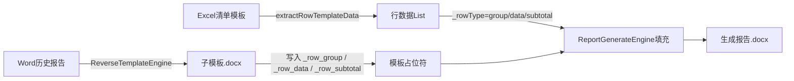

## 用户需求

修复两处行类型识别逻辑 Bug，使 TABLE_ROW_TEMPLATE 流程端到端正确运行：逆向生成子模板时能识别出正确的 group/subtotal/data 行；报告生成时能从 Excel 清单模板中正确读取并分类数据行。

## 产品概述

在"逆向模板引擎（ReverseTemplateEngine）"和"报告生成引擎（ReportGenerateEngine）"中，TABLE_ROW_TEMPLATE 类型的表格行类型识别规则与实际文档结构不匹配，导致：

1. 逆向生成子模板时，group 行（分组标题行）因"其余列非空"而无法被识别，subtotal/data 行分类也不准确，最终子模板缺少 `{{_row_group}}` 和 `{{_row_subtotal}}` 模板行。
2. 报告生成时，从 Excel 读取数据行时 data 行判断依赖"col1 为纯数字序号"，而实际 Excel 的 col1 存的是供应商名称，导致 data 行完全被跳过，表格无法正常填充。

## 核心功能

### 修复1：ReverseTemplateEngine — group 行识别规则（约 L1735~L1748）

**当前错误规则**：group = col0 非空 && 其余列均为空

**真实表格结构**：group 行的 col0 有值（如"境外采购"），col1 也有值（供应商名称），其余列也有金额/占比数据；只有 subtotal 行才含"小计/合计/总计"。

**新规则**（优先级从高到低）：

- subtotal：allStr 含"小计/合计/总计"（规则不变）
- group：col0 非空 && 不是 subtotal（不要求其余列为空）
- data：col0 为空 && allStr 非空 && 不是 subtotal

### 修复2：ReportGenerateEngine.extractRowTemplateData — data 行识别规则（约 L405~L420）

**当前错误规则**：data = col1 为纯数字序号（`^\d+）或"其他"

**真实 Excel 结构**：data 行的 col1 存的是供应商/客户名称字符串（非纯数字），col0 为空。

**新规则**（在原有 group/subtotal 判断之后新增兜底）：

- 保留原有 group 判断（col0 非空 && col1 空 && colName 空）
- 保留原有 subtotal 判断（col1 含"小计/合计/总计"）
- 新增 data 兜底：col0 为空 && colName（名称列）非空 && colName 不含"小计/合计/总计" → data 行
- 原有仅依赖纯数字序号的逻辑作为额外兜底，或在新规则覆盖后可合并简化

## 技术栈

- 现有项目：Java + Spring Boot + Apache POI（操作 Word .docx）+ EasyExcel（读取 Excel）
- 修改文件：两个 Java Service 类，均为纯逻辑修改，无需引入新依赖

## 实现思路

两处修复均为**条件判断逻辑替换**，不改变方法签名、数据结构或调用链，属于最小侵入式修复。通过对齐"Word 历史报告表格"与"Excel 清单模板"的真实列布局，将行类型判断规则从错误的结构假设改为与实际数据吻合的规则。

### 修复1 策略（ReverseTemplateEngine L1735~L1748）

删除旧的"其余列均为空才是 group"逻辑，替换为：

```
subtotal 优先 → col0 非空即为 group → col0 为空且有内容为 data
```

这与 `extractRowTemplateData` 中 group 行的语义保持一致（col0 有值 = 分组标题），确保两端规则对称。

### 修复2 策略（ReportGenerateEngine L405~L420）

在原有 `isSeqNum || isOther` 判断块之后，新增一个兜底规则：

```
col0 为空 && finalNameColIdx 列（名称列）非空 && 不含小计类词 → data 行
```

名称来源从 `colNameStr`（动态定位的"名称"列）读取，与已有逻辑完全一致，不引入新变量。同时保留原有 `isSeqNum/isOther` 分支以向后兼容旧格式 Excel。

## 实现细节

- **ReverseTemplateEngine**：仅修改 L1735~L1748 的 group 识别 if 块，移除 `otherColsEmpty` 循环，改为 `!col0Str.isEmpty()` 直接命中 group；同时将 data 行的兜底条件收紧为 `col0Str.isEmpty() && !allStr.isEmpty()`，避免空行被误识别。
- **ReportGenerateEngine**：在 L420（`continue;` 之后）追加新的 if 块处理名称列非空的 data 行；`buildRowMap` 调用方式与已有代码完全一致，零新增方法。
- **向后兼容**：两处修改均为增量/替换逻辑，不改变 subtotal 识别规则（已正确），不影响 TABLE_FINANCE 等其他分支，不改变任何公开方法签名。
- **日志保留**：现有 `log.debug` 中打印 `group/data/subtotal` 行索引的语句无需修改，修复后日志输出会自然变为正确值。

## 架构设计

两处修改均在各自 Service 类内部，属于同一功能链路的两端（逆向生成 ↔ 正向填充），修改后语义对称：



两端行类型识别规则修复后达到语义一致，填充引擎才能将 `_rowType` 正确路由到对应模板行。

## 目录结构

```
src/main/java/com/fileproc/report/service/
├── ReverseTemplateEngine.java   # [MODIFY] 修复 L1735~L1748 group 行识别逻辑：
│                                #   删除 otherColsEmpty 循环及其 if 条件，
│                                #   改为 col0 非空 && 非 subtotal → group，
│                                #   col0 为空 && allStr 非空 → data
└── ReportGenerateEngine.java    # [MODIFY] 修复 L405~L420 extractRowTemplateData data 行识别：
                                 #   在 isSeqNum/isOther 分支后追加兜底规则，
                                 #   col0 为空 && colNameStr 非空 && 不含小计词 → data 行
```