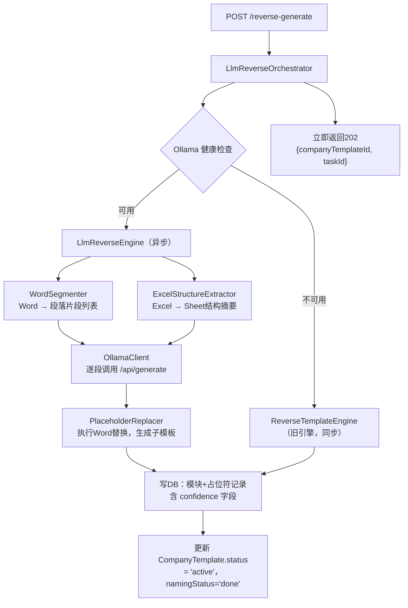

## 用户需求

利用本地私有化部署的 Ollama + Qwen2.5-7B 大模型，对企业历史报告（Word）和年度数据文件（两个 Excel）进行语义理解，直接输出合理的占位符规则，替代现有的纯字符串匹配方案，实现"上传文件 → 完全自动生成占位符化子模板"的零人工干预体验。

## 产品概述

重构反向生成流程的核心引擎：Java 负责 Word 文档分段、Excel 结构化提取，将每个文档片段连同 Excel 数据结构一起发给本地 Ollama 大模型，大模型理解语义后输出结构化占位符规则（含置信度），Java 执行替换并生成子模板 Word 文件。置信度高的项自动确认，置信度低的项仅在占位符列表页标注提示，整个过程无需用户手动确认任何占位符。原有字符串匹配引擎保留，作为 Ollama 不可用时的自动降级方案。

**约束**：

- 纯本地部署 Ollama，数据不出服务器
- 服务器：8核16G 无GPU阿里云 ECS，CPU 推理
- 准确率优先，速度不重要，异步处理可接受

## 核心功能

- **分段语义解析**：Word 按章节标题分段，每段文本 + 相关 Excel 结构一起喂给大模型，大模型输出该段中所有可替换字段的 JSON 规则
- **完全自动替换**：大模型输出置信度 ≥ 0.8 的项直接执行替换写入子模板（status=confirmed），低于 0.8 的项同样替换但在列表中标记为 uncertain 提示用户复查
- **置信度提示**：反向生成完成结果中返回 lowConfidenceCount；占位符列表页中 uncertain 状态条目标注（低置信度提示），不阻塞任何流程
- **自动降级**：系统启动或请求时检测 Ollama 健康状态，不可用时无感知切换到旧字符串匹配引擎，接口返回结果结构不变
- **配置化管理**：Ollama 地址、模型名、超时、开关等通过配置文件管理，支持环境变量注入

## 技术栈

- **框架**：Spring Boot 3.2.5 + Java 17（与现有项目完全一致）
- **大模型接入**：Ollama HTTP API（`/api/generate`），使用 Spring `RestTemplate`（已有依赖，无需新增）
- **文档解析**：Apache POI XWPF 5.2.5（已有依赖），EasyExcel 3.3.4（已有依赖）
- **异步**：Spring `@Async` + 新增 `llmExecutor` 线程池（核心线程数1，CPU推理不适合高并发）
- **数据库迁移**：Flyway V7 迁移脚本新增 `confidence` 字段
- **配置绑定**：`@ConfigurationProperties(prefix = "llm.ollama")`

---

## 实现方案

### 整体策略

新增独立的 `com.fileproc.llm` 包，包含配置、HTTP 客户端、Word 分段器、Excel 提取器、大模型反向引擎、编排器六个模块。`CompanyTemplateController.reverseGenerate()` 注入 `LlmReverseOrchestrator`，由编排器决策路由（大模型引擎 or 旧字符串匹配引擎），旧 `ReverseTemplateEngine` 完全保留不改动。

**核心技术决策**：

1. **分段策略**：按 Word 中带样式的标题段落（Heading1/Heading2 或特定字号/加粗段落）为边界分段，每段不超过 1500 字，超过则按段落数强制切分。这样每次 Prompt 输入量可控（约 2000 tokens），7B 模型在上下文窗口内可稳定输出。

2. **Prompt 设计**：每次调用只处理一个 Word 片段，同时传入两个 Excel 的 Sheet 列表摘要（Sheet名 + 前3行数据），要求大模型以纯 JSON 格式输出（`stream: false`），避免流式解析复杂度。JSON Schema 严格定义，降低模型输出不规范的风险。

3. **JSON 解析容错**：大模型输出可能在 JSON 外包裹说明文字，用正则提取 `[...]` 数组，解析失败则该片段跳过（记录 warn 日志），不影响其他片段。

4. **置信度阈值 0.8**：confidence ≥ 0.8 → status=confirmed；< 0.8 → status=uncertain（在列表中标红提示，但已执行替换，不阻塞流程）。大模型无法给出 confidence 时默认 0.5（当作低置信度处理）。

5. **异步处理**：整个大模型反向生成流程在 `llmExecutor` 线程池中异步执行，`reverseGenerate` 接口立即返回 202（含 `companyTemplateId` 和 `taskId`），前端轮询 `GET /company-template/{id}/status` 获取进度。

6. **降级路由**：编排器在每次反向生成请求前先调 Ollama `/api/tags` 做健康检查（超时3秒），失败则同步调用旧引擎并在响应中标注 `engineUsed: "fallback"`。

---

## 架构设计



---

## 目录结构

```
src/main/java/com/fileproc/
├── llm/                                        # [NEW] 大模型集成模块
│   ├── config/
│   │   └── OllamaProperties.java               # [NEW] @ConfigurationProperties 配置绑定，映射 llm.ollama.* 配置节（baseUrl, model, enabled, timeoutSeconds, confidenceThreshold）
│   ├── client/
│   │   └── OllamaClient.java                   # [NEW] 封装 Ollama HTTP API 调用，包含 generate()（单次推理）和 isHealthy()（健康检查），用 RestTemplate，超时从 OllamaProperties 读取，解析 /api/generate 的 response 字段
│   ├── dto/
│   │   ├── PlaceholderRule.java                # [NEW] 大模型输出的单条占位符规则：placeholder（占位符标识）, displayName（业务名称）, originalValue（在Word中的原始值）, sheetName（来源Sheet）, fieldAddr（单元格地址）, dataSource（list/bvd）, type（text/table）, confidence（0-1）
│   │   └── SegmentAnalysisResult.java          # [NEW] 单个 Word 片段的分析结果：segmentIndex, segmentText, rules（List<PlaceholderRule>）, parseSuccess
│   └── service/
│       ├── WordSegmenter.java                  # [NEW] Word 文档分段器：mergeRuns（复用旧引擎逻辑）→ 按标题样式切段 → 超长段按段落数截断，返回 List<WordSegment>（含原始段落/表格元素引用和文本内容）
│       ├── ExcelStructureExtractor.java        # [NEW] Excel 结构提取器：读取所有 Sheet，每个Sheet提取列名行+前5行数据，生成精简的结构摘要字符串（用于拼入 Prompt），避免传入过多token
│       ├── LlmReverseEngine.java               # [NEW] 大模型驱动反向引擎核心：协调 WordSegmenter + ExcelStructureExtractor + OllamaClient，逐段分析，收集 PlaceholderRule，调用 WordReplacer 执行替换，返回与旧引擎兼容的 ReverseResult 结构
│       └── LlmReverseOrchestrator.java         # [NEW] 路由编排器（@Async("llmExecutor")）：健康检查 → 路由到 LlmReverseEngine 或旧 ReverseTemplateEngine，完成后更新任务状态到 Redis，供前端轮询
│
├── common/
│   └── AsyncConfig.java                        # [MODIFY] 新增 llmExecutor Bean（corePoolSize=1, maxPoolSize=2, queueCapacity=10，线程名前缀 "llm-reverse-"）
│
├── template/
│   ├── entity/
│   │   └── CompanyTemplatePlaceholder.java     # [MODIFY] 新增 confidence 字段（Float 类型，@TableField("confidence")）
│   └── controller/
│       └── CompanyTemplateController.java      # [MODIFY] reverseGenerate() 改为：注入 LlmReverseOrchestrator，提交异步任务，立即返回 202（含 taskId）；新增 GET /{id}/reverse-status 轮询接口
│
└── report/
    └── service/
        └── ReverseTemplateEngine.java          # [NO CHANGE] 完全保留，作为降级引擎

src/main/resources/
├── application.yml                             # [MODIFY] 新增 llm.ollama.* 配置节（baseUrl/model/enabled/timeoutSeconds/confidenceThreshold），支持环境变量注入
└── db/
    └── V7__add_placeholder_confidence.sql      # [NEW] 条件 ALTER TABLE 为 company_template_placeholder 新增 confidence FLOAT 字段和对应索引
```

---

## 关键代码结构

### PlaceholderRule（大模型输出的核心 DTO）

```java
// 大模型每次调用返回 JSON 数组，每个元素反序列化为此类
public class PlaceholderRule {
    private String placeholder;      // 占位符标识，如 "list-基本信息-B3"
    private String displayName;      // 业务名称，如 "企业名称"
    private String originalValue;    // Word 中的原始文本，如 "华为技术有限公司"
    private String sheetName;        // 来源 Sheet 名，如 "基本信息"
    private String fieldAddr;        // 单元格地址，如 "B3"（可为空，大模型推断不出时）
    private String dataSource;       // "list" 或 "bvd"
    private String type;             // "text" 或 "table"
    private double confidence;       // 0.0 ~ 1.0
}
```

### Prompt 模板（关键设计）

```
你是一个财税文档分析专家。以下是一份企业关联交易报告的片段，以及对应的两个Excel数据文件结构摘要。
请识别报告片段中哪些文本内容来自Excel数据，以JSON数组格式输出，不要输出其他任何文字。

【报告片段】
{segmentText}

【清单Excel结构（list）】
{listExcelSummary}

【BVD Excel结构（bvd）】
{bvdExcelSummary}

输出格式（仅输出JSON数组）：
[{"placeholder":"唯一标识","displayName":"业务名称","originalValue":"报告中的原文","sheetName":"Sheet名","fieldAddr":"单元格地址或空","dataSource":"list或bvd","type":"text或table","confidence":0.95}]
```

## Agent Extensions

### SubAgent

- **code-explorer**
- 用途：在实现各模块时探索现有代码中的 EasyExcel 用法模式、POI XWPF 操作模式、以及 BizException/R/TenantContext 等公共工具的使用方式，确保新代码风格与项目一致
- 预期结果：新增的 llm 模块代码风格、异常处理、日志格式完全与现有代码保持一致