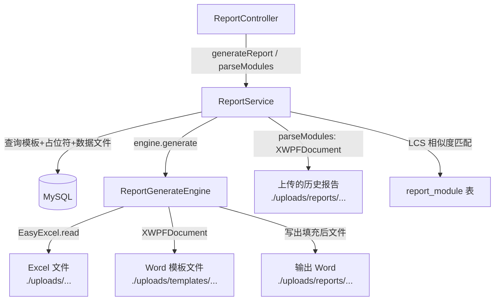

## 用户需求

补充实现后端项目中唯一缺失的功能模块，使后端代码与 `java-backend-plan` 计划文档完全吻合。

## 产品概述

在现有 Spring Boot 后端基础上，补全报告生成引擎核心功能：创建独立的 `ReportGenerateEngine.java` 负责 Word 模板填充与输出，同时完善 `ReportService` 中的 `generateReport`（调用引擎）和 `parseModules`（章节解析）两个业务方法，并在 `pom.xml` 中补充 Apache POI 依赖。

## 核心功能

- **ReportGenerateEngine（新建）**：读取模板 Word 文件，用 EasyExcel 读取 List/BvD Excel 数据，按 `Placeholder` 定义替换文档中的文本占位符、表格占位符、图表占位符，最终输出填充后的 Word 文件并保存到本地存储目录
- **ReportService.generateReport（完善）**：在创建数据库记录后，从 `template` 表查找匹配的模板，调用 `ReportGenerateEngine` 执行实际生成，将输出文件路径和大小写回 `report` 记录
- **ReportService.parseModules（完善）**：用 Apache POI 读取上传的历史报告 Word 文档，提取所有一级标题，与 `report_module` 表中配置的模块 `name/code` 进行相似度匹配，返回匹配模块列表及置信度
- **pom.xml（补充依赖）**：添加 `poi-ooxml`（操作 `.docx`）依赖，版本与 Spring Boot 3.2.5 兼容

## 技术栈

- **现有栈**：Spring Boot 3.2.5 + Java 17 + MyBatis-Plus 3.5.9 + EasyExcel 3.3.4 + Lombok
- **新增依赖**：Apache POI 5.2.5（`poi-ooxml`，操作 `.docx` OOXML 格式）

## 实现方案

### 核心策略

采用「引擎 + 服务」分层：`ReportGenerateEngine` 作为无状态 `@Component`，只负责文件 I/O 和占位符替换，所有业务规则（重复检查、DB 读写）留在 `ReportService`。`ReportService` 在生成/更新时通过 Spring 注入引擎调用，职责清晰，便于单独测试。

### 关键技术决策

1. **Word 占位符替换策略（Apache POI XWPFDocument）**

- 文本占位符：遍历所有 `XWPFParagraph` 中的 Run，查找 `{{placeholderName}}` 格式字符串并替换为 Excel 取出的值；注意 POI 可能将同一占位符拆入多个 Run，需先合并段落 Run 再替换
- 表格占位符：查找含 `{{tableName}}` 标记的 `XWPFTable`，将 EasyExcel 读取的二维列表按行追加到表格；第一行保留为表头
- 图表占位符：当前版本以文本形式在占位符位置注明「图表数据：N 行 M 列」，并在相邻段落追加数据摘要（图表嵌入 OOXML 较复杂，作为 TODO 留存，不影响主流程）

2. **EasyExcel 读取 Excel**

- 使用 `EasyExcel.read(filePath).sheet(sourceSheet).doReadSync()` 按 Sheet 名读取，返回 `List<Map<Integer, Object>>`（无表头模式），第0行为表头用于字段名映射，后续行为数据
- 文本占位符取指定列（`sourceField` 存列名，通过表头行映射到列下标）的第一行值；表格占位符取全部行

3. **parseModules 相似度算法**

- 提取 Word 文档所有 `Heading 1` 样式段落的文本作为章节标题列表
- 对每个标题与 `report_module` 表中所有模块的 `name` 进行字符串相似度比较：先做精确包含判断（置信度 1.0），再用公共最长子序列（LCS）比率作为置信度，过滤 `>= 0.4` 的结果
- 返回结构：`{ reportId, matchedModules: [{moduleId, moduleName, moduleCode, headingTitle, confidence}], unmatchedHeadings: [...] }`

4. **generateReport 引擎集成**

- 若同企业同年度存在 `active` 状态的模板则使用；否则跳过文件生成（仅创建 DB 记录），日志中记录警告
- 引擎执行后将输出文件的相对路径和大小更新到 `report` 记录，确保 DB 数据完整

### 性能与可靠性

- EasyExcel 读取大文件（默认最大 50MB）同步执行，当前场景数据量可接受；后续可改为 `@Async` 异步任务
- POI 操作结束后必须关闭 `XWPFDocument`（try-with-resources），避免文件句柄泄漏
- 模板文件不存在时抛出 `BizException`，不静默跳过，确保前端能感知错误

## 实现注意事项

- `Template.filePath` 字段标注了 `@TableField(select = false)`，查询时默认不返回，需要在 `TemplateMapper` 中用 `select("id, file_path, ...")` 或新增 `selectWithFilePath` 方法显式查询该字段
- `DataFile.filePath` 同样被 `select = false` 屏蔽，需要显式 select
- 占位符名称格式约定为 `{{name}}`，`name` 字段来自 `Placeholder.name`
- POI 版本选 5.2.5，与 EasyExcel 3.3.4 内部依赖的 POI 版本保持一致，避免 jar 冲突；在 pom.xml 中仅添加 `poi-ooxml`，其余 poi 传递依赖由其自动引入
- `DataFileMapper` 中已有 `@TableField(select = false)` 的 filePath，需通过 `selectObjs` 或自定义 SQL 取出，可在 `DataFileMapper` 新增 `@Select` 方法 `selectFilePathById`

## 架构设计



## 目录结构

```
f:\CodeBuddy\fileWork_backend\
├── pom.xml
│   # [MODIFY] 在 <dependencies> 中新增 Apache POI 5.2.5 依赖（poi-ooxml）
│   # 新增 <poi.version>5.2.5</poi.version> property，添加 poi-ooxml artifact
│
└── src/main/java/com/fileproc/
    ├── report/
    │   └── service/
    │       ├── ReportGenerateEngine.java
    │       │   # [NEW] 报告生成核心引擎，@Component，无状态
    │       │   # 方法：generate(templateFilePath, placeholders, dataFiles, outputDir) -> String(outputPath)
    │       │   # 内部：
    │       │   #   loadExcelData(DataFile, sourceSheet) -> Map<String, List<Object>>（列名->列数据）
    │       │   #   replaceParagraphPlaceholders(XWPFDocument, Map<name, value>)
    │       │   #   replaceTablePlaceholders(XWPFDocument, Map<name, List<List<Object>>>)
    │       │   #   mergeRunsInParagraph(XWPFParagraph) -> 合并碎片Run避免占位符被拆分
    │       │
    │       └── ReportService.java
    │           # [MODIFY] 完善两个方法：
    │           # 1. generateReport()：注入 ReportGenerateEngine，查询 Template+Placeholder+DataFile
    │           #    后调用引擎生成文件，将 filePath/fileSize 写回 report 记录
    │           # 2. parseModules()：用 POI 读取报告 Word 一级标题，与 ModuleMapper 查出的模块
    │           #    做 LCS 相似度匹配，返回含 confidence 的匹配结果 Map
    │
    └── template/
        └── mapper/
            └── TemplateMapper.java
                # [MODIFY] 新增 selectWithFilePath(@Param companyId, year) 方法
                # 使用 @Select 查出包含 file_path 字段的模板记录（绕过 select=false）
    
    （另在 datafile/mapper/DataFileMapper.java 补充 selectFilePathById 方法）
    
    └── datafile/
        └── mapper/
            └── DataFileMapper.java
                # [MODIFY] 新增 @Select selectFilePathById(id) -> String
                # 显式查询 file_path 字段，供引擎获取 Excel 文件路径使用
```

## Agent Extensions

### SubAgent

- **code-explorer**
- 用途：在实现 ReportGenerateEngine 时，深入读取 TemplateMapper、DataFileMapper、MybatisPlusConfig（租户插件忽略表配置）等相关文件，确认现有 SQL/注解模式，避免破坏已有逻辑
- 预期成果：准确掌握 filePath select=false 的绕过方式、模板查询的字段映射，以及 MybatisPlusConfig 中需要忽略的表名列表是否需要补充 template/report_module 等表