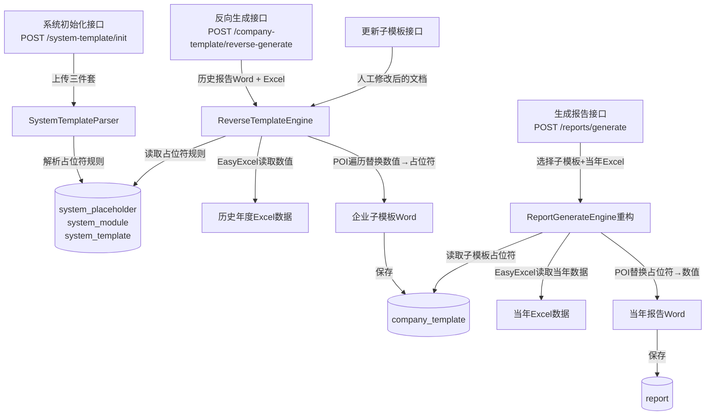

## 用户需求

重新设计并实现**关联交易同期资料报告生成系统**的核心模板引擎，包含以下完整业务流程：

## 产品概述

系统是多租户的关联交易同期资料报告自动化生成平台。核心功能是：基于系统内置标准模板，通过"反向生成"从企业历史报告提取企业专属子模板，再用新年度数据文件正向填充占位符，自动生成当年报告Word文档。

## 核心功能

### 1. 数据库表结构重新设计

- **系统标准模板表**（system_template）：系统级，不绑定租户/企业，存储标准Word模板、清单Excel模板、BVD Excel模板的文件路径，支持多套标准模板扩展
- **系统占位符规则表**（system_placeholder）：系统级，记录从标准模板解析出的所有占位符规则（名称、类型、数据来源、sheet、字段），不绑定租户
- **系统模块表**（system_module）：系统级，记录标准模板解析出的章节模块信息，不绑定租户
- **企业子模板表**（company_template）：企业级，每个企业可有多个子模板版本，记录反向生成的子模板Word文件路径及来源历史报告信息
- 保留现有 `report`、`data_file` 表，在 `report` 表中补充 `template_id`（关联子模板）、`generation_status`、`generation_error` 字段

### 2. 系统初始化接口

- 上传标准模板三件套（Word + 清单Excel + BVD Excel）
- 系统自动解析Word中的 `{{占位符名}}` 格式标记，提取所有占位符定义
- 解析Excel模板的Sheet结构，将占位符与数据源字段建立映射关系
- 将解析结果存入 `system_module`、`system_placeholder` 表

### 3. 反向生成企业子模板（核心难点）

- 输入：企业历史报告Word + 对应年份的清单Excel + BVD Excel
- 流程：从Excel中读取所有数据值 → 遍历历史报告Word的每个段落/表格/图表 → 与系统占位符规则匹配，找到对应数据位置 → 将数据值替换为占位符标记 `{{占位符名}}`
- 保留企业历史报告的原始字体、字号、段落格式、表格布局（仅替换内容，不改变样式）
- 输出文件存储为企业子模板，写入 `company_template` 表

### 4. 正向生成报告

- 输入：企业子模板（选择一个）+ 当年清单Excel + 当年BVD Excel
- 用新年度Excel数据替换子模板中的 `{{占位符}}` → 生成完整报告Word
- 支持文本占位符、表格占位符、图表占位符（图表暂用文字摘要）
- 生成结果更新到 `report` 表

### 5. 人工修改后更新子模板

- 用户下载报告 → 人工编辑 → 上传修改后的文档作为新历史报告
- 系统将新历史报告与当前子模板比对，保留人工修改内容，生成该企业的最新版子模板

### 6. 接口完善

- `POST /api/system-template/init` — 系统初始化上传三件套并解析
- `GET /api/system-template/placeholders` — 查看系统占位符规则
- `POST /api/company-template/reverse-generate` — 反向生成企业子模板
- `GET /api/company-template` — 企业子模板列表（支持按企业查询）
- 保留并完善现有 `POST /api/reports/generate`（正向生成）和 `POST /api/reports/update`（更新报告）

## 技术栈

- **框架**：Spring Boot 3.2.5 + Java 17（现有）
- **ORM**：MyBatis-Plus 3.5.9（现有）
- **Word处理**：Apache POI 5.2.5 poi-ooxml（现有）
- **Excel处理**：EasyExcel 3.3.4（现有）
- **数据库**：MySQL 8（现有）
- **多租户**：TenantContext（现有）

---

## 实现方案

### 核心策略

采用三层引擎设计：

1. **SystemTemplateParser**：系统初始化时解析标准模板，提取模块和占位符规则，存入数据库
2. **ReverseTemplateEngine**：反向生成引擎，从Excel数据 + 系统占位符规则，在历史报告Word中搜索数值并替换为占位符，保留原始排版
3. **ReportGenerateEngine**（重构现有）：正向生成引擎，用当年Excel数据替换子模板占位符，生成报告

### 关键技术决策

**1. 标准模板解析（正则扫描）**

Word中的占位符格式为 `{{占位符名}}`，使用 POI 遍历所有段落和表格单元格，正则匹配 `\{\{([^}]+)\}\}`，提取占位符名称和位置上下文，写入 `system_placeholder` 表。Excel模板扫描所有Sheet的列头，建立 `sheet名 → 列名列表` 的映射关系。

**2. 反向生成算法（数值匹配替换）**

反向生成的核心难点是："在历史报告中找到某个数值，确认其对应哪个占位符"。

算法策略：

- 从当年Excel（清单/BVD）读取所有数据，构建 `占位符名 → 实际值` 的映射表
- 遍历历史Word的所有 Run，先合并段落内的Run（防止POI拆分），然后逐个检查文本是否包含某个占位符的实际值
- 文本类型：精确字符串匹配，找到后替换为 `{{占位符名}}`，保留该Run的字体、字号等样式
- 表格类型：逐行逐列扫描表格单元格，批量替换一组值为占位符标记
- 难点处理：同一数值可能对应多个占位符，优先按 Excel sheet 的数据类型和上下文章节位置区分；数字格式（千分位、百分比）需归一化后再比对

**3. 保留排版样式的关键**

使用 POI 的 `XWPFRun` 对象替换文本时，**不新建Run，只修改现有Run的文本内容**，这样字体（`bold`、`fontFamily`、`fontSize`、`color`）和段落格式（`spacing`、`alignment`）自动保留。表格中替换单元格文字同理，不修改表格的 `CTTcPr`（列宽、合并单元格、边框）。

**4. 数据库重设计方案**

新增迁移脚本 `V3__redesign_template_system.sql`，保持向后兼容：

- 新建 `system_template`、`system_placeholder`、`system_module`、`company_template` 四张表
- 旧 `template`、`placeholder`、`report_module` 表**保留不删除**（防止破坏现有数据），仅在新代码流程中不再使用
- `report` 表新增 `template_id` 列（关联 `company_template.id`）和 `generation_status`、`generation_error` 列（现有 Java 实体中已有这两个字段，只需补充SQL列）

---

## 实现注意事项

- **POI Run合并**：现有 `ReportGenerateEngine.mergeAllRunsInDocument` 已实现，反向引擎复用此方法再做替换
- **数字格式归一化**：历史报告中数字可能为 `1,234,567.89`（千分位）或 `12,345,678.90`，需剥离逗号、空格后与Excel读取值比较；百分比需 ×100 处理
- **占位符冲突**：多个占位符可能对应相同数值（如金额相同），此时保留首次匹配，记录 warn 日志，后续可人工确认
- **性能**：反向生成是 O(占位符数 × Word段落数) 的遍历，对于典型报告（~200页，~100个占位符）可接受；EasyExcel 读取同步完成
- **`@TableField(select=false)`**：凡涉及 `filePath` 字段的查询均用自定义 `@Select` 方法显式列出字段，沿用现有 `TemplateMapper.selectActiveWithFilePath` 的模式

---

## 架构设计



---

## 目录结构

```
src/main/java/com/fileproc/
├── template/
│   ├── entity/
│   │   ├── SystemTemplate.java          # [NEW] 系统标准模板实体，对应 system_template 表
│   │   │                                #  字段：id, name, version, wordFilePath, listExcelPath, bvdExcelPath,
│   │   │                                #        status(active/archived), description, createdAt, deleted
│   │   ├── SystemPlaceholder.java       # [NEW] 系统级占位符规则实体，对应 system_placeholder 表
│   │   │                                #  字段：id, systemTemplateId, moduleCode, name, displayName,
│   │   │                                #        type(text/table/chart), dataSource(list/bvd),
│   │   │                                #        sourceSheet, sourceField, chartType, sort, description, deleted
│   │   ├── SystemModule.java            # [NEW] 系统模块实体，对应 system_module 表
│   │   │                                #  字段：id, systemTemplateId, name, code, description, sort, deleted
│   │   └── CompanyTemplate.java         # [NEW] 企业子模板实体，对应 company_template 表
│   │                                    #  字段：id, tenantId, companyId, systemTemplateId, name, year,
│   │                                    #        sourceReportId(来源历史报告), filePath, fileSize,
│   │                                    #        status(active/archived), createdAt, deleted
│   │
│   ├── mapper/
│   │   ├── SystemTemplateMapper.java    # [NEW] 系统模板Mapper，含 selectActiveWithAllPaths() 自定义查询
│   │   ├── SystemPlaceholderMapper.java # [NEW] 系统占位符Mapper，含 selectByTemplateId() 查询
│   │   ├── SystemModuleMapper.java      # [NEW] 系统模块Mapper
│   │   └── CompanyTemplateMapper.java   # [NEW] 企业子模板Mapper，含 selectWithFilePath() 自定义查询
│   │
│   ├── service/
│   │   ├── SystemTemplateService.java   # [NEW] 系统模板管理 Service
│   │   │                                #  方法：uploadAndInit(wordFile, listFile, bvdFile) — 上传三件套并触发解析
│   │   │                                #  方法：getActive() — 获取当前激活的标准模板及占位符列表
│   │   ├── SystemTemplateParser.java    # [NEW] 系统标准模板解析器（@Component）
│   │   │                                #  方法：parseWordTemplate(filePath) -> List<SystemPlaceholder> — 正则扫描 {{占位符}}
│   │   │                                #  方法：parseExcelTemplate(filePath, type) -> Map<sheet, List<colName>> — 扫描Excel列头
│   │   │                                #  方法：buildModules(placeholders) -> List<SystemModule> — 按占位符前缀分组为模块
│   │   └── CompanyTemplateService.java  # [NEW] 企业子模板管理 Service
│   │                                    #  方法：reverseGenerate(req) — 触发反向生成，保存子模板
│   │                                    #  方法：pageList(companyId, ...) — 分页查询企业子模板列表
│   │                                    #  方法：download(id) — 下载子模板文件
│   │
│   └── controller/
│       ├── SystemTemplateController.java # [NEW] 系统模板管理接口
│       │                                 #  POST /system-template/init — 上传三件套初始化
│       │                                 #  GET  /system-template/active — 获取当前激活模板详情
│       │                                 #  GET  /system-template/placeholders — 占位符规则列表
│       └── CompanyTemplateController.java # [NEW] 企业子模板接口
│                                          #  POST /company-template/reverse-generate — 反向生成子模板
│                                          #  GET  /company-template — 企业子模板列表
│                                          #  GET  /company-template/download/{id} — 下载子模板
│
├── report/
│   ├── service/
│   │   ├── ReportGenerateEngine.java    # [MODIFY] 重构现有引擎：
│   │   │                                #  - 接受 CompanyTemplate 对象替代旧 Template
│   │   │                                #  - 从 system_placeholder 读取占位符规则（系统级）
│   │   │                                #  - 其余替换逻辑保持现有实现不变
│   │   └── ReverseTemplateEngine.java   # [NEW] 反向生成引擎（@Component）
│   │                                    #  方法：reverse(historicalReportPath, listExcelPath, bvdExcelPath,
│   │   │                                #         placeholders, outputPath) — 核心反向替换逻辑
│   │                                    #  内部：buildValueToPlaceholderMap() — 构建值→占位符映射
│   │                                    #  内部：replaceValueInDocument() — 遍历Word替换，保留样式
│   │                                    #  内部：normalizeNumber() — 数字格式归一化
│   │
│   └── service/ReportService.java       # [MODIFY] 调整 generateReport/updateReport
│                                        #  - tryGenerateFile 改为查 company_template 而非旧 template 表
│                                        #  - 占位符来源改为 system_placeholder（按systemTemplateId查询）
│
└── (其他模块不变)

src/main/resources/db/
└── V3__redesign_template_system.sql     # [NEW] 数据库迁移脚本
                                         #  新建 system_template、system_placeholder、system_module、company_template 表
                                         #  ALTER report 表新增 template_id、generation_status、generation_error 列
                                         #  旧 template/placeholder/report_module 表保留不动
```

## Agent Extensions

### SubAgent

- **code-explorer**
- 用途：在实现 ReverseTemplateEngine 和 SystemTemplateParser 之前，深入扫描现有 mapper 的 `@Select` 注解模式、TenantContext 使用方式、BizException 工具类、FileUtil 工具类，以及 `MybatisPlusConfig` 中租户插件的忽略表配置，确保新代码遵循现有约定
- 预期成果：准确掌握项目中 filePath select=false 的绕过方式、自定义SQL的写法规范、多租户表的 tenant_id 注入机制，保证新增的四张表（system_template 等）与现有架构完全一致