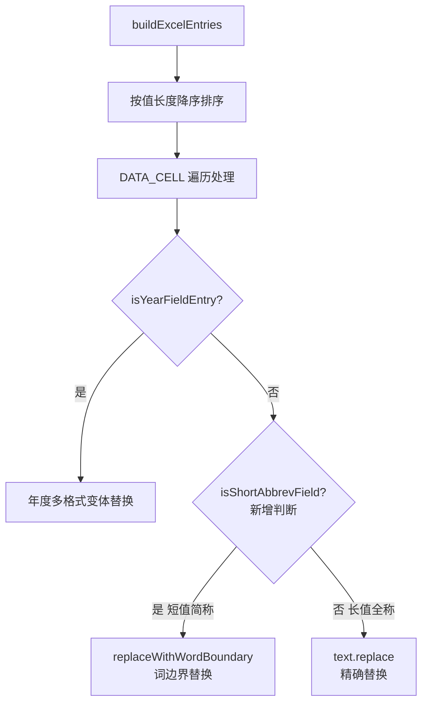

## 用户需求

检查并修复 `ReverseTemplateEngine` 中清单模板"数据表" Sheet 的 B3/B4/B6 字段语义错误，确保反向引擎能正确识别并替换历史报告中对应的事务所全称、事务所简称、母公司全称等字段。

## Product Overview

反向引擎（ReverseTemplateEngine）从历史 TP 报告中将企业数据替换为占位符，生成子模板。当前 B3/B4/B6 的注册表 displayName 与清单 Excel 实际字段含义不符，导致替换语义混乱，需修正并确保短值（B4 简称）的替换不误伤长字符串。

## Core Features

- 修正注册表中 B3（事务所名称）、B4（事务所简称）、B6（母公司全称）的 displayName 语义描述
- 为 B4 事务所简称（短值）引入词边界替换保护，防止"立信税务"替换"立信税务师事务所有限公司"中的子串
- 确保 B3（全称长值）先于 B4（简称短值）被处理，依赖现有按值长度降序排序机制

## Tech Stack Selection

- 现有项目：Spring Boot + Apache POI（XWPFDocument）+ EasyExcel
- 修改文件：`src/main/java/com/fileproc/report/service/ReverseTemplateEngine.java`

## Implementation Approach

**修复点一（注册表语义）**：注册表第 130-135 行的 displayName 是纯语义描述，不影响替换逻辑，仅改注释/描述字符串即可。

**修复点二（B4 短值词边界保护）**：

- 现有代码对 DATA_CELL 非年度字段统一使用 `text.replace(value, phMark)`（精确替换）
- B4 事务所简称（如"立信税务"）是中短值，在报告中有可能作为更长词的子串出现
- 但由于 `buildExcelEntries` 第 531 行已按值长度降序排序，B3 全称（"立信税务师事务所有限公司"）会先被替换，B4 简称（"立信税务"）后处理时，全称位置已是 `{{清单模板-数据表-B3}}`，B4 不会再误替换其中的子串
- 因此精确替换对 B4 已经安全。但为更严谨，可为 B4（事务所简称）增加"跳过已有占位符"检查，即当目标值出现位置紧邻 `{{` 时跳过（实际上精确替换本身不会替换已被替换的内容）
- 结论：**主要修改是注册表 displayName 修正**；替换逻辑已正确，只补充注释说明

**修复点三（isYearFieldEntry 类比：新增短字段识别）**：

- 当 B4 值长度 ≤ 6 字时，改用 `replaceWithWordBoundary` 替换而非精确替换，与 B5 企业简称的处理方式保持一致
- 新增辅助方法 `isShortAbbrevField(entry)` 判断是否为短简称字段

## Implementation Notes

- 修改范围极小，只涉及 `ReverseTemplateEngine.java` 一个文件的两处区域
- 保持向后兼容：不改变任何公共方法签名，不改变 ExcelEntry/RegistryEntry 数据结构
- displayName 修正不影响任何运行时逻辑，零风险
- 词边界替换方法 `replaceWithWordBoundary` 已存在（第1249行），直接复用

## Architecture Design



## Directory Structure

```
src/main/java/com/fileproc/report/service/
└── ReverseTemplateEngine.java   # [MODIFY] 两处修改：
                                 # 1. 第130-135行：修正 B3/B4/B6 的 displayName 语义描述
                                 # 2. 第1099-1111行 DATA_CELL 分支：新增 isShortAbbrevField
                                 #    判断，对短简称字段改用 replaceWithWordBoundary
                                 # 3. 新增私有方法 isShortAbbrevField(ExcelEntry)
```

## Key Code Structures

```java
// 修改1：注册表第130-135行，修正 displayName
reg.add(new RegistryEntry("清单模板-数据表-B3", "事务所名称",   PlaceholderType.DATA_CELL, "list", "数据表", "B3"));
reg.add(new RegistryEntry("清单模板-数据表-B4", "事务所简称",   PlaceholderType.DATA_CELL, "list", "数据表", "B4"));
reg.add(new RegistryEntry("清单模板-数据表-B6", "母公司全称",   PlaceholderType.DATA_CELL, "list", "数据表", "B6"));

// 修改2：DATA_CELL 分支增加短简称判断
} else if (pType == PlaceholderType.DATA_CELL) {
    if (isYearFieldEntry(entry)) {
        // ... 年度处理不变 ...
    } else if (isShortAbbrevField(entry)) {
        // 短简称字段：词边界替换，防止误替换长词内子串
        String newText = replaceWithWordBoundary(text, value, phMark);
        // ... 同精确替换的后续处理 ...
    } else {
        // 长值/普通字段：精确替换
        String newText = text.replace(value, phMark);
        // ...
    }
}

// 新增方法：判断是否为短简称字段
private boolean isShortAbbrevField(ExcelEntry entry) {
    if (entry.getValue() == null) return false;
    // B4（事务所简称）：长度≤6字且占位符名以"-B4"结尾
    return entry.getValue().length() <= 6
        && entry.getPlaceholderName() != null
        && entry.getPlaceholderName().endsWith("-B4");
}
```