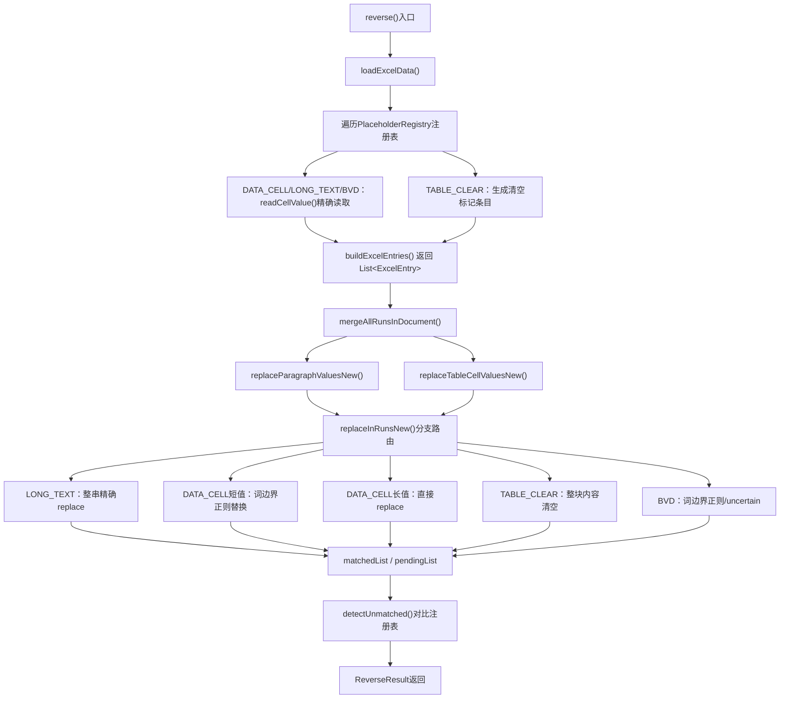

## 用户需求

对 `ReverseTemplateEngine.java` 进行全面改造，将阶段一（内置静态占位符映射表 + 坐标精确读取）和阶段二（短值词边界替换、财务数据整列清空、BVD坐标直读、未匹配提示完善）合并为一次完整重构。

## 产品概览

反向生成引擎是将历史报告 Word + 当年清单 Excel/BVD Excel 转换为企业子模板的核心组件。当前引擎依赖动态 Sheet 扫描和关键字推断，存在短值误替换、财务数字误替换、占位符名称不稳定等问题。本次改造目标是：以标准模板中内置的静态占位符映射表替代动态扫描，彻底解决上述问题，提高子模板生成的准确率和稳定性。

## 核心功能

### 1. 内置静态占位符映射表（PlaceholderRegistry）

将从标准模板提取的占位符定义硬编码为内置注册表，包含四类占位符：

- **数据表单元格占位符**（B1~B8）：按精确坐标直接读取单个单元格值
- **整表/区域占位符**（PL等财务类）：仅清空对应段落/表格内容，不做数值匹配替换
- **行业情况长文本占位符**（行业情况 B1~B5）：按坐标读取后做整段精确替换
- **BVD数据占位符**：按标准名称（如 `【BVD数据模板-数据表B1~B4】`）直接读取对应坐标

### 2. 精确坐标读取

废弃当前动态行扫描方式，改为按 `sheetName + cellAddress` 直接定位单元格，消除"哪行对应哪个占位符"的歧义。

### 3. 财务数据整列清空策略

PL 等整表类占位符不再逐数字匹配，改为识别对应表格/段落区域后整块内容替换为占位符标记，从根本上杜绝误替换。

### 4. 短值词边界正则替换

对企业简称（4~6字）等短值，改用中文词边界正则（`(?<![\\u4e00-\\u9fa5\\w])值(?![\\u4e00-\\u9fa5\\w])`）做精准边界替换，不再依赖频次统计。

### 5. 完善未匹配占位符的前端提示

对注册表中有定义但在 Word 中未找到对应内容的占位符，在 `ReverseResult` 中增加 `unmatchedRegistryEntries` 字段，前端据此明确提示用户哪些占位符未能自动处理。

## 技术栈

- **语言**：Java 17（项目现有）
- **框架**：Spring Boot + MyBatis-Plus（现有）
- **Word 处理**：Apache POI XWPF（现有）
- **Excel 处理**：EasyExcel + Apache POI XSSF（现有，`readCellValue` 等方法已有）
- **改造范围**：仅修改 `ReverseTemplateEngine.java`，不引入新依赖，不改动调用链（`CompanyTemplateController`、`LlmReverseOrchestrator` 等保持兼容）

---

## 实现思路

### 整体策略

**以静态注册表驱动引擎，分层按类型路由处理**，取代当前"动态扫描所有 Sheet → 靠关键字猜测类型"的方式。

核心思路：

1. 在引擎内部定义一个 `PlaceholderRegistry`（静态常量列表），将标准模板中已确认的全部占位符定义内置，每条记录携带 `placeholderType`（DATA_CELL / TABLE_CLEAR / LONG_TEXT / BVD）、`sheetName`、`cellAddress`（或 `null` 表示整表）。
2. `buildExcelEntries()` 改为遍历注册表，按坐标精确读取，而非扫描全行。
3. `replaceInRunsNew()` 按 `placeholderType` 分支处理：短值走词边界正则、TABLE_CLEAR 走整段清空、长文本走全串精确匹配。

### 各子问题处理方案

#### 1. 内置注册表设计

以枚举嵌套 `RegistryEntry` 内部静态类的方式定义，每个条目包含：

```
placeholderName  → 如"清单模板-数据表-B1"（对应 {{...}} 内的名称）
displayName      → 如"企业全称"（用于日志/前端展示）
placeholderType  → DATA_CELL | TABLE_CLEAR | LONG_TEXT | BVD
dataSource       → "list" | "bvd"
sheetName        → Excel Sheet 名（可为 null，整表清空时忽略）
cellAddress      → 单元格坐标如"B1"（TABLE_CLEAR 类型为 null）
```

#### 2. 精确坐标读取

直接复用现有 `readCellValue(rows, cellAddress)` 方法，通过 `readSheetByIndex` 或 `readSheet(filePath, sheetName)` 读取指定 Sheet，不再扫描全行。
`buildExcelEntries()` 重构为：遍历注册表 → 对 DATA_CELL/LONG_TEXT/BVD 按坐标读值 → 对 TABLE_CLEAR 生成无值的清空标记条目。

#### 3. 短值词边界正则替换

新增 `replaceWithWordBoundary(text, value, replacement)` 方法，使用 `(?<![\\u4e00-\\u9fa5A-Za-z0-9])` + `Pattern.quote(value)` + `(?![\\u4e00-\\u9fa5A-Za-z0-9])` 构造边界正则，适用于中文词边界场景（4~8字的简称/年度等短字段），废弃当前频次统计判断。

#### 4. 财务数据整列清空

TABLE_CLEAR 类型的 `ExcelEntry` 携带 `value=null`，在 `replaceInRunsNew` 中检测到此类型时，不做值匹配，而是：

- 遍历文档中表格的特定列区域，将该列/该整块单元格内容统一替换为 `{{placeholderName}}` 占位符标记。
- 具体定位策略：在表格中寻找"包含特征关键字（如表头含'收入'/'费用'/数字列）"的列，整列清空。此处设计为可扩展的 `TableClearStrategy`，初期实现为"整表第一列为文字、其余列为数字时，对数字列内容全部清空"。

#### 5. BVD 占位符坐标化

注册表中的 BVD 条目携带具体 `sheetName` + `cellAddress`（如 `SummaryYear Sheet B3`），引擎直接按坐标读值，不再靠企业名称定位行。对于 `AP Lead Sheet` 等行范围占位符（13~19行），生成区间标记条目，整段替换。

#### 6. 未匹配条目完善

`ReverseResult` 新增 `unmatchedRegistryEntries`（List\<RegistryEntry\>），在 `reverse()` 末尾对比注册表与实际匹配结果，将注册表中有定义但 `matchedList` 中未出现的条目归入此字段，前端据此精确提示。

---

## 实现注意事项

1. **向后兼容**：`reverse(String, String, String, String)` 和旧 `@Deprecated` 5参数签名均保留，`ReverseResult` 的现有字段不变，只追加新字段；`CompanyTemplateController` 和 `LlmReverseOrchestrator` 调用链无需改动。

2. **注册表维护**：`PlaceholderRegistry` 以静态内部类 + 静态初始化块实现，后续新增占位符只改注册表，不动替换逻辑。注释中明确说明每个条目来源（对应标准模板哪个 Sheet 的哪个单元格）。

3. **Sheet 名匹配容错**：清单 Excel 的实际 Sheet 名可能存在前后空格或大小写差异，`readSheet` 调用前先做 `trim()` + 忽略大小写匹配；读取失败时 `warn` 日志 + 跳过该条目，不中断整体流程。

4. **TABLE_CLEAR 降级保护**：若整表清空策略无法定位目标表格（如文档结构不符合预期），记录 `warn` 日志并将该占位符加入 `unmatchedRegistryEntries`，不抛异常。

5. **词边界正则性能**：`Pattern.compile` 在每次替换时不重复编译，将构造好的 `Pattern` 缓存在 `ExcelEntry` 的扩展字段或本地变量中。

6. **`mergeAllRunsInDocument` 保留**：词边界替换和长文本替换都依赖 Run 合并，此方法不变。

7. **`extractCompanyNameFromEntries` 调整**：改为从注册表的 B1（企业全称）条目读取，无需遍历推断。

---

## 架构设计



---

## 目录结构

```
src/main/java/com/fileproc/report/service/
└── ReverseTemplateEngine.java   # [MODIFY] 核心改造文件
    ├── PlaceholderType 枚举      # [NEW] DATA_CELL/TABLE_CLEAR/LONG_TEXT/BVD 四种类型
    ├── RegistryEntry 内部类      # [NEW] 注册表条目：name/displayName/type/sheetName/cellAddr
    ├── PLACEHOLDER_REGISTRY 常量 # [NEW] 内置静态占位符映射表（约40条）
    ├── buildExcelEntries()       # [MODIFY] 改为遍历注册表+坐标读取，废弃Sheet动态扫描
    ├── replaceInRunsNew()        # [MODIFY] 按placeholderType分支：词边界/整块清空/精确replace
    ├── replaceWithWordBoundary() # [NEW] 中文词边界正则替换
    ├── clearTableBlock()         # [NEW] TABLE_CLEAR类型整块清空逻辑
    ├── buildBvdEntries()         # [MODIFY] 改为按注册表坐标直接读取
    ├── detectUnmatchedRegistry() # [NEW/MODIFY] 对比注册表检测未匹配条目
    └── ReverseResult             # [MODIFY] 追加 unmatchedRegistryEntries 字段
```

### 关键内部结构

**PlaceholderType 枚举**（新增）：

```java
private enum PlaceholderType {
    DATA_CELL,    // 数据表单元格：按坐标读值，按长度/词边界替换
    TABLE_CLEAR,  // 整表/区域：不读值，整块清空替换为占位符
    LONG_TEXT,    // 长文本：按坐标读值，整段精确替换
    BVD           // BVD数据：按坐标读值，标uncertain
}
```

**RegistryEntry 内部类**（新增）：

```java
@Data
private static class RegistryEntry {
    String placeholderName; // 标准名：如"清单模板-数据表-B1"
    String displayName;     // 可读名：如"企业全称"
    PlaceholderType type;
    String dataSource;      // "list" 或 "bvd"
    String sheetName;       // Excel Sheet名，TABLE_CLEAR可为null
    String cellAddress;     // 如"B1"，TABLE_CLEAR为null
}
```

**ExcelEntry 扩展**（现有类新增字段）：

```java
private PlaceholderType placeholderType; // 新增：替换时分支路由依据
private String displayName;              // 新增：日志/提示用可读名
```