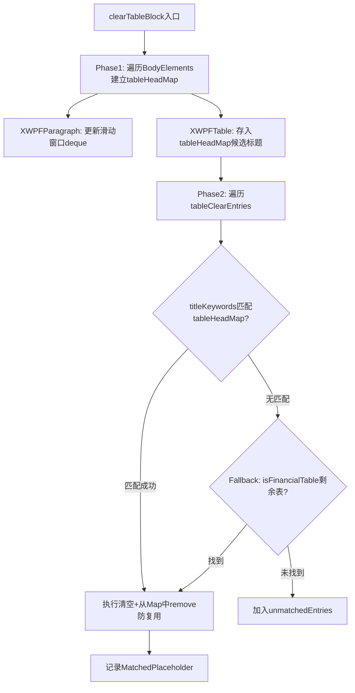

## 用户需求

修复 `ReverseTemplateEngine.java` 中 `clearTableBlock` 方法的三个 Bug，采用路径A（精确标题匹配）方案：

## 产品概述

反向引擎根据历史报告 Word 文档，将实际数据替换为占位符标记，生成企业子模板。其中 `TABLE_CLEAR` 类型的占位符需定位到 Word 文档中对应的表格并清空数字列、写入占位符标记。当前实现存在三处严重误处理 Bug。

## 核心问题

**Bug 1：同期资料本地文档对照表被误清空**
`isFinancialTable` 将章节编号（如 `2.2.2`、`4.1`）误判为数字内容，导致该辅助性索引表的数字占比超过 40% 阈值，被错误地判定为财务表，进而被 TABLE_CLEAR 逻辑错误清空。

**Bug 2 & 3：多条目竞争同一张表**
`clearTableBlock` 当前策略是每个条目遍历全文档表格、取第一个满足 `isFinancialTable` 的表格即 break——所有条目都会争抢同一张表，导致"独立交易区间表"被 `{{清单模板-PL}}` 覆盖、"组织结构表"被 `{{清单模板-PL含特殊因素调整}}` 覆盖。

## 修复方案（路径A：精确标题匹配）

1. `RegistryEntry` 新增 `List<String> titleKeywords` 字段，并新增兼容性 7 参数构造方法
2. 所有 19 条 `TABLE_CLEAR` 注册表条目补充对应的表格前置标题关键词列表
3. `clearTableBlock` 改为：遍历 `doc.getBodyElements()` 顺序，记录每张表格前最近（距离 ≤ 3）的非空段落文本，用 `titleKeywords` 做 `contains` 精确绑定，实现 1:1 表格占位符匹配，且已匹配的表格不会被后续条目复用
4. `isFinancialTable` 增加排除规则：若首列含 `x.x.x` 格式章节编号，或任意行含"报告索引"文本，则直接排除，不判为财务表

## 技术栈

- 语言：Java（Spring Boot 后端，已有项目）
- 文档处理：Apache POI `XWPFDocument`，使用 `doc.getBodyElements()` 遍历段落与表格的文档顺序
- 数据结构：Lombok `@Data`，`List<String>` 关键词列表

## 实现方案

### 总体策略

基于文档 Body Elements 的有序遍历，为每张表格找到其前置标题段落，通过注册表中配置的关键词列表精确绑定"占位符 ↔ 表格"关系，彻底解耦多条目竞争问题。

### 关键技术决策

**1. `RegistryEntry` 扩展**

新增 `List<String> titleKeywords` 字段（`@Data` 自动生成 getter/setter）；新增 7 参数构造方法（额外接收关键词列表），原 6 参数构造方法保持不变，供 DATA_CELL/LONG_TEXT/BVD 条目使用，兼容无需改动。

**2. 关键词传递链路**

```
RegistryEntry.titleKeywords
  → buildExcelEntries() 中将关键词从 RegistryEntry 复制到 ExcelEntry（新增 titleKeywords 字段）
  → clearTableBlock() 读取 entry.getTitleKeywords() 匹配前置段落
```

`ExcelEntry` 同步新增 `List<String> titleKeywords` 字段（`@Data`）。

**3. `clearTableBlock` 重写逻辑**

```
Phase 1 — 建立"表格 → 前置标题段落"映射表（Map<XWPFTable, String>）：
  遍历 doc.getBodyElements()（IBodyElement）
  维护一个滑动窗口：最近 3 个段落文本 deque
  遇到 XWPFTable：将 deque 中最近的非空段落文本合并为候选标题文本，存入 tableHeadMap

Phase 2 — 每个 TABLE_CLEAR 条目在 tableHeadMap 中查找关键词匹配：
  找到 → 用该表格执行清空操作，将该表格从候选池中删除（防止复用）
  找不到关键词匹配 → fallback：在剩余未绑定的财务表格中取第一个（保持原有降级行为）
  依然找不到 → 加入 unmatchedEntries
```

`isFinancialTable` 排除逻辑（增量修改，不破坏原有判断流程）：

- 若首列任意单元格文本匹配 `\d+\.\d+(\.\d+)*` 章节编号格式，返回 `false`
- 若首列任意单元格文本包含 "报告索引" 或 "章节" 等关键词，返回 `false`

**4. 性能与安全**

- `getBodyElements()` 仅遍历一次（O(N)），Phase 1 构建 Map，Phase 2 查找均为 O(N)，总复杂度不变
- 已匹配表格从 Map 中 `remove`，防止同一张表被多个占位符绑定
- Fallback 机制保证 `isFinancialTable` 仍有意义（对于没有明确前置标题的财务表）

## 实现注意事项

- `IBodyElement` 类型判断：`instanceof XWPFParagraph` / `instanceof XWPFTable`
- 段落文本取 `para.getText()`，空白段落跳过，deque 最大保留 3 个非空段落
- 关键词 `contains` 直接匹配（中文无大小写问题），无需 `toLowerCase`
- `ExcelEntry` 的 `titleKeywords` 字段仅在 `buildExcelEntries` 的 TABLE_CLEAR 分支赋值，其余类型为 null，不影响现有逻辑
- 注册表条目中 PL相关条目（PL12行以上、PL全表、PL含特殊）共享部分关键词但需精确区分：可通过行数或关键词"特殊因素"加以区分，关键词优先级靠特异性排序

## 架构设计



## 目录结构

```
src/main/java/com/fileproc/report/service/
└── ReverseTemplateEngine.java  # [MODIFY] 唯一修改文件
    修改点1: RegistryEntry 静态内部类 —— 新增 titleKeywords 字段 + 7参数构造方法
    修改点2: ExcelEntry 静态内部类 —— 新增 titleKeywords 字段
    修改点3: PLACEHOLDER_REGISTRY 静态初始化块 —— 19条TABLE_CLEAR条目改用7参数构造传入关键词
    修改点4: buildExcelEntries() —— TABLE_CLEAR分支将 reg.getTitleKeywords() 赋给 entry
    修改点5: clearTableBlock() —— 整体重写为两阶段：Phase1建Map + Phase2关键词匹配+fallback
    修改点6: isFinancialTable() —— 新增章节编号/报告索引排除规则
```