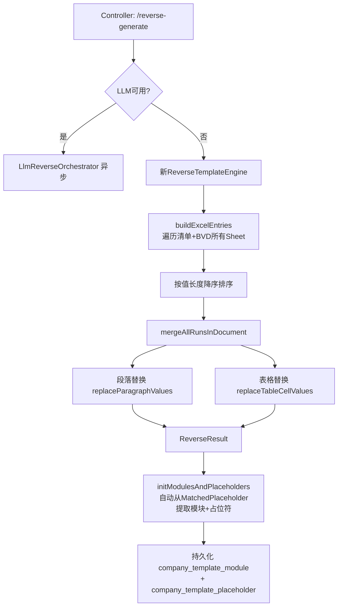

## 用户需求

实现「反向报告生成企业子模板」的核心引擎重写，将现有依赖 `SystemPlaceholder` 规则列表的旧引擎升级为**Excel 全量扫描驱动**的新引擎。

## 产品概述

用户上传企业历史报告 Word 文件，系统自动读取该企业对应年度的清单Excel和BVD Excel，通过遍历Excel所有单元格的实际值，在Word文档中精确定位并替换为占位符标记，生成带占位符的企业子模板Word文件，同时将所有匹配关系持久化到数据库。

## 核心功能

- **Excel全量扫描**：遍历清单Excel + BVD Excel 的所有Sheet的所有非空单元格，自动提取值与单元格地址的映射，无需预先人工定义规则
- **长度优先替换策略**：将所有单元格值按字符长度降序排序后依次替换，避免短字符串（如企业简称）干扰长字符串（如企业全称）的匹配
- **最小长度过滤**：值长度小于4字符的单元格跳过，防止年份数字、单字等误匹配
- **占位符自动命名**：按 `清单模板-Sheet名-单元格地址`（如 `清单模板-行业情况-B1`）规则自动生成占位符名，无需手工定义
- **全文本替换**：同时处理Word段落文本和表格单元格，同一占位符值在文档中多处出现均全部替换
- **格式保留**：替换后保留原始Word的字体、字号、段落样式、表格布局，仅修改文本内容
- **结果持久化**：将所有匹配成功的占位符映射（来源Sheet、单元格地址、期望值、位置信息）存入数据库，支持后续人工确认和管理
- **Controller层兼容**：修改 `CompanyTemplateController` 降级分支，不再依赖 `SystemPlaceholder` 列表，`initModulesAndPlaceholders` 改为从引擎结果中自动生成模块和占位符记录

## 技术栈

基于现有 Spring Boot + MyBatis-Plus + Apache POI (XWPFDocument) + EasyExcel 技术栈，在现有 `ReverseTemplateEngine.java` 基础上进行核心方法重写，**不引入新依赖，不改变整体架构**。

## 实现方案

### 核心策略：Excel全量扫描 + 长度优先替换

**新引擎方法签名**（去掉 `List<SystemPlaceholder> placeholders` 参数）：

```java
public ReverseResult reverse(String historicalReportPath, String listExcelPath, String bvdExcelPath, String outputPath)
```

新旧引擎同时保留，Controller 降级分支改为调用无 `placeholders` 参数的新签名；旧签名保留但内部 `if(placeholders.isEmpty())` 时委托新签名处理。

### 关键技术决策

1. **值→占位符映射构建**：遍历所有Sheet的所有行列，每个非空单元格生成一条映射记录 `{值: "xxx", 占位符名: "清单模板-行业情况-B1", sourceSheet: "行业情况", sourceField: "B1", dataSource: "list"}`。同一值首次出现的单元格地址优先。

2. **长度降序排序**：`List<ExcelEntry>` 按 `value.length()` 降序排序，确保先替换长值（如企业全称"上海远化物流有限公司"，15字），再替换短值（如企业简称"远化物流"，4字），彻底避免子字符串误匹配。

3. **长度阈值**：值长度 < 4 的跳过。纯数字且长度 < 6 的（年度"2023"等）标记为 `uncertain` 而非自动替换。

4. **Word替换机制**：沿用已有的 `mergeAllRunsInDocument` + 单Run文本替换逻辑，不做结构改动。

5. **占位符命名规则**：

- 清单Excel → `清单模板-{SheetName}-{CellAddr}`
- BVD Excel → `BVD-{SheetName}-{CellAddr}`
- 占位符标记格式：`{{清单模板-数据表-B1}}` （与现有系统一致的双大括号格式）

6. **模块提取**：SheetName 即为模块名，代码沿用现有 `sheetNameToCode()` / `extractModules()` 方法。

### 性能考量

- 清单Excel约23个Sheet，BVD Excel约数十个Sheet，单元格总量预计 1000~3000 个，排序和替换操作为 O(N*M)（N=单元格数，M=Word Run数），量级可接受，无需优化。
- EasyExcel 读取时使用 `headRowNumber(0)` 无表头模式，按行列索引读取，与现有代码一致。

## 实现细节

### 1. `ExcelEntry` 内部类（新增）

```java
@Data
static class ExcelEntry {
    String value;           // 单元格原始值（已trim）
    String placeholderName; // 如 "清单模板-行业情况-B1"
    String dataSource;      // "list" 或 "bvd"
    String sourceSheet;
    String sourceField;     // 单元格地址 "B1"
    boolean isShortNumber;  // 是否为短数字（长度<6的纯数字）
}
```

### 2. 新主方法 `buildExcelEntries()`

遍历Excel所有Sheet，对每个Sheet调用 `readSheetByIndex(filePath, sheetIdx)` 获取行列Map，逐单元格提取值，生成 `ExcelEntry` 并加入列表，按值长度降序排列。

### 3. Controller 改动点

`CompanyTemplateController.java` 降级分支（~180行）：

- 删除 `if(placeholders.isEmpty())` 报错守卫
- 调用 `reverseTemplateEngine.reverse(histPath, listPath, bvdPath, outAbsPath)` 新签名
- `initModulesAndPlaceholders` 中，不再从系统占位符继承字段，改为从 `MatchedPlaceholder` 自身携带的 `dataSource / sourceSheet / sourceField` 填充占位符记录

### 4. `MatchedPlaceholder` 扩展字段

在已有 `MatchedPlaceholder` 中补充：

```java
private String dataSource;   // "list" 或 "bvd"
private String sourceSheet;  // Sheet名
private String sourceField;  // 单元格地址
```

让 Controller 在保存占位符记录时能直接使用，不再依赖系统占位符Map。

## 架构图



## 目录结构

```
src/main/java/com/fileproc/
├── report/service/
│   └── ReverseTemplateEngine.java         # [MODIFY] 核心改造文件
│                                           # - 新增内部类 ExcelEntry
│                                           # - 新增公共方法 reverse(4参数，无placeholders)
│                                           # - 新增私有方法 buildExcelEntries() 全量扫描所有Sheet
│                                           # - 新增 readAllSheets() 读取Excel所有Sheet
│                                           # - MatchedPlaceholder 增加 dataSource/sourceSheet/sourceField 字段
│                                           # - 保留旧的5参数方法（内部委托新方法）
│                                           # - replaceInRun改为接收ExcelEntry列表，长度已预排序
│
└── template/controller/
    └── CompanyTemplateController.java     # [MODIFY] 降级分支适配
                                           # - 降级分支：调用新4参数reverse()，删除placeholders非空检查
                                           # - initModulesAndPlaceholders：不再查系统占位符Map，
                                           #   改为直接使用MatchedPlaceholder.dataSource/sourceSheet/sourceField
                                           #   填充CompanyTemplatePlaceholder记录
```

## 使用的 SubAgent

### code-explorer

- **Purpose**: 在生成计划前深入探索 ReverseTemplateEngine、CompanyTemplateController、CompanyTemplatePlaceholder 等核心文件，确认现有字段、方法签名、EasyExcel 读取模式，以及 initModulesAndPlaceholders 的完整数据流
- **Expected outcome**: 确认所有修改点的精确位置和上下文，避免方案与代码现状不符导致返工