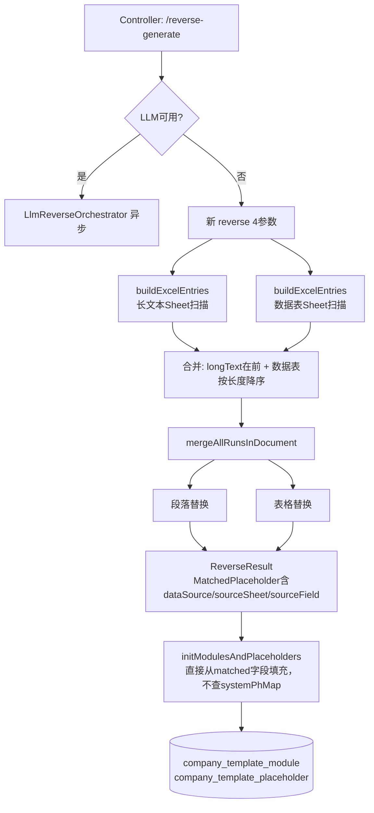

## 用户需求

将现有「反向报告生成企业子模板」引擎从依赖 `SystemPlaceholder` 规则列表的旧方式，升级为**分层 Excel 扫描驱动**的新方式。

## 产品概述

用户上传企业历史报告 Word，系统读取该企业对应年度的清单Excel，通过分层策略（长文本段落优先 → 数据表具名字段次之）自动将历史报告中的实际值替换为占位符，生成带占位符的企业子模板Word文件，同时将所有匹配关系持久化入库。

## 核心功能

- **分层替换策略**：先替换长文本段落Sheet（集团背景/行业情况，整段字符串精确匹配），再替换数据表Sheet的具名字段（A列为字段名，B列为值），两层按不同规则处理，避免互相干扰
- **数据表字段语义化命名**：A列字段名直接作为占位符名（`{{企业名称}}`、`{{企业简称}}`），而非机械的单元格地址
- **长文本整段替换**：行业情况/集团背景等长文本（>10字）全字符串精确匹配，无误匹配风险
- **数据表值按长度降序替换**：先替换"上海远化物流有限公司"，后替换"远化物流"，防止短值误匹配
- **BVD Excel 不扫描**：BVD数据量大（3472行）且含大量数值，误匹配风险高，本期不处理
- **格式保留**：沿用现有 `mergeAllRunsInDocument` 机制，仅修改文本内容，保留原始样式
- **结果持久化**：匹配成功的占位符自动写入数据库，`dataSource/sourceSheet/sourceField` 字段由引擎自身携带，不再依赖系统占位符Map
- **接口向下兼容**：旧5参数 `reverse()` 方法保留，降级分支改为调用新4参数签名

## 技术栈

沿用现有项目栈：Spring Boot + MyBatis-Plus + Apache POI (XWPFDocument) + EasyExcel，**不引入任何新依赖**。

---

## 实现方案

### 核心策略：分层 Excel 扫描 + 分类替换

基于对真实清单Excel结构的分析，将Sheet分为三类分别处理：

```
第0层（最先执行）：长文本 Sheet
  → 集团背景情况、行业情况等：B列（或A列）为数百字长文本
  → 整段精确匹配，无需阈值，先执行避免被第1层拆散

第1层（次之执行）：数据表 Sheet
  → A列=字段名，B列=值（企业名称、企业简称、年度等）
  → 按B列值长度降序替换；字段名直接做占位符名
  → 年度等纯数字短值（≤4字符）：跳过或标记 uncertain

第2层（不处理）：表格类 Sheet
  → 组织结构、关联公司信息、劳务交易等
  → 本期不做文本替换（结构化数据由正向生成时填入）
  → BVD Excel 整体不扫描
```

**如何判断Sheet类型**：

- `数据表` → Sheet名精确匹配（固定为"数据表"）
- 长文本Sheet → 非"数据表"，且该Sheet第B列（colIndex=1）有长度>10的单元格值
- 其余为表格类，跳过

### 关键技术决策

1. **新增 `ExcelEntry` 内部类**：承载单元格信息（value、placeholderName、sourceSheet、sourceField、dataSource、isLongText），与 `MatchedPlaceholder` 中新增的同名字段对接，使 Controller 持久化时不再依赖 `systemPhMap`。

2. **`MatchedPlaceholder` 扩展3个字段**：`dataSource`、`sourceSheet`、`sourceField`，从 `ExcelEntry` 传入，与 `CompanyTemplatePlaceholder` 实体字段直接对应（实体已有这3个字段，零改造）。

3. **新4参数 `reverse()` 主方法**：去掉 `List<SystemPlaceholder> placeholders` 参数，内部调用 `buildExcelEntries()` 替代旧 `buildValueToPlaceholderMap()`；旧5参数方法保留，内部直接委托新方法（忽略placeholders参数）。

4. **`initModulesAndPlaceholders` 去依赖 `systemPhMap`**：不再查 `systemPh`，改为直接从 `matched.getDataSource()/getSourceSheet()/getSourceField()` 填充占位符实体的对应字段。

5. **占位符名称格式**：

- 数据表字段：`{{企业名称}}`、`{{企业简称}}`（A列字段名直接用，需sanitize非法字符）
- 长文本Sheet：`{{行业情况-B1}}`、`{{集团背景情况-A1}}`（Sheet名+单元格地址）

### 性能考量

清单Excel约23个Sheet，总单元格量约200~500个有效值，替换操作为 O(N×M)，N≤500，M=Word Run数约数千，完全可接受，无需优化。

---

## 实现细节

### 新 `ExcelEntry` 内部类（替代旧 SystemPlaceholder 入参）

```java
@Data
static class ExcelEntry {
    String value;            // 原始单元格值（已trim）
    String placeholderName;  // 如 "企业名称" 或 "行业情况-B1"
    String dataSource;       // 固定 "list"
    String sourceSheet;      // Sheet名
    String sourceField;      // 单元格地址如 "B1"
    boolean isLongText;      // true=长文本整段替换，false=数据表字段替换
}
```

### `buildExcelEntries()` 分层扫描逻辑（伪代码）

```
1. 读取"数据表"Sheet（headRowNumber=0，按行读取）
   逐行：A列=字段名，B列=值
   → 跳过B列值为空或长度<=0的行
   → 生成 ExcelEntry { value=B列值, placeholderName=A列字段名sanitize, isLongText=false }
   → 排序：按value.length()降序

2. 遍历其余Sheet（跳过"数据表"和已知表格类Sheet）
   对每个Sheet：读全部行，检查B列最长值 > 10 → 判定为长文本Sheet
   逐行：B列（或A列）有长值（>10字符）→ 生成 ExcelEntry { isLongText=true }
   → 这些Entry整体先于数据表Entry执行

3. 合并：longTextEntries + 数据表Entries（长文本在前）
```

### Controller 改动点（降级分支）

```java
// 旧代码（删除）：
if (placeholders.isEmpty()) { throw ... }
ReverseResult result = reverseTemplateEngine.reverse(histPath, listPath, bvdPath, placeholders, outAbsPath);

// 新代码：
ReverseResult result = reverseTemplateEngine.reverse(histPath, listPath, bvdPath, outAbsPath);

// initModulesAndPlaceholders去掉第三个参数（或改为不使用systemPhMap）
initModulesAndPlaceholders(companyTemplate.getId(), result);
```

`initModulesAndPlaceholders` 中填充占位符实体时：

```java
// 旧代码（删除）：
if (systemPh != null) { ph.setDataSource(systemPh.getDataSource()); ... }

// 新代码（直接从matched获取）：
ph.setType("text"); // 默认text
ph.setDataSource(matched.getDataSource());
ph.setSourceSheet(matched.getSourceSheet());
ph.setSourceField(matched.getSourceField());
ph.setName(matched.getPlaceholderName()); // 字段名即显示名
```

---

## 架构图



---

## 目录结构

```
src/main/java/com/fileproc/
├── report/service/
│   └── ReverseTemplateEngine.java         # [MODIFY] 核心改造
│       # 改动点：
│       # 1. 新增内部类 ExcelEntry（value/placeholderName/dataSource/sourceSheet/sourceField/isLongText）
│       # 2. MatchedPlaceholder 增加字段：dataSource/sourceSheet/sourceField
│       # 3. 新增 public reverse(4参数，无placeholders) 主方法
│       # 4. 新增私有 buildExcelEntries(listExcelPath) 分层扫描
│       # 5. 新增私有 readSheetAllRows(filePath, sheetName) 读全部行
│       # 6. 新增私有 sanitizePlaceholderName(name) 去除{{}}等非法字符
│       # 7. 旧5参数 reverse() 内部直接委托新4参数方法（去掉对placeholders参数的使用）
│       # 8. replaceInRun 改为接受 List<ExcelEntry>，逻辑简化（长文本整段替换 + 短值含边界替换）
│       # 9. 删除 buildValueToPlaceholderMap / buildValueToCandidatesMap（不再需要）
│
└── template/controller/
    └── CompanyTemplateController.java     # [MODIFY] 降级分支适配
        # 改动点：
        # 1. 降级分支删除 placeholders.isEmpty() 报错守卫
        # 2. 改为调用 reverseTemplateEngine.reverse(4参数) 新签名
        # 3. initModulesAndPlaceholders 去掉 List<SystemPlaceholder> 参数
        # 4. initModulesAndPlaceholders 内删除 systemPhMap 构建和 systemPh 查找
        # 5. 填充 CompanyTemplatePlaceholder 时直接使用 matched.getDataSource等
        # 注意：大模型分支（llmReverseOrchestrator.executeAsync 传 placeholders）暂不改动
```