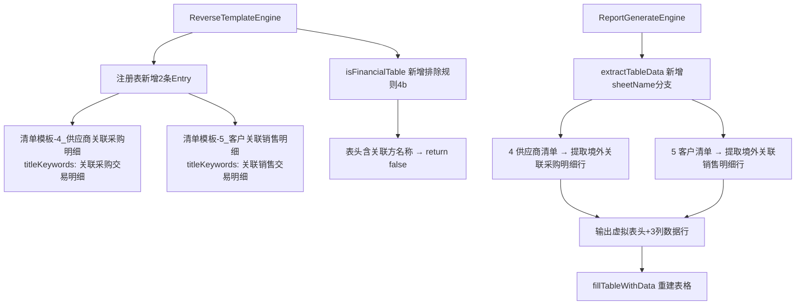

## 用户需求

历史报告（Word）中存在"图表10：2024年度关联采购交易明细表"和"图表11：2024年度关联销售交易明细表"，当前逆向引擎未能识别这两张表并写入正确占位符，生成引擎也没有对应的数据重建逻辑。需要新增完整的逆向识别 + 生成填充支持。

## 产品概述

基于转定价报告的正逆向引擎，逆向阶段将 Word 历史报告还原为带占位符的子模板，生成阶段从清单 Excel 数据重建 Word 表格内容。"关联采购/销售交易明细表"是新增的两个整表占位符，需要覆盖逆向识别和生成填充两个环节。

## 核心功能

- **逆向识别**：在注册表中为"关联采购交易明细表"和"关联销售交易明细表"新增两个 `TABLE_CLEAR_FULL` 类型的 `RegistryEntry`，配置高区分度的 `titleKeywords`，使 `clearTableBlock` 能通过精确匹配定位并清空这两张表，写入占位符 `{{清单模板-4_供应商关联采购明细}}` 和 `{{清单模板-5_客户关联销售明细}}`
- **生成填充**：在 `extractTableData` 中新增对这两个 sheetName 的专用截取逻辑，从 Excel `4 供应商清单` / `5 客户清单` Sheet 提取关联方有效明细行（有金额的行）+ 小计行，转换为 Word 表格所需的 3 列格式（关联方名称 | 交易金额 | 占比），通过 `fillTableWithData` 重建表格行
- **排除误命中保护**：在 `isFinancialTable` 中新增排除规则，防止关联采购/销售明细表（首行含"关联方名称"）被 fallback 误命中

## 技术栈

- 现有 Java 项目，Apache POI（XWPFDocument/XWPFTable/XWPFTableRow/XWPFTableCell）
- EasyExcel 无表头模式读取 Excel Sheet 数据
- 修改范围：`ReverseTemplateEngine.java` + `ReportGenerateEngine.java`，不新增文件

---

## 实现方案

### 总体策略

复用现有的 `TABLE_CLEAR_FULL` 整表占位符机制，无需引入新类型或新方法，只需：

1. **ReverseTemplateEngine**：注册表新增两条 Entry + `isFinancialTable` 新增排除规则
2. **ReportGenerateEngine**：`extractTableData` 新增两个 sheetName 分支

---

### 修复点1：ReverseTemplateEngine 注册表新增两个条目

**插入位置**：在 `清单模板-关联交易汇总表` 条目之后（第179~180行附近），与关联交易系列紧邻：

```java
reg.add(new RegistryEntry("清单模板-4_供应商关联采购明细", "关联采购明细",
        PlaceholderType.TABLE_CLEAR_FULL, "list", "4 供应商清单", null,
        List.of("关联采购交易明细", "关联采购明细表", "采购交易明细表")));
reg.add(new RegistryEntry("清单模板-5_客户关联销售明细", "关联销售明细",
        PlaceholderType.TABLE_CLEAR_FULL, "list", "5 客户清单", null,
        List.of("关联销售交易明细", "关联销售明细表", "销售交易明细表")));
```

**关键设计点**：

- `titleKeywords` 选用 `"关联采购交易明细"` / `"关联销售交易明细"` 作为首选关键词——Word 中表格标题为"图表10：2024年度关联采购交易明细表"，这两个词高区分度，不会与其他表格前置段落重叠
- `sourceSheet` 设为 `"4 供应商清单"` / `"5 客户清单"`，与现有 `清单模板-4_供应商清单` 不同，此处用于生成阶段按 sheetName 分支处理
- 注意这两条**必须插在** `清单模板-4_供应商清单` 和 `清单模板-5_客户清单` 之前，避免原有注册条目的 titleKeywords（`"供应商清单"`/`"客户清单"`）因出现在同一段落中而抢先绑定错表

### 修复点2：isFinancialTable 新增排除规则

在现有"排除规则4：关联交易汇总表"之后，增加规则，防止关联采购/销售明细表被 fallback 误绑：

```java
// 排除规则4b：关联交易明细表（表头含"关联方名称"）
if (headerRowText.contains("关联方名称")) {
    return false;
}
```

Word 图表10/11 的表格第一行表头含"关联方名称"，这是强区分特征，不会与 PL/分部财务等表格表头冲突。

### 修复点3：ReportGenerateEngine extractTableData 新增分支

在 PL 专用截取块之后，新增两个 sheetName 分支：

**供应商清单提取逻辑（sheetName = "4 供应商清单"）**：

Excel 结构（0-based行索引）：

- 行0：公司名称
- 行1：空
- 行2：附件四标题
- 行3：说明文字
- 行4：大表头（项目/编号/供应商名称/产品类型/金额/占采购总金额比例/占关联采购总金额比例...）
- 行5：子表头（金额（人民币）/...）
- 行6：关联供应商（分组标题行）
- **行7**：境外关联采购（大分组行，col0）
- **行8~12**：明细行1~5（col1=编号, col2=供应商名称, col4=金额, col5=占采购总额比例）
- **行13**：其他
- **行14**：境外关联采购小计
- **行15**：境内关联采购（大分组行）
- **行16~20**：明细行1~5
- **行21**：其他
- **行22（含）以下**：境内关联采购小计, 关联采购小计...

**目标转换**：提取 `境外关联采购` 分组下有金额（col4 非空且>0）的明细行，转换为3列：

- col0 → 关联方名称（col2，供应商名称）
- col1 → 交易金额（col4，金额人民币）
- col2 → 占比（col5，占采购总金额比例，格式化为百分比）

同时在 Word 表格中保留分组行（"境外关联采购"）和小计行（"境外关联采购小计"）的结构，与 Word 原始格式对齐。

**提取规则**（按行7~末尾扫描）：

1. col0 非空 且 col1 为空 → 这是分组标题行（"境外关联采购"等），写入第一列，二三列为空
2. col1 为数字编号（"1"~"5"）且 col2 非空（有供应商名称）→ 明细行，提取名称/金额/占比
3. col1 = "其他" 且 col4 非空非0 → 其他行，写入
4. col1 包含"小计" 或 col0 包含"小计" → 小计行，写入金额合计

客户清单提取逻辑完全对称，对应"境外关联销售"分组，金额列col4，占比列col5。

**输出格式（List<List<Object>>）**：

- 行0：虚拟空表头（供 `fillTableWithData` 的 `startDataRow=1` 跳过，保留 Word 原有表头）
- 行1..N：实际数据行，每行3个元素 `[关联方名称/分组名, 交易金额, 占比]`

---

## 实现注意事项

1. **注册顺序很关键**：新条目`清单模板-4_供应商关联采购明细`必须在`清单模板-4_供应商清单`之前注册，否则 Phase 2a 匹配时，若前置段落同时含有"供应商清单"和"关联采购交易明细"，后者会被原有条目抢走

2. **金额格式化**：Excel 中金额为数值类型（如 `36904831.57`），占比为小数（如 `0.0417`）。生成时需格式化：金额保留2位小数并加千分位（`#,##0.00`），占比转为百分比（`0.00%`）。复用现有模式，直接 `toString()` 即可（EasyExcel 读出的数值原样保留）

3. **空行过滤**：Excel 中编号1~5即使没有供应商名称也占位，需严格过滤 col2（供应商名称）为空的行，避免写入空白数据行

4. **不改变现有`清单模板-4_供应商清单`和`清单模板-5_客户清单`条目**：原有条目绑定的是清单模板中的附件表（完整格式），明细表是独立的两张新表，通过新的占位符和 sheetName 区分

5. **isFinancialTable 排除规则执行顺序**：新规则4b（含"关联方名称"）插入在规则4（含"关联交易类型"）之后、规则5（独立交易区间表）之前，逻辑链路清晰

---

## 架构设计



## 目录结构

```
src/main/java/com/fileproc/report/service/
├── ReverseTemplateEngine.java  # [MODIFY]
│   ├── 注册表（第179~184行附近）：
│   │   新增 清单模板-4_供应商关联采购明细 和 清单模板-5_客户关联销售明细 两条 RegistryEntry，
│   │   sourceSheet 分别为 "4 供应商清单" / "5 客户清单"，
│   │   titleKeywords 为高区分度的 "关联采购交易明细" / "关联销售交易明细"；
│   │   位置：插在原有 清单模板-4_供应商清单 / 清单模板-5_客户清单 之前
│   └── isFinancialTable 方法（排除规则4之后）：
│       新增排除规则4b：表头含"关联方名称"时返回 false，
│       防止关联采购/销售明细表被 fallback 误绑到 PL含特殊因素调整
│
└── ReportGenerateEngine.java   # [MODIFY]
    └── extractTableData 方法（PL 分支之后）：
        新增 "4 供应商清单" 和 "5 客户清单" 两个 sheetName 分支，
        扫描 Excel 行7~末尾，过滤出境外关联采购（或销售）的分组行、
        有名称的明细行、其他行、小计行，
        转换为 3 列格式（关联方名称 | 交易金额 | 占比），
        前置虚拟空表头行后返回，供 fillTableWithData 重建表格
```