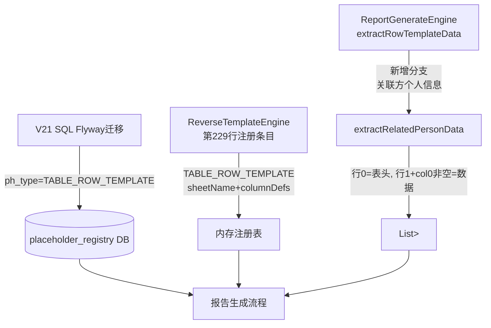

## 用户需求

将"清单模板-关联方个人信息"占位符的类型从 `TABLE_CLEAR_FULL` 升级为 `TABLE_ROW_TEMPLATE`，使其支持动态行数的报告生成。

## 产品概述

关联方个人信息表（Sheet：关联方个人信息）是清单模板中的一张极简结构表：行0为表头（个人关联方 | 国籍 | 关联关系类型 | 居住地址），行1起为数据行，col0（个人关联方）非空则为有效数据行。当前该占位符注册为 TABLE_CLEAR_FULL 导致无法按实际数据行数动态克隆行模板，需将其升级为 TABLE_ROW_TEMPLATE 并补充完整的字段配置与数据提取逻辑。

## 核心功能

- **SQL 迁移脚本（V21）**：将数据库中该占位符的 `ph_type` 改为 `TABLE_ROW_TEMPLATE`，同步写入 `sheet_name`、`column_defs`（默认4列）和 `available_col_defs`（全量4列）
- **ReverseTemplateEngine 更新**：将第229行的注册条目从 `TABLE_CLEAR_FULL` 改为 `TABLE_ROW_TEMPLATE`，补充 sheetName="关联方个人信息" 和完整的 columnDefs/availableColDefs
- **ReportGenerateEngine 新增分支**：在 `extractRowTemplateData` 方法中新增关联方个人信息专用数据提取方法 `extractRelatedPersonData`，逻辑为：读取行0作为表头，从行1起扫描，col0非空则纳入结果行

## 技术栈

与现有项目完全一致：Java（Spring Boot）+ MyBatis-Plus + Flyway 数据库迁移 + EasyExcel 数据读取。

## 实现方案

本次变更严格对标 V18/V20 + `extractOrgStructureData` / `extractRelatedCompanyData` 已验证的升级路径，分三处改动，相互独立、顺序无关：

1. **数据库迁移（V21 SQL）**：UPDATE `placeholder_registry`，将 `ph_type`、`sheet_name`、`column_defs`、`available_col_defs` 一次性写入，格式与 V20 完全一致。4列全部纳入 available_col_defs，column_defs 默认全选4列（该表列数少，无需分默认/全量差异）。

2. **ReverseTemplateEngine 第229行**：将现有 TABLE_CLEAR_FULL 注册条目替换为 TABLE_ROW_TEMPLATE 形式，补充 sheetName="关联方个人信息"、columnDefs=["个人关联方","国籍","关联关系类型","居住地址"]、availableColDefs=同列，关键词保持不变。注册位置移入 TABLE_ROW_TEMPLATE 分组注释块内（第235行之后），避免留在 TABLE_CLEAR_FULL 块中造成误解。

3. **ReportGenerateEngine 新增 `extractRelatedPersonData`**：结构最简单——行0即表头，行1起为数据，col0非空即有效行。逻辑比 `extractOrgStructureData`（表头在行5，数据从行6起）更简单，直接复用同一模式。在 `extractRowTemplateData` 路由分支中，新增 `"关联方个人信息".equals(sheetName)` 判断，调用新方法。

## 实现注意事项

- **sheetName 精确匹配**：Excel Sheet Tab 名为"关联方个人信息"（无数字前缀），SQL 的 `sheet_name` 字段和 Java 路由判断字符串必须完全一致，不可加空格或前缀。
- **最低行数校验**：`extractRelatedPersonData` 中校验 `rows.size() < 2`（至少有表头行+1行数据）即可返回空列表并 warn 日志，与同类方法保持一致的防御性编程风格。
- **占位符注册顺序**：移入 TABLE_ROW_TEMPLATE 分组后，需确保在"供应商/客户清单"关键词注册前，避免关键词抢先匹配，与 V20 升级关联公司信息时的注意事项一致。
- **SQL WHERE 条件**：必须加 `AND level = 'system' AND deleted = 0`，与 V18/V20 完全对齐，防止误更新用户级记录。
- **不修改无关逻辑**：TABLE_CLEAR_FULL 的整表清空处理路径不需要改动，仅新增 TABLE_ROW_TEMPLATE 分支；供应商/客户/劳务等现有路径零影响。

## 架构设计



## 目录结构

```
src/main/resources/db/
└── V21__upgrade_related_person_to_row_template.sql   # [NEW] Flyway迁移脚本
    # UPDATE placeholder_registry SET ph_type='TABLE_ROW_TEMPLATE',
    # sheet_name='关联方个人信息', column_defs='["个人关联方","国籍","关联关系类型","居住地址"]',
    # available_col_defs='["个人关联方","国籍","关联关系类型","居住地址"]'
    # WHERE placeholder_name='清单模板-关联方个人信息' AND level='system' AND deleted=0

src/main/java/com/fileproc/report/service/
├── ReverseTemplateEngine.java                        # [MODIFY] 第229-230行
│   # 将 TABLE_CLEAR_FULL 注册条目替换为 TABLE_ROW_TEMPLATE，
│   # 补充 sheetName="关联方个人信息"，columnDefs/availableColDefs=4列，
│   # 将该条目移入 TABLE_ROW_TEMPLATE 分组注释块（第235行之后）
│
└── ReportGenerateEngine.java                         # [MODIFY] extractRowTemplateData方法
    # 1. 在方法顶部路由区新增分支：
    #    if ("关联方个人信息".equals(sheetName)) return extractRelatedPersonData(rows);
    # 2. 在 extractRelatedCompanyData 方法之后新增 extractRelatedPersonData 私有方法：
    #    - 行数<2时warn+返回空列表
    #    - 读取rows.get(0)构建colIdx→字段名Map（表头）
    #    - 从i=1起遍历，col0非空则按colNameMap提取所有列加入结果
    #    - debug日志：表头解析结果、数据行数
```