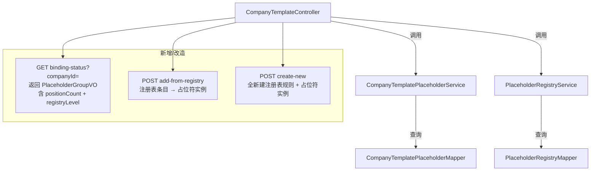

## 用户需求

基于 V7 已完成的占位符绑定基础接口，对现有后端进行补充，满足前端「占位符管理面板」的完整功能需求：

## 产品概述

在子模板在线编辑页面右侧「占位符管理面板」中，支持展示反向生成的占位符列表（带文档插入数量和系统/企业级标签）、从占位符库中选择已有条目添加到子模板、以及全新新建一个占位符（同时创建注册表规则）。

## 核心功能

- **占位符列表增强**：现有 `binding-status` 接口返回数据需新增 `positionCount`（该占位符在文档中的位置记录数）和 `registryLevel`（system/company，来源于注册表）两个字段，支持前端渲染卡片上的数量标签和系统/企业级标签
- **从占位符库添加**：新接口 `POST /{templateId}/placeholders/add-from-registry`，传入注册表条目ID，将该规则实例化为子模板占位符记录；若该 placeholderName 在此子模板已存在则返回 400 禁止重复添加
- **全新新建占位符**：新接口 `POST /{templateId}/placeholders/create-new`，同时创建企业级注册表规则和子模板占位符记录（原子操作），用于「在数据源中选字段新建」的场景；与已有 `create-registry-and-bind` 区分（后者是为已有占位符实例补充注册表规则）

## 技术栈

Spring Boot + MyBatis-Plus + MySQL，全注解 Mapper（无 XML），与现有项目保持完全一致。

## 实现方案

### 整体策略

本次修改聚焦在 3 个文件，改动最小化：

1. `CompanyTemplatePlaceholderMapper` 新增2条查询
2. `CompanyTemplatePlaceholderService` 改造 `listWithBindingStatus` + 新增2个业务方法
3. `CompanyTemplateController` 新增2个接口

涉及的注册表层（`PlaceholderRegistryService`、`PlaceholderRegistryMapper`）**无需任何修改**，直接复用现有 `saveEntry()`、`selectCompanyEntries()` 等方法。

---

### 关键技术决策

#### positionCount 的实现方式

`company_template_placeholder` 表中，同一 `templateId` 下同一 `placeholder_name` 可能存在**多条记录**（每条对应一个文档位置），`positionCount` = 同 `templateId` + 同 `placeholder_name` 的记录数。

实现方案：在 `listWithBindingStatus` 中，先按 `templateId` 拉取全量列表，再在内存中按 `placeholderName` 分组，`count` 即为 size。**不需要额外 COUNT SQL**，避免 N+1 查询。

但这引出一个问题：`binding-status` 接口原本是每条记录一个 VO，改为"按 placeholderName 聚合"后，需要决定聚合的行为：

- 同名多条记录合并为一条展示（卡片维度），`positionCount = 记录数`
- `sourceSheet`/`sourceField` 取第一条非空值（通常同名记录绑定信息一致）

这个聚合逻辑在 Service 层做，VO 新增 `positionCount`、`registryLevel` 字段，用 `static` 内部类方式扩展（与现有 `PlaceholderBindingVO` 模式一致）。

#### registryLevel 的实现方式

需要从 `placeholder_registry` 表查出每个 `placeholderName` 对应的 level（企业级优先）。

实现方案：在 `listWithBindingStatus` 中，调用已有 `PlaceholderRegistryService.listCompanyEntries(companyId)` + `listSystemEntries()` 做内存合并，构建 `placeholderName → level` 的 Map，避免 N+1。`companyId` 从请求参数传入（接口改为接收 `companyId` 查询参数）。

#### add-from-registry 的重复校验

`selectByTemplateIdAndName` 已存在，直接复用，非空即返回 400。

#### create-new 与 create-registry-and-bind 的职责边界

| 接口 | 前提条件 | 操作 |
| --- | --- | --- |
| `create-registry-and-bind` | 占位符实例**已存在**（由反向引擎生成），只是没有注册表规则 | 新建注册表规则 + 更新现有占位符绑定字段 |
| `create-new`（新增） | 占位符实例**不存在**，从零创建 | 新建注册表规则 + 新建占位符实例记录 |


两者语义不同，不合并，各自职责清晰。

---

### 性能说明

- `listWithBindingStatus` 改为聚合后仍只有1次 SELECT（`selectByTemplateId`），注册表查询也是批量，整体仍为 O(n) 内存操作，无性能回归
- `add-from-registry`、`create-new` 均为单次写入，事务范围小

## 架构设计



## 目录结构

```
src/main/java/com/fileproc/
├── template/
│   ├── mapper/
│   │   └── CompanyTemplatePlaceholderMapper.java   # [MODIFY] 新增2个查询方法：
│   │                                                #  selectCountByTemplateId（统计各占位符数量，可选）
│   │                                                #  selectDistinctNamesWithCount 按name分组统计
│   ├── service/
│   │   └── CompanyTemplatePlaceholderService.java  # [MODIFY] 
│   │                                                #  1. listWithBindingStatus 改造：入参加 companyId，
│   │                                                #     按 placeholderName 聚合，返回 PlaceholderGroupVO 列表
│   │                                                #  2. 新增 addFromRegistry：从注册表添加到子模板
│   │                                                #  3. 新增 createNew：全新建注册表规则+占位符实例
│   │                                                #  4. 新增 PlaceholderGroupVO（替代 PlaceholderBindingVO）
│   │                                                #  5. 新增 AddFromRegistryRequest、CreateNewRequest DTO
│   └── controller/
│       └── CompanyTemplateController.java          # [MODIFY]
│                                                    #  1. binding-status 接口加 companyId 参数，返回类型改为 PlaceholderGroupVO
│                                                    #  2. 新增 POST add-from-registry 接口
│                                                    #  3. 新增 POST create-new 接口
│                                                    #  4. 新增 AddFromRegistryRequest、CreateNewRequest DTO
```

## 关键数据结构

```java
// PlaceholderGroupVO：按 placeholderName 聚合后的占位符卡片 VO
public static class PlaceholderGroupVO {
    // 来自 CompanyTemplatePlaceholder 的代表字段（取第一条）
    String placeholderName;   // 占位符原始名（如 ${companyName}）
    String name;              // 显示名
    String type;
    String sourceSheet;
    String sourceField;
    String bindingStatus;     // bound / unbound
    
    // 新增字段
    int positionCount;        // 文档中该占位符出现的位置数（同名记录数）
    String registryLevel;     // system / company / null（注册表中不存在）
    
    // 所有位置记录（供下方详情面板展示）
    List<CompanyTemplatePlaceholder> positions;
}
```