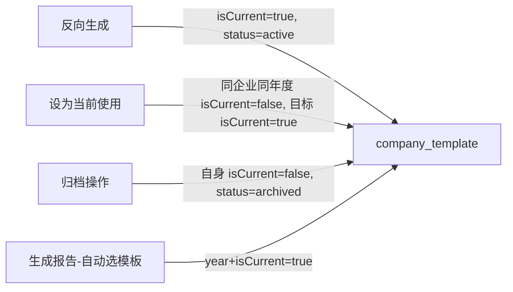

## 用户需求

企业子模板当前的"当前使用"状态与"归档"状态混在一起（通过 status 字段管理），业务上需要将两者解耦。

## 产品概述

新增 `isCurrent` 字段专门表示某个子模板是否为"当前使用"版本，`status` 字段仅表示生命周期状态（active / archived）。

## 核心功能

- **新增 `isCurrent` 字段**：布尔类型，表示该模板是否为当前使用版本
- **切换当前使用**：`setActive(id)` 只更新 `isCurrent`，不改变 `status`；切换范围限定在**同一企业同一年度**内，其他年度模板不受影响
- **反向生成默认当前使用**：新反向生成的子模板默认 `isCurrent=true`（不影响其他年度同企业模板的 `isCurrent`）
- **归档独立流程**：归档操作（生成报告 → 删除文件 → status=archived）同时将该模板 `isCurrent=false`，不影响其他模板
- **报告生成选模板**：自动选模板时按 `companyId + year + isCurrent=true` 查询，不再按最新 active 模板查

## 技术栈

- Java 17 + Spring Boot
- MyBatis-Plus ORM
- MySQL + Flyway 数据库迁移

## 实现方案

通过 Flyway 新增迁移脚本为 `company_template` 表添加 `is_current` 字段，同步更新 Java 实体、Mapper 自定义 SQL、Service 业务逻辑。

`setActive` 方法改为仅在同一企业同一年度内切换 `isCurrent` 值，不触碰 `status`；`archive` 方法归档同时清除 `isCurrent`；`saveReverseResult` 新建时设置 `isCurrent=true`；报告异步生成自动选模板改用 `isCurrent=true` + 年度查询。

## 实现注意事项

- Mapper 中所有自定义 `@Select` SQL 的字段列表需同步补充 `is_current` 字段，否则 MyBatis 映射时该字段始终为 null
- `selectCurrentByCompanyAndYear` 新增方法需加 `AND deleted = 0` 过滤逻辑删除数据
- `saveReverseResult` 不自动归档旧模板，维持原有设计（允许多个 active 共存），仅将新模板的 `isCurrent=true`；若该年度已有 `isCurrent=true` 的模板，不自动改为 false（由前端调用 set-active 接口手动切换）
- `archive` 时只将被归档模板自身 `isCurrent=false`，不影响同年度其他模板状态

## 架构设计

数据流：



## 目录结构

```
src/
├── main/
│   ├── resources/db/
│   │   └── V5__add_is_current.sql          # [NEW] 为 company_template 表新增 is_current 字段，默认值 false；同时将现有 status=active 的记录中创建时间最新的一条设为 is_current=true（按企业+年度分组）
│   └── java/com/fileproc/template/
│       ├── entity/
│       │   └── CompanyTemplate.java         # [MODIFY] 新增 isCurrent 字段（Boolean，对应 is_current）；更新 getIsActive() 注释，保留 status 字段含义说明
│       ├── mapper/
│       │   └── CompanyTemplateMapper.java   # [MODIFY] 所有自定义 @Select SQL 字段列表加 is_current；新增 selectCurrentByCompanyAndYear 方法（按 companyId+tenantId+year+isCurrent=true 查询，含 file_path）；新增 clearCurrentByCompanyAndYear 批量 update 方法
│       └── service/
│           └── CompanyTemplateService.java  # [MODIFY] setActive：改为只更新 isCurrent，先将同企业同年度其他模板 isCurrent=false，再将目标模板 isCurrent=true，不修改 status；saveReverseResult：设置 isCurrent=true；archive：归档时设置 isCurrent=false
└── report/service/
    └── ReportAsyncService.java              # [MODIFY] asyncGenerateFile 中自动选模板逻辑从 selectLatestActiveByCompany 改为调用 selectCurrentByCompanyAndYear（按 year+isCurrent=true 精确匹配）
```