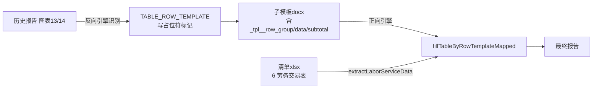

## 用户需求

历史报告中的图表13（2024年度接受关联劳务明细表）和图表14（2024年度提供关联劳务明细表）在反向生成引擎处理时未被识别，导致这两张表保留了原始数据而非被替换为占位符。

## 产品概述

参考已有的关联采购/销售明细表（`清单模板-4`/`清单模板-5`）的 `TABLE_ROW_TEMPLATE` 处理方式，让反向引擎识别这两张劳务明细表，保留原有表结构（行类型 group/data/subtotal），并从清单文件"6 劳务交易表"Sheet 中提取对应字段数据。正向生成时同样通过行模板克隆机制填充实际数据。

## 核心功能

- **反向生成**：识别报告中的"接受关联劳务明细表"（图表13）和"提供关联劳务明细表"（图表14），将其处理为行模板占位符结构（`{{_tpl_清单模板-6_劳务支出明细}}`、`{{_tpl_清单模板-7_劳务收入明细}}`），保留 group/data/subtotal 行类型标记
- **正向生成**：从清单文件"6 劳务交易表"Sheet 中按行次范围分别提取劳务支出（行次16-30）和劳务收入（行次1-14）数据，按字段名（关联方名称、交易金额、占比）填充行模板
- 数据映射列：关联方名称 → 关联方名称、交易金额 → 交易金额、占比列 → 对应占比（支出用"占总经营成本费用比重"，收入用"占总劳务收入比重/占营业收入比重"）

## 技术栈

现有 Java/Spring Boot 项目，使用 Apache POI（XWPF）处理 Word、EasyExcel 读取 Excel，沿用项目现有架构，不引入新框架。

## 实现思路

### 总体策略

劳务交易表与采购/销售明细表结构高度一致（均为3列：名称、金额、占比，含 group/data/subtotal 行类型），可**完整复用**现有的 `TABLE_ROW_TEMPLATE` 机制。

唯一的差异点在于：劳务收入和劳务支出混在同一个 Sheet（`6 劳务交易表`）中，需要**按行次范围分段提取**。现有 `extractRowTemplateData` 方法是专门为供应商/客户清单 Sheet 的固定结构设计的（从行8开始扫描），无法直接复用，需新增一个针对劳务交易表的专用提取方法。

### 两个新占位符

| 占位符名 | 对应表格 | Sheet | 行次范围 | titleKeywords |
| --- | --- | --- | --- | --- |
| `清单模板-6_劳务支出明细` | 图表13 接受关联劳务明细表 | `6 劳务交易表` | 行次16-30（劳务支出部分） | `["接受关联劳务明细", "劳务支出明细", "劳务支出"]` |
| `清单模板-7_劳务收入明细` | 图表14 提供关联劳务明细表 | `6 劳务交易表` | 行次1-14（劳务收入部分） | `["提供关联劳务明细", "劳务收入明细", "劳务收入"]` |


原有的 `清单模板-6_劳务交易表`（`TABLE_CLEAR_FULL`）继续保留，不影响原有逻辑。

### 劳务交易表 Sheet 结构分析

```
行0-1: 空行
行2:   "附件六：劳务交易表"（标题）
行3:   说明文字
行4:   空行
行5:   列头（行次 | 关联交易类型 | 关联方名称 | 关联交易内容 | 交易金额 | 比例 | 占总劳务收入比重(%) ）
行6:   列序号（1|2|3|4|5|6）
行7:   空行
行8 (行次=1):  劳务收入明细行
...
行14 (行次=7): "境外关联劳务收入小计"（subtotal）
...
行22 (行次=15): "境内外关联和非关联劳务收入合计"（subtotal，收入段结束）
行23 (行次=16): 劳务支出开始（"境外关联劳务支出"分组行）
...
行37 (行次=30): "境内外关联和非关联劳务支出合计"（subtotal，支出段结束）
```

判断逻辑：

- 分组行：col1（关联交易类型）含"境外"/"境内"且不含小计/合计，视为 group
- 明细行：col0（行次）为整数，col2（关联方名称）非空，视为 data
- 合计行：col1含"小计"/"合计"，视为 subtotal
- `"────"` / `"其他关联方"` 特殊行：视为 data（其他关联方汇总）

字段映射（列索引从0起）：

- col0 = 行次，col1 = 关联交易类型，col2 = 关联方名称，col3 = 关联交易内容，col4 = 交易金额，col5 = 比例，col6 = 占总劳务收入比重（%）

报告表格列定义（`columnDefs`）：

- 支出表：`["关联方名称", "交易金额（人民币元）", "占总经营成本费用比重(%)"]`
- 收入表：`["关联方名称", "交易金额（人民币元）", "占营业收入比重(%)"]`

（columnDefs 用于反向引擎写 `{{_col_字段名}}`，需与历史报告表格实际列标题一致）

## 执行细节

### ReverseTemplateEngine.java 修改

**改动1**：将原有 `清单模板-6_劳务交易表` 的注册改为两条 `TABLE_ROW_TEMPLATE` 类型注册（放在采购/销售明细后面，关键词优先匹配）：

```java
// 在清单模板-5_客户关联销售明细之后、清单模板-5_客户清单之前插入
reg.add(new RegistryEntry("清单模板-6_劳务支出明细", "接受关联劳务明细",
    PlaceholderType.TABLE_ROW_TEMPLATE, "list", "6 劳务交易表", null,
    List.of("接受关联劳务明细", "劳务支出明细"),
    List.of("关联方名称", "交易金额（人民币元）", "占总经营成本费用比重(%)")));
reg.add(new RegistryEntry("清单模板-7_劳务收入明细", "提供关联劳务明细",
    PlaceholderType.TABLE_ROW_TEMPLATE, "list", "6 劳务交易表", null,
    List.of("提供关联劳务明细", "劳务收入明细"),
    List.of("关联方名称", "交易金额（人民币元）", "占营业收入比重(%)")));
// 原 清单模板-6_劳务交易表 TABLE_CLEAR_FULL 保留（改关键词避免误触发）
```

**注意**：原 `清单模板-6_劳务交易表` 的 titleKeywords 中去掉"劳务交易"，改为其他更精确的词，避免与新注册条目冲突。

### ReportGenerateEngine.java 修改

**改动1**：`rowTemplateSheets` Set 新增 `"6 劳务交易表"` 触发行模板路由。

**改动2**：新增 `extractLaborServiceData(rows, sheetName, boolean isExpense)` 方法，专门从"6 劳务交易表"提取收入或支出段数据：

```java
// 参数 isExpense=true 提取支出部分（行次16-30），false 提取收入部分（行次1-14）
private List<Map<String, Object>> extractLaborServiceData(
        List<Map<Integer, Object>> rows, String sheetName, boolean isExpense)
```

扫描逻辑：

1. 先定位列头行（行5，0-based index=4），解析 col2=关联方名称、col4=交易金额、col6=占比
2. 按行次范围过滤：收入部分行次1-15，支出部分行次16-30
3. 按列1（关联交易类型）判断行类型：

- 含"境外"/"境内"且不含小计/合计 → group
- 含"小计"/"合计" → subtotal  
- col0为整数（行次）且col2非空 → data（含"其他关联方"兜底为data）

4. 使用 `buildRowMap` 构建统一格式输出（复用现有方法）

**改动3**：在 `extractRowTemplateData` 的调用路由处，增加对 `"6 劳务交易表"` 的分支判断——需区分是支出还是收入占位符，通过 `ph.getName()` 判断后路由到 `extractLaborServiceData`：

```java
// 在路由判断处（当前 rowTemplateSheets.contains(ph.getSourceSheet()) 分支内）
if ("6 劳务交易表".equals(ph.getSourceSheet())) {
    boolean isExpense = ph.getName().contains("劳务支出");
    List<Map<String, Object>> rowData = extractLaborServiceData(rows, ph.getSourceSheet(), isExpense);
    rowTemplateValues.put(ph.getName(), rowData);
} else {
    List<Map<String, Object>> rowData = extractRowTemplateData(rows, ph.getSourceSheet());
    rowTemplateValues.put(ph.getName(), rowData);
}
```

## 架构设计



## 目录结构

```
src/main/java/com/fileproc/report/service/
├── ReverseTemplateEngine.java  # [MODIFY] 注册两条新 TABLE_ROW_TEMPLATE（~206-220行），调整原清单模板-6关键词
└── ReportGenerateEngine.java   # [MODIFY] 新增 extractLaborServiceData 方法；rowTemplateSheets 增加"6 劳务交易表"；路由分支增加劳务表判断
```