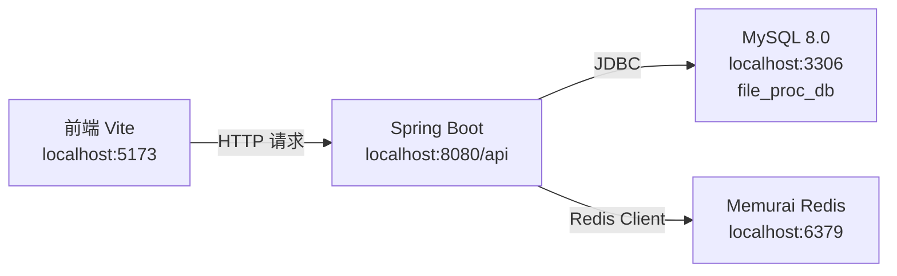

## 用户需求

将 Spring Boot 后端项目在本机 Windows 环境中运行，配合前端（`http://localhost:5173`）进行联调。

## 产品概述

本机无任何运行环境（无 JDK、Maven、MySQL、Redis、Docker），Docker Desktop 安装失败（权限拒绝）。需要通过 winget 包管理器安装全套依赖环境，修正 CORS 配置，最终使后端在本机 `localhost:8080` 运行并可被前端正常调用。

## 核心功能

- 安装 JDK 17、Maven、MySQL 8.0、Redis（Memurai）运行环境
- 初始化数据库（执行 `init.sql` 建表并导入初始数据）
- 修正 CORS 跨域白名单，将 `http://localhost:3000` 改为 `http://localhost:5173`
- 使用 `mvn spring-boot:run` 以 dev profile 在本机启动后端服务
- 提供完整的一键启动脚本，方便后续每次调试复用

## 技术栈

- **后端**：Spring Boot 3.2.5 / Java 17 / Maven
- **数据库**：MySQL 8.0（本机 Windows Service）
- **缓存**：Redis（使用 Memurai —— Redis 的 Windows 原生版本，完全兼容 Redis 协议）
- **包管理**：winget（Windows 内置，无需额外安装）
- **环境工具**：Eclipse Temurin JDK 17、Apache Maven 3.9

## 实现方案

Docker Desktop 因权限问题无法安装，改用**本机原生服务**方式部署中间件：

- MySQL 8.0 通过 winget 安装为 Windows 服务，端口 3306
- Redis 使用 Memurai（Redis for Windows 兼容版）通过 winget 安装为 Windows 服务，端口 6379
- JDK 17 + Maven 通过 winget 安装后配置环境变量
- 后端直接 `mvn spring-boot:run` 启动，dev profile 默认连 `localhost:3306` 和 `localhost:6379`，无需任何连接配置改动

CORS 配置只需修改 `application.yml` 中的 `cors.allowed-origins`，将 `http://localhost:3000` 改为 `http://localhost:5173`，CORS 处理逻辑（`WebMvcConfig.java`）已支持逗号分隔多域名，无需改动 Java 代码。

## 实施说明

- **MySQL 初始化**：首次启动 MySQL 服务后需执行 `src/main/resources/db/init.sql`，该脚本已包含 `CREATE DATABASE IF NOT EXISTS` 和所有表结构及初始数据，幂等安全可重复执行
- **环境变量**：winget 安装 JDK/Maven 后需要刷新 PowerShell 会话（或重新开启终端）才能识别 `java`/`mvn` 命令
- **端口冲突**：本机 3306 和 6379 端口需确保未被其他进程占用
- **文件上传目录**：`file.upload-dir` 默认为 `./uploads`，相对于项目根目录，首次运行会自动创建
- **保持向后兼容**：仅修改 `application.yml` 的 CORS 配置项，不改动任何 Java 代码和其他配置

## 架构设计



## 目录结构

```
d:/wangzhe/CodeBuddy/fileWork_backend/
├── src/main/resources/
│   └── application.yml          # [MODIFY] 修改 cors.allowed-origins 为 http://localhost:5173
├── start-dev.ps1                # [NEW] 本机一键启动脚本（验证环境 + 启动 MySQL/Redis 服务 + mvn spring-boot:run）
└── docs/
    └── local-dev-setup.md       # [NEW] 本机环境搭建说明文档（winget 安装步骤 + 数据库初始化 + 常见问题）
```