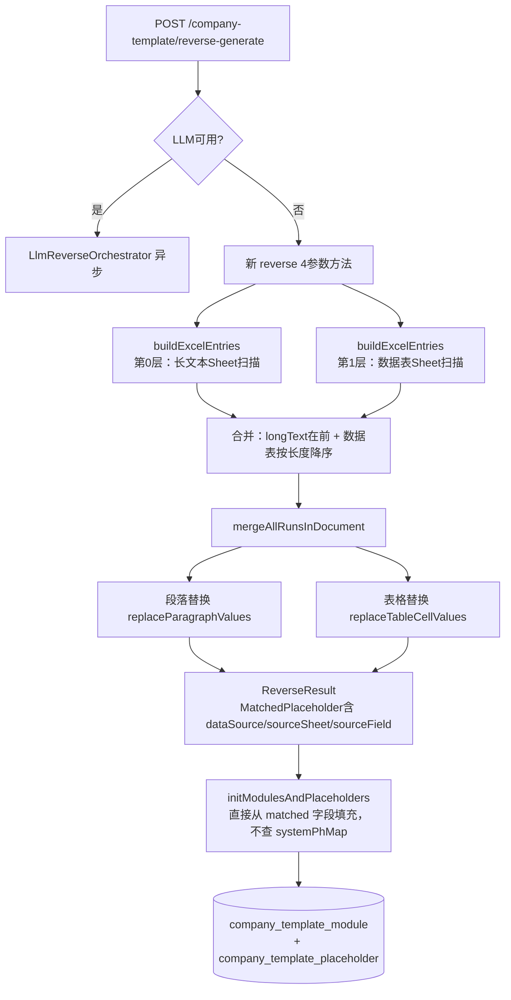

# 关联交易同期资料报告生成系统 — 反向引擎重写开发计划（v3）

> 本文档记录「反向报告生成企业子模板」引擎从依赖 `SystemPlaceholder` 规则列表的旧方式，升级为**分层 Excel 扫描驱动**新方式的完整开发计划。

---

## 一、背景与问题

### 现有方案的根本缺陷

旧引擎（`ReverseTemplateEngine.java`）依赖人工预定义的 `SystemPlaceholder` 规则列表（写死每个占位符对应哪个 Sheet / 单元格），存在以下问题：

| 问题 | 描述 |
|------|------|
| 动态内容无法覆盖 | 行业情况、集团背景等长文本段落因企业而异，无法在系统标准模板中预先定义单元格地址 |
| 维护成本高 | 每增加一个字段，需在系统标准模板中手工添加占位符规则 |
| BVD全量扫描风险 | BVD Excel 有 3472 行，含大量数值，若全量扫描极易误匹配 |
| 短值误替换 | 统一最小长度阈值（4字符）无法阻止"中国"、"上海"等通用词被替换 |

### 新方案目标

- 零规则维护：不依赖预定义规则，直接从清单 Excel 动态提取所有数据
- 零误匹配风险：通过分层策略和精确边界控制，彻底解决短值干扰问题
- 完整覆盖：行业分析等动态长文本段落全部自动处理

---

## 二、清单 Excel 数据结构（已确认）

基于对远化物流 `清单模板-23.xlsx` 的实际分析（23个Sheet）：

### 数据表 Sheet（固定结构，8行）

| A列（字段名） | B列（值） | 生成占位符 |
|-------------|---------|----------|
| 企业名称 | 上海远化物流有限公司 | `{{企业名称}}` |
| 年度 | 23 | `{{年度}}`（标记 uncertain）|
| 事务所名称 | 立信税务师事务所有限公司 | `{{事务所名称}}` |
| 事务所简称 | 立信税务 | `{{事务所简称}}` |
| 企业简称 | 远化物流 | `{{企业简称}}` |
| 母公司全称 | 远纺工业（上海）有限公司 | `{{母公司全称}}` |
| 集团情况描述 | 台湾远东集团于1945年... | `{{集团情况描述}}` |

> A列字段名直接作为占位符名称（语义化），而非机械的单元格地址。

### 长文本 Sheet（整段替换）

| Sheet名 | 结构 | 占位符示例 |
|---------|------|----------|
| 集团背景情况 | A1 = 整段集团背景描述（数百字） | `{{集团背景情况-A1}}` |
| 行业情况 | A列=章节标题，B列=该节完整段落 | `{{行业情况-B1}}`...`{{行业情况-B7}}` |

### 表格类 Sheet（本期不处理）

`1 组织结构及管理架构`、`2 关联公司信息`、`6 劳务交易表`、`PL`、`4 供应商清单`、`5 客户清单` 等表格数据——这些内容由正向生成时直接填入，不做文本级替换。

> **BVD Excel 整体不扫描**：数据量 3472 行，含大量数值和短字符串，误匹配风险极高，本期不处理。

---

## 三、分层替换策略

```
第0层（最先执行）：长文本 Sheet
  → 集团背景情况、行业情况等 B 列（或 A 列）含数百字长文本
  → 整段字符串精确匹配替换，无误匹配风险
  → 必须先于第1层执行，避免段落中的企业名称被第1层先行替换后漏匹配

第1层（次之执行）：数据表 Sheet
  → A列=字段名，B列=值（企业名称、企业简称、年度等）
  → 按 B 列值长度降序排列后依次替换
  → 先替换"上海远化物流有限公司"，后替换"远化物流"，防止短值误匹配
  → 纯数字且长度 ≤ 4 的值（如年度"23"）：标记 status=uncertain，不自动替换

第2层（不处理）：表格类 Sheet + BVD Excel
  → 结构化数据由正向生成流程填入，本期跳过
```

---

## 四、技术方案

### 4.1 整体架构



### 4.2 新增 ExcelEntry 内部类

```java
@Data
static class ExcelEntry {
    String value;            // 原始单元格值（已 trim）
    String placeholderName;  // 如 "企业名称" 或 "行业情况-B1"
    String dataSource;       // 固定 "list"
    String sourceSheet;      // Sheet 名
    String sourceField;      // 单元格地址，如 "B1"
    boolean isLongText;      // true=长文本整段替换，false=数据表字段替换
}
```

### 4.3 扩展 MatchedPlaceholder（内部类）

在现有 `MatchedPlaceholder` 中补充以下字段，使 Controller 持久化时不再依赖 `systemPhMap`：

```java
private String dataSource;   // "list" 或 "bvd"
private String sourceSheet;  // Sheet 名
private String sourceField;  // 单元格地址
```

> `CompanyTemplatePlaceholder` 实体已有这3个字段，零改造。

### 4.4 buildExcelEntries() 分层扫描逻辑

```
1. 读取"数据表"Sheet（headRowNumber=0，按行遍历）
   逐行：A列=字段名，B列=值
   → 跳过 B 列为空或值长度 ≤ 0 的行
   → 纯数字且长度 ≤ 4：生成 Entry 但标记 uncertain=true
   → 生成 ExcelEntry { isLongText=false, placeholderName=A列值sanitize }
   → 对这批Entry按 value.length() 降序排序

2. 遍历其余非表格类 Sheet
   判定规则：该 Sheet 的 B 列（colIndex=1）存在长度 > 10 的值 → 为长文本Sheet
   逐行：B 列（或 A 列）有长值（> 10字符）→ 生成 ExcelEntry { isLongText=true }

3. 最终合并顺序：longTextEntries（第0层）在前，数据表Entries（第1层）在后
```

### 4.5 替换逻辑

| Entry 类型 | 替换规则 |
|-----------|---------|
| `isLongText=true` | Word 中整段精确全字符串匹配，找到即替换为 `{{placeholderName}}` |
| `isLongText=false`（长值≥5字） | 全局 `String.replace()` 替换所有出现位置 |
| `isLongText=false`（短值） | 带词边界（前后非中文字符）替换，防止"上海"替换"上海市"中的"上海" |
| `uncertain=true` | 记录匹配位置但在输出文档中保留原值，仅在数据库中标记 `status=uncertain` |

### 4.6 占位符命名规则

| 来源 | 占位符名格式 | 示例 |
|------|------------|------|
| 数据表 A 列字段名 | `{字段名}` | `{{企业名称}}`、`{{企业简称}}` |
| 长文本 Sheet B 列 | `{Sheet名-单元格地址}` | `{{行业情况-B1}}`、`{{集团背景情况-A1}}` |

> `sanitizePlaceholderName()`：去除 `{{`、`}}`、`【`、`】` 等非法字符，替换空格为下划线。

---

## 五、改动文件清单

### 5.1 ReverseTemplateEngine.java（核心改造）

| 改动类型 | 具体内容 |
|---------|---------|
| 新增内部类 | `ExcelEntry`（含 isLongText 标志） |
| 扩展内部类 | `MatchedPlaceholder` 增加 `dataSource/sourceSheet/sourceField` |
| 新增公共方法 | `reverse(histPath, listExcelPath, bvdExcelPath, outputPath)` 4参数签名 |
| 新增私有方法 | `buildExcelEntries(listExcelPath)` 分层扫描 |
| 新增私有方法 | `readSheetAllRows(filePath, sheetName)` 读取Sheet全部行 |
| 新增私有方法 | `sanitizePlaceholderName(name)` 占位符名合法化 |
| 改造旧方法 | 5参数 `reverse()` 内部委托新4参数方法（忽略 placeholders 参数） |
| 改造旧方法 | `replaceInRun` 接受 `List<ExcelEntry>`，按 isLongText 分支处理 |
| 删除旧方法 | `buildValueToPlaceholderMap`、`buildValueToCandidatesMap`（不再需要） |

### 5.2 CompanyTemplateController.java（降级分支适配）

| 改动类型 | 具体内容 |
|---------|---------|
| 删除 | `if (placeholders.isEmpty()) { throw ... }` 报错守卫 |
| 修改调用 | 改为 `reverseTemplateEngine.reverse(histPath, listPath, bvdPath, outAbsPath)` |
| 修改方法签名 | `initModulesAndPlaceholders` 去掉 `List<SystemPlaceholder>` 参数 |
| 删除逻辑 | `initModulesAndPlaceholders` 内删除 `systemPhMap` 构建和 `systemPh` 查找 |
| 修改逻辑 | 填充 `CompanyTemplatePlaceholder` 时直接使用 `matched.getDataSource()/getSourceSheet()/getSourceField()` |
| 保留不动 | 大模型分支（`llmReverseOrchestrator.executeAsync`）暂不改动 |

---

## 六、待办事项（TODO）

| ID | 内容 | 依赖 | 状态 |
|----|------|------|------|
| build-excel-entries | 重写 ReverseTemplateEngine：新增 ExcelEntry / 扩展 MatchedPlaceholder / 实现 buildExcelEntries 分层扫描 / 新增4参数 reverse() / 旧5参数委托 | — | ✅ 已完成 |
| replace-logic-refactor | 重构替换逻辑：接收 List&lt;ExcelEntry&gt;，长文本整段匹配，数据表短值带边界替换，uncertain 标记 | build-excel-entries | ✅ 已完成 |
| controller-adapt | 修改 Controller 降级分支：新4参数调用、删除守卫、重写 initModulesAndPlaceholders 去掉 systemPhMap 依赖 | replace-logic-refactor | ✅ 已完成 |

---

## 七、不在本期范围内

- BVD Excel 数据扫描与占位符生成
- 表格类 Sheet（组织结构、关联方信息、劳务交易表、PL 等）的反向处理
- 大模型分支（LlmReverseOrchestrator）的适配
- 图表（chart）类型占位符的反向处理
