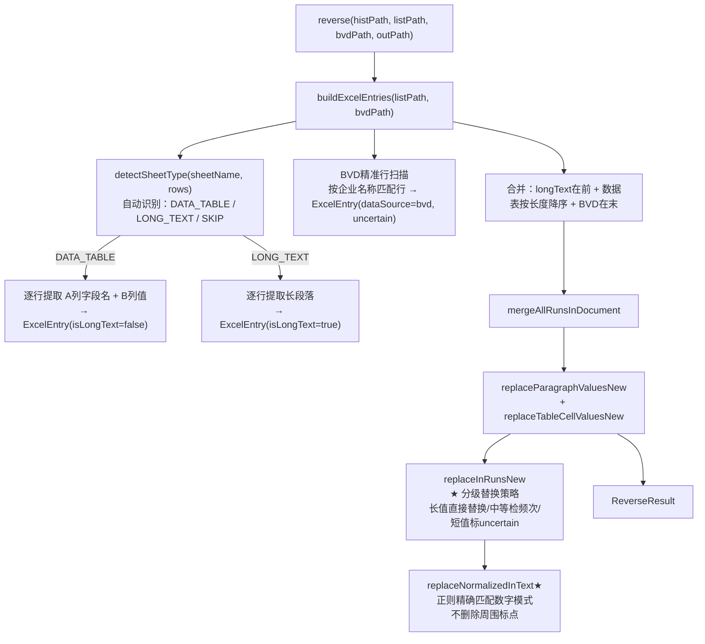

# 反向引擎技术改造开发计划 V4

## 项目背景

彻底解决反向引擎（`ReverseTemplateEngine`）在4家企业（远化物流、松莉科技、上海派智能源、斯必克流体）实际测试中暴露的所有功能问题，一步到位，不留隐患。

## 产品概述

反向引擎负责将历史报告Word+清单Excel中的实际数据，自动替换为占位符标记，生成企业子模板供后续报告复用。当前实现存在多处硬编码和逻辑缺陷，导致每换一家企业就失效或产生错误内容。

---

## 核心功能需求

### P0：Sheet类型识别自适应（彻底消除硬编码）

- **现状**：数据表Sheet名硬编码为"数据表"精确匹配；长文本Sheet依赖`application.yml`白名单配置
- **目标**：通过扫描Sheet内容自动识别类型，删除白名单配置，对任意企业清单开箱即用
- **识别规则**：Sheet名包含"数据"或行内容符合"A列短字段名+B列短值"模式 → 数据表；B列存在长度>50字符的段落 → 长文本Sheet；其余跳过

### P0：短值替换词边界保护（防止误替换）

- **现状**：对所有值直接调用`text.replace(value, phMark)`，无任何边界保护
- **目标**：按值长度分级处理，短值不自动替换只标记uncertain，中等长度值检查出现频次，长值直接替换

### P1：数字归一化替换修复（防止内容破坏）

- **现状**：`replaceNormalizedInText`方法中用`text.replace(",", "")`删除文本中所有逗号，破坏中文标点
- **目标**：使用正则精确匹配数字模式，只替换数字串本身，不影响周围文字

### P1：BVD精准行扫描（补全财务数据占位符）

- **现状**：BVD Excel参数完全被忽略，无任何处理
- **目标**：在BVD中查找与清单企业名称匹配的行，提取该行长度≥6的数值，全部标记uncertain供用户确认

---

## 技术栈

- **语言/框架**：Java 17 + Spring Boot（现有项目延续）
- **Excel解析**：EasyExcel（现有）+ Apache POI XSSFWorkbook（现有）
- **Word处理**：Apache POI XWPFDocument（现有）
- **配置管理**：Spring `@Value`（现有）

---

## 实现思路

### 总体策略

以最小侵入原则改造 `ReverseTemplateEngine.java` 一个核心文件，删除 `application.yml` 中的白名单配置项，不改动 Controller 层和数据库层。所有改动围绕"让引擎自适应清单结构"这一核心目标展开。

### P0-1：Sheet类型自动识别（替换白名单机制）

新增 `detectSheetType(sheetName, rows)` 方法，规则优先级如下：

```
1. Sheet名包含"数据"（宽泛匹配）→ DATA_TABLE
2. 该Sheet所有行中，B列有≥1个长度>50字符的值 → LONG_TEXT
3. 其余 → SKIP
```

删除 `@Value("${reverse-engine.long-text-sheets:}")` 注解和对应字段，删除 `application.yml` 中的 `reverse-engine.long-text-sheets` 配置块。

`buildExcelEntries` 方法内循环由原来的两个分支（精确名匹配 + 白名单检查）改为调用 `detectSheetType` 统一分发。

### P0-2：短值分级替换策略

在 `replaceInRunsNew` 方法中，对每个 `ExcelEntry`（非长文本）按值长度分级：

| 值长度 | 策略 |
| --- | --- |
| ≥ 8字符 | 直接 `text.replace(value, phMark)`，精确安全 |
| 5-7字符 | 统计在文档全段落中的出现次数，仅出现1次才自动替换，否则标 uncertain |
| < 5字符 | 全部标 uncertain，不修改文本，保留原值让用户确认 |

统计出现次数的方法 `countOccurrences(text, value)` 仅在替换前调用一次（非全文档扫描，在当前Run范围内判断），控制性能开销。

### P1-1：数字归一化替换修复

重写 `replaceNormalizedInText` 方法，不再整体删除逗号，改为构造正则表达式精确匹配千分位数字串：

```java
// 例：value="1,234,567" 构造正则 "1[,，]?234[,，]?567"
// 只替换精确匹配的数字串，不动周围中文字符
Pattern p = buildNumberPattern(value);
return p.matcher(text).replaceAll(Matcher.quoteReplacement(replacement));
```

`buildNumberPattern(value)` 方法：去掉逗号后将数字每3位之间插入 `[,，]?`（允许有无千分位、中英文逗号），返回 `Pattern`。

### P1-2：BVD精准行扫描

在 `buildExcelEntries` 末尾新增 BVD 扫描逻辑（仅当 `bvdExcelPath` 非空时执行）：

```
1. 从已构建的 dataTableEntries 中取出"企业名称"对应的值
2. 遍历BVD Excel所有Sheet的所有行，查找包含该企业名称的行（模糊含字符串匹配）
3. 收集该行中长度≥6的数值型单元格
4. 生成 ExcelEntry { isLongText=false, dataSource="bvd", status=uncertain }
5. 追加到 dataTableEntries 末尾（排在数据表条目之后）
```

BVD扫描只取企业匹配行，不全量扫描，避免3000+行全部误匹配。

`reverse()` 方法签名已有 `bvdExcelPath` 参数，将其传递进 `buildExcelEntries` 方法即可，无需改动调用方。

### 性能说明

- Sheet类型检测：遍历每个Sheet的所有行做一次扫描，O(n)，n为行数，可接受
- BVD扫描：仅匹配企业名称所在行，最坏情况O(m×k)，m为BVD行数，k为列数，一次扫描后不再重复
- 替换逻辑：在当前Run文本范围内做频次统计（非全文档），O(e×r)，e为Entry数，r为Run数，与现有逻辑同量级

---

## 架构设计

改动完全在 `ReverseTemplateEngine.java` 内部，保持现有分层调用结构不变：



---

## 文件清单

```
src/
└── main/
    ├── java/com/fileproc/report/service/
    │   └── ReverseTemplateEngine.java   # [MODIFY] 核心改造文件
    │       ├── 删除字段：longTextSheetNames (@Value白名单)
    │       ├── 新增方法：detectSheetType(sheetName, rows) → SheetType枚举
    │       ├── 新增枚举：私有枚举 SheetType {DATA_TABLE, LONG_TEXT, SKIP}
    │       ├── 改造方法：buildExcelEntries(listExcelPath, bvdExcelPath) 增加bvd参数
    │       ├── 新增方法：scanBvdForCompanyRow(bvdPath, companyName) → List<ExcelEntry>
    │       ├── 改造方法：replaceInRunsNew() 中的替换分支，增加分级策略
    │       ├── 改造方法：replaceNormalizedInText() 改用正则匹配数字
    │       └── 新增方法：buildNumberPattern(value) → Pattern
    └── resources/
        └── application.yml              # [MODIFY] 删除 reverse-engine.long-text-sheets 配置块
```

---

## 任务清单

| 序号 | 任务ID | 任务描述 | 依赖 | 状态 |
|------|--------|----------|------|------|
| 1 | auto-sheet-detect | 重写 buildExcelEntries 和新增 detectSheetType，实现Sheet类型自动识别，删除白名单@Value字段和 application.yml 配置 | - | 待执行 |
| 2 | graded-replace-strategy | 改造 replaceInRunsNew 中的替换分支，实现按值长度分级替换策略（长值直接替换/中等检频次/短值标uncertain） | auto-sheet-detect | 待执行 |
| 3 | fix-number-normalize | 重写 replaceNormalizedInText，改用正则精确匹配千分位数字串，修复删除整段逗号的问题 | graded-replace-strategy | 待执行 |
| 4 | bvd-precise-scan | 新增 scanBvdForCompanyRow 方法，实现BVD按企业名称精准行扫描，将结果追加为uncertain条目 | fix-number-normalize | 待执行 |

---

## 技术细节补充

### 常量定义

```java
private static final int LONG_TEXT_MIN_CHARS = 50;     // 长文本判定阈值
private static final int SHORT_VALUE_THRESHOLD = 5;     // 短值阈值（<5字符标uncertain）
private static final int MEDIUM_VALUE_THRESHOLD = 8;    // 中等值阈值（5-7字符检查唯一性）
```

### 枚举定义

```java
private enum SheetType { 
    DATA_TABLE,   // 数据表类型：A列字段名，B列值
    LONG_TEXT,    // 长文本类型：B列包含长段落
    SKIP          // 跳过类型：不符合上述两种
}

private enum ReplaceDecision { 
    AUTO,               // 自动替换
    UNCERTAIN_SHORT,    // 短值，标记uncertain
    UNCERTAIN_AMBIGUOUS // 有歧义，标记uncertain
}
```

### Sheet类型检测逻辑

```java
private SheetType detectSheetType(String sheetName, List<Map<Integer, Object>> rows) {
    String lowerName = sheetName.trim().toLowerCase();
    
    // 规则1：Sheet名包含"数据"或常见数据表命名
    if (lowerName.contains("数据") || lowerName.equals("基本信息")
            || lowerName.equals("data") || lowerName.equals("info")) {
        return SheetType.DATA_TABLE;
    }
    
    // 规则2：检查是否存在超长单元格（长文本判定）
    for (Map<Integer, Object> row : rows) {
        Object bVal = row.get(1);  // B列
        if (bVal != null && bVal.toString().trim().length() > LONG_TEXT_MIN_CHARS) {
            return SheetType.LONG_TEXT;
        }
        Object aVal = row.get(0);  // A列
        if (aVal != null && aVal.toString().trim().length() > LONG_TEXT_MIN_CHARS) {
            return SheetType.LONG_TEXT;
        }
    }
    
    return SheetType.SKIP;
}
```

### 分级替换决策逻辑

```java
private ReplaceDecision decideReplaceStrategy(String value, String fullDocText) {
    int len = value.length();
    
    // 短值（<5字符）或纯数字短值 → 标记uncertain
    if (len < SHORT_VALUE_THRESHOLD || isShortPureNumber(value)) {
        return ReplaceDecision.UNCERTAIN_SHORT;
    }
    
    // 长值（≥8字符）→ 直接自动替换
    if (len >= MEDIUM_VALUE_THRESHOLD) {
        return ReplaceDecision.AUTO;
    }
    
    // 中等值（5-7字符）→ 检查文档中出现次数
    int occurrences = countOccurrences(fullDocText, value);
    return (occurrences == 1) ? ReplaceDecision.AUTO : ReplaceDecision.UNCERTAIN_AMBIGUOUS;
}
```

### 数字正则构建示例

| 输入值 | 归一化值 | 构建的正则表达式 | 匹配范围 |
|--------|----------|------------------|----------|
| 1,234,567 | 1234567 | `1[,，]?234[,，]?567` | 匹配"1,234,567"、"1，234，567"、"1234567" |
| 12,345 | 12345 | `12[,，]?345` | 匹配"12,345"、"12，345"、"12345" |
| 1.2345 | 1.2345 | `1\.2345` | 精确匹配小数 |

---

## 注意事项

1. **向后兼容性**：本次改造不修改 Controller 层和数据库层，仅调整 Engine 内部逻辑
2. **配置清理**：改造后需删除 `application.yml` 中的 `reverse-engine.long-text-sheets` 配置块
3. **性能考虑**：BVD扫描仅匹配企业名称所在行，避免全量扫描3000+行数据
4. **测试验证**：改造完成后需在4家企业（远化物流、松莉科技、上海派智能源、斯必克流体）的测试文件上验证

---

## 更新记录

| 版本 | 日期 | 更新内容 |
|------|------|----------|
| V4 | 2026-03-12 | 初始版本，汇总4项技术改造需求 |
