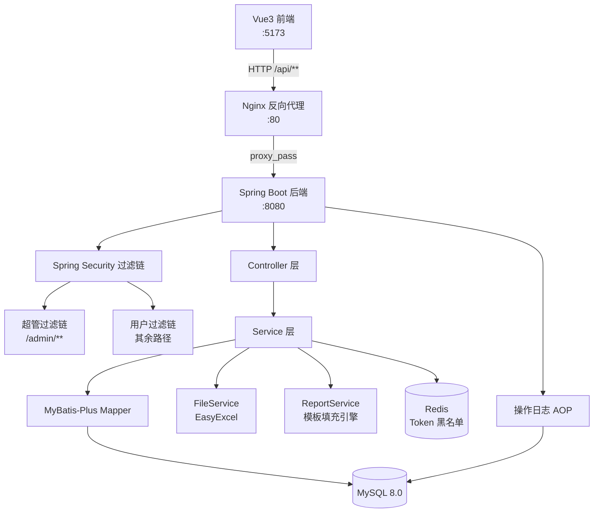

## 用户需求

为已完成的前端项目（Vue3 + TypeScript + Element Plus，使用 Mock.js 模拟接口）开发对应的 Java 后端服务，实现前后端完整对接。

## 产品概述

同期资料文件解析处理平台的后端服务，支持多租户隔离，提供完整的企业文件处理业务能力，包括用户认证鉴权、企业档案管理、数据文件上传处理、报告生成与归档、模板与占位符管理以及系统管理等核心功能。后端需严格遵循前端已定义的 API 契约（路径、请求体、响应格式），做到零改动对接前端。

## 核心功能

- **双 Token 认证体系**：普通用户（含租户隔离）与超管各自独立的登录、鉴权、登出流程；请求通过 `Authorization: Bearer <token>` + `X-Tenant-Id` 请求头进行身份识别
- **超管后台**：租户 CRUD 管理、启用/禁用租户状态切换
- **系统管理**：租户内的用户/角色/权限管理，操作日志记录，系统配置读写，首页统计数据
- **企业档案管理**：企业信息 CRUD（含联系人子表），支持关键词搜索和下拉联想
- **数据文件管理**：Excel 文件（List 表/BvD 表）上传存储、按企业/年度查询、年度数据校验检查
- **报告管理**：报告生成（调用模板+数据文件填充）、子模板更新、归档（editing→history）、手动上传历史报告、报告章节解析
- **模板/占位符/模块管理**：模板 CRUD 及归档、占位符定义管理、报告模块管理
- **消息通知**：管理端发布/编辑/删除通知（支持全员/按角色投送），用户端获取通知、标记已读、全部已读、获取未读数
- **统一响应格式**：所有接口返回 `{ code, message, data }` 结构，分页接口返回 `{ list, total, page, pageSize }`

## 技术栈

| 分类 | 选型 |
| --- | --- |
| 框架 | Spring Boot 3.x |
| ORM | MyBatis-Plus 3.5.x |
| 数据库 | MySQL 8.0 |
| 认证 | Spring Security 6 + JWT (jjwt 0.12.x) |
| 文件处理 | EasyExcel 3.x |
| 接口文档 | Knife4j 4.x (OpenAPI 3) |
| 工具库 | Lombok、MapStruct、Hutool |
| 构建 | Maven 3.9+ |
| 部署 | Docker + Docker Compose |
| 缓存 | Redis（Token 黑名单 + 登出失效） |


---

## 实现方案

### 多租户隔离策略

采用**行级隔离（Row-level Tenancy）**：所有业务表增加 `tenant_id` 字段，通过 MyBatis-Plus 的**租户插件（`TenantLineInnerInterceptor`）** 自动在 SQL 中注入 `WHERE tenant_id = ?` 条件，避免遗漏。租户 ID 由 `X-Tenant-Id` 请求头传入，在 `JwtAuthFilter` 中解析并存入 `TenantContext`（ThreadLocal）。超管接口路径以 `/admin/**` 开头，走独立 `SecurityFilterChain`，不注入租户上下文，绕开租户插件。

### 双 Token 认证

- **普通用户 Token**：携带 `userId`、`tenantId`、`roles`、`permissions` claims
- **超管 Token**：携带 `adminId`、固定角色标识 `SUPER_ADMIN`
- 两套 Token 使用不同的 JWT 密钥（`jwt.user.secret` / `jwt.admin.secret`），防止超管 Token 被用于普通接口
- 登出采用 Redis 维护 Token 黑名单（key=`token:blacklist:{jti}`，TTL=剩余有效期），`JwtAuthFilter` 每次验签后检查黑名单

### 文件上传与报告生成

- 文件存储：本地 `FileStore`（可替换为 OSS），上传后记录元数据到 `data_file` 表
- 报告生成：读取模板 Word 文件，结合 `placeholder` 定义从已上传的 Excel 中抽取数据（EasyExcel 读取），替换占位符后输出 Word/PDF；`generate` 接口为耗时操作，当前同步返回（后续可改为异步任务队列）
- 章节解析（`parse-modules`）：读取上传的历史报告 Word，按章节标题匹配系统已配置的 `module`，返回匹配结果及置信度

### 操作日志

通过 `@OperationLog` 自定义注解 + Spring AOP 切面，在 Service 方法返回后异步写入 `sys_log` 表，记录操作人、IP、模块、动作、详情，不阻塞主流程。

### 统一响应与异常处理

全局 `@RestControllerAdvice` 捕获业务异常（`BizException`）、参数校验异常（`MethodArgumentNotValidException`）等，统一返回 `{ code, message, data }` 格式；HTTP 4xx/5xx 也包装为相同结构。

---

## 实现注意事项

- **租户插件与超管接口**：超管路径 `/admin/**` 和公开路径 `/auth/login`、`/tenants/list` 必须加入租户插件忽略表列表，避免 SQL 注入多余 tenant_id 条件
- **并发安全**：报告生成前校验同年度是否已存在（数据库唯一索引 `uk_company_year_status`），避免重复生成；利用 `SELECT FOR UPDATE` 防止并发归档冲突
- **文件上传**：`multipart/form-data` 与 JSON 混用，数据文件上传接口接收 `file` 二进制 + 业务字段，Spring Boot 默认 `max-file-size` 配置为 50MB（对应前端 SysConfig.maxFileSize）
- **分页响应**：MyBatis-Plus `IPage` 转为 `PageResult<T>` 时保持字段名 `list/total/page/pageSize` 与前端一致，`page` 从 1 开始
- **公司搜索接口** `/companies/search` 路径需在 `/companies/{id}` 之前注册，避免路由冲突（在 Controller 方法顺序或使用 `@GetMapping("/search")` 置于 `@GetMapping("/{id}")` 前）
- **通知投送逻辑**：发布通知时根据 `targetType`（all/role）将 `notice_user` 关联记录批量插入，确保未读数统计准确
- **日志不记录敏感字段**：密码、Token 等字段在切面中通过字段名过滤，不写入 `detail`
- **Docker Compose**：`backend`、`mysql`、`redis` 三个服务，`mysql` 使用初始化 SQL 脚本自动建库建表并插入初始数据（超管账号、权限树、系统配置）

---

## 架构设计



### 模块划分

| 模块包名 | 职责 |
| --- | --- |
| `auth` | 用户登录、超管登录、JWT 工具、Security 配置 |
| `tenant` | 公开租户列表、超管租户 CRUD |
| `system` | 用户/角色/权限/日志/配置/统计 |
| `company` | 企业档案 + 联系人子表 |
| `datafile` | 数据文件上传/查询/校验 |
| `report` | 报告生成/更新/归档/上传/解析 |
| `template` | 模板/占位符/模块 CRUD |
| `notice` | 消息通知管理端 + 用户端 |
| `common` | 统一响应、全局异常、分页工具、租户上下文、日志注解 |


---

## 目录结构

```
f:\CodeBuddy\fileWork\
└── file-processing-backend/               # [NEW] Java 后端项目根目录
    ├── pom.xml                             # [NEW] Maven 依赖管理：Spring Boot 3、MyBatis-Plus、jjwt、EasyExcel、Knife4j、Redis、Lombok、MapStruct
    ├── Dockerfile                          # [NEW] 多阶段构建：builder(maven:3.9-jdk21) + runtime(eclipse-temurin:21-jre)
    ├── docker-compose.yml                  # [NEW] 编排 backend + mysql8 + redis7，含健康检查和 volume 挂载
    ├── src/main/resources/
    │   ├── application.yml                 # [NEW] 主配置：端口8080、数据源、Redis、JWT密钥、文件存储路径、MyBatis-Plus租户插件配置
    │   ├── application-dev.yml             # [NEW] 开发环境覆盖配置（本地数据库连接）
    │   └── db/
    │       └── init.sql                    # [NEW] 建库建表 DDL（全部12张表）+ 初始数据（超管账号、权限树、默认系统配置）
    └── src/main/java/com/fileproc/
        ├── FileProcessingApplication.java  # [NEW] Spring Boot 启动类，@EnableAsync 开启异步日志
        ├── common/
        │   ├── R.java                      # [NEW] 统一响应体：code/message/data，静态工厂方法 ok()/fail()/of()
        │   ├── PageResult.java             # [NEW] 分页响应体：list/total/page/pageSize，与前端 PageResult<T> 完全对齐
        │   ├── BizException.java           # [NEW] 业务异常类，携带 code 和 message
        │   ├── GlobalExceptionHandler.java # [NEW] @RestControllerAdvice：处理 BizException、ConstraintViolation、MethodArgumentNotValid、AuthException 等，统一包装为 R
        │   ├── TenantContext.java          # [NEW] ThreadLocal 持有当前请求的 tenantId，TenantLineHandler 从此处读取
        │   ├── MybatisPlusConfig.java      # [NEW] 注册 TenantLineInnerInterceptor（忽略 sys_tenant/sys_admin/sys_permission 表）和 PaginationInnerInterceptor
        │   ├── WebMvcConfig.java           # [NEW] 注册全局跨域配置（开发阶段放开 5173 端口），配置文件静态资源映射
        │   ├── annotation/
        │   │   └── OperationLog.java       # [NEW] 自定义注解：module、action 属性，标记需要记录操作日志的 Service 方法
        │   └── aspect/
        │       └── OperationLogAspect.java # [NEW] AOP 切面：@Around OperationLog 注解，异步（@Async）写入 sys_log 表，从 SecurityContext 获取操作人信息，过滤密码等敏感字段
        ├── auth/
        │   ├── controller/
        │   │   ├── AuthController.java     # [NEW] POST /auth/login、POST /auth/logout、GET /auth/userinfo，GET /tenants/list（委托 TenantService）
        │   │   └── AdminAuthController.java# [NEW] POST /admin/login、POST /admin/logout
        │   ├── service/
        │   │   ├── AuthService.java        # [NEW] 用户登录验证（BCrypt密码校验）、生成用户 JWT（含 tenantId/permissions）、登出写黑名单、查询 userinfo
        │   │   └── AdminAuthService.java   # [NEW] 超管登录验证、生成超管 JWT、登出写黑名单
        │   ├── filter/
        │   │   ├── JwtAuthFilter.java      # [NEW] 普通用户过滤器：解析 Bearer token → 校验签名 → 查 Redis 黑名单 → 设置 SecurityContext + TenantContext
        │   │   └── AdminJwtAuthFilter.java # [NEW] 超管过滤器：解析 Bearer token → 校验超管密钥 → 查 Redis 黑名单 → 设置 SecurityContext
        │   ├── config/
        │   │   └── SecurityConfig.java     # [NEW] 配置两条 SecurityFilterChain：①超管链（/admin/**，使用 AdminJwtAuthFilter）②用户链（其余路径，使用 JwtAuthFilter）；公开路径白名单
        │   └── util/
        │       └── JwtUtil.java            # [NEW] 封装 jjwt：生成用户Token/超管Token、解析Claims、获取剩余TTL；双密钥配置
        ├── tenant/
        │   ├── controller/
        │   │   └── AdminTenantController.java # [NEW] GET/POST/PUT/DELETE /admin/tenants，PATCH /admin/tenants/{id}/status；@PreAuthorize("hasRole('SUPER_ADMIN')")
        │   ├── service/
        │   │   └── TenantService.java      # [NEW] 租户 CRUD，getTenantList()（返回 active 状态列表供登录页使用），状态切换
        │   ├── mapper/
        │   │   └── TenantMapper.java       # [NEW] MyBatis-Plus BaseMapper<SysTenant>，自定义分页查询支持 keyword 过滤
        │   └── entity/
        │       └── SysTenant.java          # [NEW] 表：sys_tenant（id,name,code,status,admin_count,logo_url,description,created_at）
        ├── system/
        │   ├── controller/
        │   │   ├── StatsController.java    # [NEW] GET /stats：返回 companyCount/reportCount/templateCount/dataFileCount（租户隔离统计）
        │   │   ├── UserController.java     # [NEW] GET/POST/PUT/DELETE /system/users（分页+keyword）
        │   │   ├── RoleController.java     # [NEW] GET/POST/DELETE /system/roles，GET/PUT /system/roles/{id}/permissions
        │   │   ├── PermissionController.java # [NEW] GET /system/permissions：返回权限树（含 children 嵌套结构）
        │   │   ├── LogController.java      # [NEW] GET /system/logs（分页）
        │   │   └── SysConfigController.java# [NEW] GET/PUT /system/config
        │   ├── service/
        │   │   ├── UserService.java        # [NEW] 用户 CRUD，创建时密码 BCrypt 加密，更新时跳过空密码，关联角色名回显
        │   │   ├── RoleService.java        # [NEW] 角色 CRUD，权限绑定（批量写 sys_role_permission），getRolePermissions 返回 permissions+checkedIds
        │   │   ├── PermissionService.java  # [NEW] 递归构建权限树，缓存权限列表
        │   │   ├── LogService.java         # [NEW] 分页查询日志，save()（被 AOP 切面异步调用）
        │   │   └── SysConfigService.java   # [NEW] 读写 sys_config 表（单条记录），返回 SysConfig DTO
        │   ├── mapper/
        │   │   ├── UserMapper.java         # [NEW] BaseMapper<SysUser>，自定义 selectPageWithRole（联表查 roleName）
        │   │   ├── RoleMapper.java         # [NEW] BaseMapper<SysRole>
        │   │   ├── PermissionMapper.java   # [NEW] BaseMapper<SysPermission>
        │   │   ├── RolePermissionMapper.java # [NEW] BaseMapper<SysRolePermission>，批量插入/按 roleId 删除
        │   │   ├── LogMapper.java          # [NEW] BaseMapper<SysLog>
        │   │   └── SysConfigMapper.java    # [NEW] BaseMapper<SysConfig>
        │   └── entity/
        │       ├── SysUser.java            # [NEW] 表：sys_user（id,tenant_id,username,real_name,password,email,phone,role_id,status,avatar,created_at）
        │       ├── SysRole.java            # [NEW] 表：sys_role（id,tenant_id,name,code,description,created_at）
        │       ├── SysPermission.java      # [NEW] 表：sys_permission（id,name,code,type,parent_id,path,icon,sort）全局共享，无 tenant_id
        │       ├── SysRolePermission.java  # [NEW] 表：sys_role_permission（role_id,permission_code）
        │       ├── SysLog.java             # [NEW] 表：sys_log（id,tenant_id,user_id,user_name,action,module,detail,ip,created_at）
        │       └── SysConfig.java          # [NEW] 表：sys_config（id,tenant_id,site_name,logo_url,icp,max_file_size）
        ├── company/
        │   ├── controller/
        │   │   └── CompanyController.java  # [NEW] GET/POST/PUT/DELETE /companies，GET /companies/search，GET /companies/{id}；注意 /search 路由注册在 /{id} 之前
        │   ├── service/
        │   │   └── CompanyService.java     # [NEW] 企业 CRUD，联系人子表级联保存（先删后插），搜索（keyword 模糊匹配，limit 10）
        │   ├── mapper/
        │   │   ├── CompanyMapper.java      # [NEW] BaseMapper<Company>，自定义分页+keyword查询
        │   │   └── ContactMapper.java      # [NEW] BaseMapper<Contact>，按 companyId 删除/查询
        │   └── entity/
        │       ├── Company.java            # [NEW] 表：company（id,tenant_id,name,alias,industry,tax_id,establish_date,address,business_scope,created_at）
        │       └── Contact.java            # [NEW] 表：company_contact（id,company_id,tenant_id,name,position,phone,email）
        ├── datafile/
        │   ├── controller/
        │   │   └── DataFileController.java # [NEW] GET /data-files，POST /data-files（multipart），DELETE /data-files/{id}，GET /data-files/check
        │   ├── service/
        │   │   └── DataFileService.java    # [NEW] 文件上传（存储到本地 upload 目录，记录元数据），列表查询（companyId+year过滤），年度数据检查
        │   ├── mapper/
        │   │   └── DataFileMapper.java     # [NEW] BaseMapper<DataFile>
        │   └── entity/
        │       └── DataFile.java           # [NEW] 表：data_file（id,tenant_id,company_id,name,type,year,size,file_path,upload_at）
        ├── report/
        │   ├── controller/
        │   │   └── ReportController.java   # [NEW] GET /reports，POST /reports/generate，POST /reports/update，POST /reports/{id}/archive，POST /reports/upload（multipart），DELETE /reports/{id}，POST /reports/parse-modules
        │   ├── service/
        │   │   ├── ReportService.java      # [NEW] 报告 CRUD，generate()（校验重复+调用模板填充），update()（生成子模板），archive()（状态变更+文件生成），upload()（手动上传）
        │   │   └── ReportGenerateEngine.java # [NEW] 核心引擎：读取 Word 模板，用 EasyExcel 读取 List/BvD Excel 数据，替换占位符（文本/表格/图表），输出最终 Word 文件
        │   ├── mapper/
        │   │   └── ReportMapper.java       # [NEW] BaseMapper<Report>，自定义多条件分页（companyId/status/year/name）
        │   └── entity/
        │       └── Report.java             # [NEW] 表：report（id,tenant_id,company_id,name,year,status,is_manual_upload,file_path,file_size,created_at,updated_at）；唯一索引 uk_tenant_company_year_status
        ├── template/
        │   ├── controller/
        │   │   ├── TemplateController.java # [NEW] GET/POST /templates，POST /templates/{id}/archive，DELETE /templates/{id}
        │   │   ├── PlaceholderController.java # [NEW] GET/POST/PUT/DELETE /placeholders
        │   │   └── ModuleController.java   # [NEW] GET/POST/PUT/DELETE /modules
        │   ├── service/
        │   │   ├── TemplateService.java    # [NEW] 模板 CRUD，归档（status→archived）
        │   │   ├── PlaceholderService.java # [NEW] 占位符 CRUD，按 companyId 过滤
        │   │   └── ModuleService.java      # [NEW] 模块 CRUD，按 companyId 过滤，placeholders 字段以 JSON 数组存储
        │   ├── mapper/
        │   │   ├── TemplateMapper.java     # [NEW] BaseMapper<Template>，多条件分页（companyId/keyword/year）
        │   │   ├── PlaceholderMapper.java  # [NEW] BaseMapper<Placeholder>
        │   │   └── ModuleMapper.java       # [NEW] BaseMapper<ReportModule>
        │   └── entity/
        │       ├── Template.java           # [NEW] 表：template（id,tenant_id,company_id,name,year,status,description,created_at）
        │       ├── Placeholder.java        # [NEW] 表：placeholder（id,tenant_id,company_id,name,type,data_source,source_sheet,source_field,chart_type,description）
        │       └── ReportModule.java       # [NEW] 表：report_module（id,tenant_id,company_id,name,code,description,placeholders JSON,sort）
        └── notice/
            ├── controller/
            │   ├── NoticeController.java   # [NEW] 用户端：GET /notices/mine，GET /notices/unread-count，POST /notices/{id}/read，POST /notices/read-all
            │   └── AdminNoticeController.java # [NEW] 管理端：GET/POST/PUT/DELETE /system/notices
            ├── service/
            │   └── NoticeService.java      # [NEW] 通知 CRUD，发布时批量生成 notice_user 记录（全员/按角色），标记已读（更新 notice_user.is_read），未读数统计，获取我的通知列表
            ├── mapper/
            │   ├── NoticeMapper.java       # [NEW] BaseMapper<Notice>，分页+keyword查询
            │   └── NoticeUserMapper.java   # [NEW] BaseMapper<NoticeUser>，按 userId 查未读数，批量插入
            └── entity/
                ├── Notice.java             # [NEW] 表：notice（id,tenant_id,title,content,target_type,target_role_ids JSON,published_by,published_by_name,status,created_at,updated_at）
                └── NoticeUser.java         # [NEW] 表：notice_user（id,notice_id,tenant_id,user_id,is_read,read_at）；唯一索引 uk_notice_user
```

---

## 关键数据结构

```java
// 统一响应体（与前端 ApiResponse<T> 完全对齐）
public class R<T> {
    private int code;       // 200=成功，其他=失败
    private String message;
    private T data;

    public static <T> R<T> ok(T data);
    public static <T> R<T> ok(String message, T data);
    public static <T> R<T> fail(int code, String message);
    public static <T> R<T> fail(String message);  // code=500
}

// 分页结果（与前端 PageResult<T> 字段名完全一致）
public class PageResult<T> {
    private List<T> list;
    private long total;
    private int page;       // 从1开始
    private int pageSize;
}

// JWT Claims 结构
// 用户 Token: { sub: userId, tenantId, roleId, permissions: ["*"] or [...], iat, exp }
// 超管 Token: { sub: adminId, role: "SUPER_ADMIN", iat, exp }
```

## Agent Extensions

### SubAgent

- **code-explorer**
- 用途：在生成各模块代码时，探索前端 Mock 文件中的业务细节（如报告生成逻辑、通知投送规则、权限树结构），确保后端实现与前端 Mock 行为完全一致
- 预期成果：准确还原所有业务规则（如归档时文件名替换逻辑、报告重复检查条件、权限 checkedIds 回显算法），避免接口行为偏差导致前端功能异常