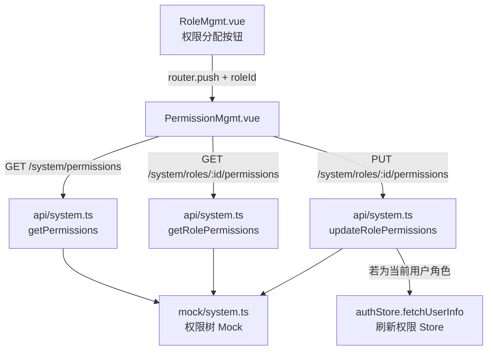

## 用户需求

用户发现系统管理模块中的"权限管理"页面功能未完成，仅有静态展示效果，需要将其实现为完整可用的角色权限分配功能。

## 产品概述

权限管理功能的核心目标是：允许系统管理员选择一个角色，查看该角色当前拥有的权限（树形勾选回显），然后通过勾选/取消权限节点，保存后实时生效。同时，角色管理列表中的"权限分配"按钮应能直接跳转并预选对应角色，实现两个页面之间的联动。

## 核心功能

- **角色选择**：页面顶部提供角色下拉选择器，选中角色后动态加载该角色已有权限并回显勾选状态
- **权限树交互**：`el-tree` 支持勾选操作，勾选父节点自动关联子节点，取消同理；提供"全选/全不选"快捷操作
- **保存权限**：提供"保存"按钮，点击后将当前勾选的权限 code 列表提交到接口，成功后刷新当前用户 Store 中的权限数据
- **RoleMgmt 联动**：角色列表中"权限分配"按钮绑定点击事件，携带角色 ID 跳转到 `/system/permission?roleId=xxx`，权限管理页识别 `roleId` 参数自动选中对应角色
- **接口与 Mock 补全**：补充获取权限树、获取角色权限、保存角色权限三个 API 接口及对应 Mock 数据

## 技术栈

- **框架**：Vue 3 + TypeScript（Composition API + `<script setup>`）
- **状态管理**：Pinia（复用现有 `useAuthStore`）
- **UI 组件**：Element Plus（`el-tree`、`el-select`、`el-button`）
- **接口层**：axios 封装的 `request`（复用现有 `@/utils/request`）
- **Mock**：mockjs（与现有 `mock/system.ts` 保持一致）
- **类型**：TypeScript，复用已定义的 `Permission`、`Role` 接口

---

## 实现方案

### 整体思路

采用"角色上下文驱动"模式：权限管理页通过 URL query 参数 `roleId` 与角色管理页解耦联动。页面进入时读取 `roleId` 参数，自动选中对应角色并加载权限；用户也可以手动切换角色下拉框。保存时仅提交勾选的 action 节点 code（叶子节点），父级菜单节点由后端或前端根据业务逻辑自动包含。

### 关键技术决策

1. **`el-tree` 使用 `ref` 获取实例，通过 `getCheckedKeys()` 获取勾选节点**：相比 `v-model:checked-keys`，`ref` 方式更精确控制半选/全选状态，避免父子关联时的重复 code 问题。结合 `:check-strictly="false"`（父子联动），选中父节点自动选中所有子节点。

2. **保存时提取叶子节点 code**：通过 `getCheckedNodes(true)` 仅获取叶子节点（操作权限），避免将菜单节点 code 也存入角色权限列表，与现有 `mock/system.ts` 中 `permissions` 字段的数据格式（操作级 code，如 `company:read`）保持一致。

3. **权限树数据静态化**：`PermissionMgmt.vue` 中已有完整的权限树结构硬编码，将其迁移至 `mock/system.ts` 作为 `/system/permissions` 接口的响应数据，前端改为异步加载，保持数据一致性，未来对接真实后端时只需更换接口地址。

4. **`RoleMgmt.vue` 跳转方式**：使用 `router.push({ name: 'PermissionMgmt', query: { roleId: row.id } })` 跳转，权限管理页通过 `useRoute().query.roleId` 接收，响应式监听保证直接刷新页面也能正常初始化。

5. **保存后更新 Store**：若当前登录用户的 `roleId` 与被修改角色一致，则重新调用 `authStore.fetchUserInfo()` 刷新权限，使 `v-permission` 指令实时生效。

### 性能与可靠性

- 权限树数据量小（约 20 个节点），无需分页或懒加载
- 切换角色时先清空旧勾选再加载新数据，避免闪烁
- 保存操作加 `loading` 状态防止重复提交

---

## 架构设计



---

## 目录结构

```
file-processing-platform/src/
├── api/
│   └── system.ts          # [MODIFY] 新增3个权限相关接口：
│                          #   getPermissions() - GET /system/permissions 获取全量权限树
│                          #   getRolePermissions(roleId) - GET /system/roles/:id/permissions 获取角色权限列表
│                          #   updateRolePermissions(roleId, codes[]) - PUT /system/roles/:id/permissions 保存角色权限
├── mock/
│   └── system.ts          # [MODIFY] 新增3个 Mock 接口：
│                          #   GET /system/permissions - 返回完整权限树（将现有硬编码数据迁移至此）
│                          #   GET /system/roles/:id/permissions - 返回指定角色的 permissions 数组
│                          #   PUT /system/roles/:id/permissions - 更新 roles 数组中对应角色的 permissions 字段
├── views/system/
│   ├── PermissionMgmt.vue # [MODIFY] 完整重写功能逻辑：
│                          #   - 顶部增加角色选择下拉（el-select，从 getRoles 接口加载角色列表）
│                          #   - 增加"全选/全不选"快捷按钮
│                          #   - el-tree 绑定 ref，异步加载权限树数据，支持勾选交互
│                          #   - 监听 route.query.roleId，自动加载该角色权限并回显勾选
│                          #   - 切换角色时调用 getRolePermissions 刷新勾选状态
│                          #   - 底部增加"保存"按钮，调用 updateRolePermissions 提交
│                          #   - 保存成功后若为当前用户角色则刷新 authStore
│   └── RoleMgmt.vue       # [MODIFY] 给"权限分配"按钮绑定 @click 事件：
│                          #   - import useRouter，点击执行 router.push({ name: 'PermissionMgmt', query: { roleId: row.id } })
```

## 使用的 Agent 扩展

### SubAgent

- **code-explorer**
- 用途：在计划执行时用于深入探索 `PermissionMgmt.vue`、`RoleMgmt.vue`、`api/system.ts`、`mock/system.ts` 等文件的完整内容，确认现有代码结构和 Mock 注册模式，保证修改时不破坏已有逻辑
- 预期结果：准确获取各文件的完整代码，为精确修改提供依据